# Cline Foundation Documentation

Comprehensive documentation for the Cline Foundation setup in this workspace.

---

## Table of Contents

1. [Overview](#overview)
2. [Project Structure](#project-structure)
3. [Cline Skills](#cline-skills)
4. [Workflow Rules](#workflow-rules)
5. [Validation Standards](#validation-standards)
6. [Best Practices](#best-practices)
7. [Getting Started](#getting-started)

---

## Overview

### What is Cline Foundation?

Cline Foundation is a structured workspace configuration that enables AI-assisted development through Cline (an AI coding assistant). This foundation provides:

- **Standardized Workflows**: Plan → Confirm → Act pattern for all operations
- **Validation System**: Ensures quality and compliance for generated skills
- **State Management**: Tracks progress across multi-step operations
- **Best Practices**: Guidelines based on Anthropic's recommendations

### Purpose

This workspace is designed to:

1. Create and manage Cline Skills efficiently
2. Enforce quality through validation rules
3. Provide reproducible workflows
4. Maintain state across complex operations

---

## Project Structure

```
d:\CLAUDE-SKILL\Campaign\
│
├── .clinerules/                          # Cline configuration & rules
│   ├── validation-rules.md               # Skill validation standards
│   └── workflows/                        # Workflow definitions
│       ├── blueprint-execution.md        # Plan → Confirm → Act workflow
│       ├── state-management.md           # State tracking rules
│       └── workflow_state.json           # Current workflow state
│
├── docs/                                 # Additional documentation
│   └── anthropic-best-practices.md       # Anthropic Claude best practices
│
├── mcp-servers/                          # MCP server configurations
│   ├── context7-mcp/                     # Context7 MCP server
│   └── filesystem-mcp/                   # Filesystem MCP server
│
└── CLINE_FOUNDATION.md                   # This documentation
```

### Directory Descriptions

| Directory | Purpose |
|-----------|---------|
| `.clinerules/` | Contains all Cline-specific configuration, validation rules, and workflow definitions |
| `docs/` | Additional documentation and reference materials |
| `mcp-servers/` | Model Context Protocol server configurations |

---

## Cline Skills

### What are Cline Skills?

Cline Skills are reusable instruction sets that extend Cline's capabilities. Each skill is defined in a `SKILL.md` file with YAML frontmatter that controls when the skill auto-activates.

### Skill Architecture

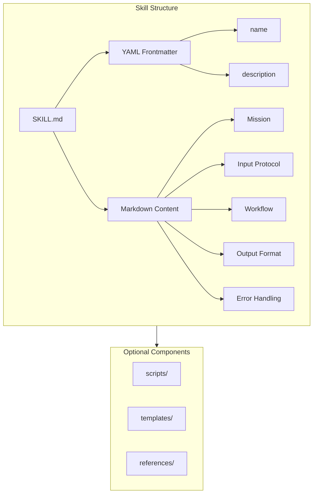

### Skill Directory Structure

```
skill-name/
├── SKILL.md              # Required: Main skill definition
├── scripts/              # Optional: Automation scripts
│   ├── script.py
│   └── script.js
├── templates/            # Optional: File templates
│   └── template.md
└── references/           # Optional: Reference documentation
    └── frameworks.md
```

### Skill Activation Mechanism

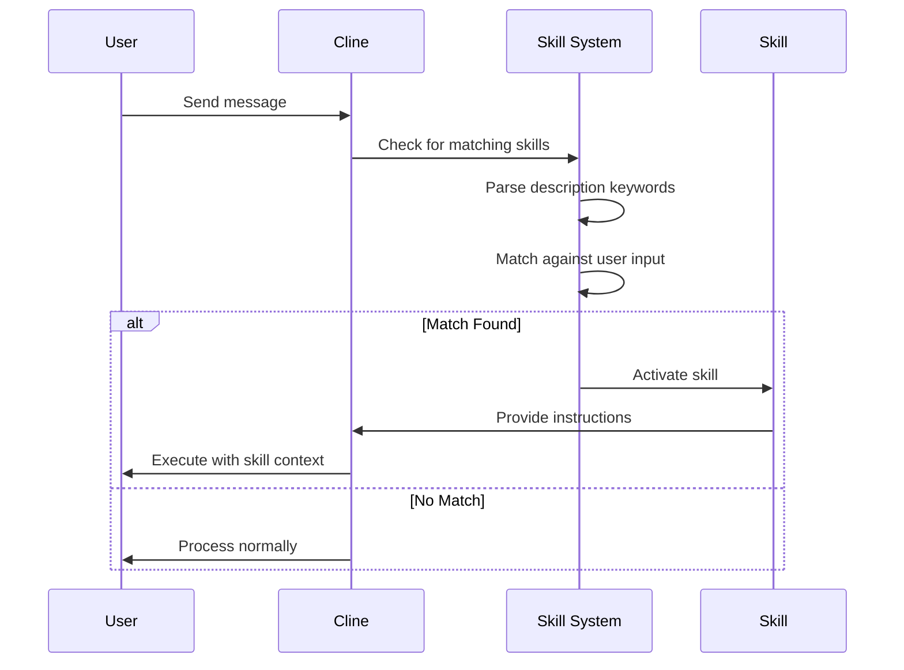

### Description-Based Activation

Skills auto-activate based on their `description` field:

| Component | Purpose | Example |
|-----------|---------|---------|
| **Keywords** | Single words that trigger | `brand dna`, `marketing`, `campaign` |
| **Phrases** | Multi-word expressions | `analyze this website`, `create campaign` |
| **Context** | When to activate | `first phase of marketing campaign` |
| **Exclusion** | When NOT to activate | `DOES NOT trigger for general web scraping` |

### Skill Types

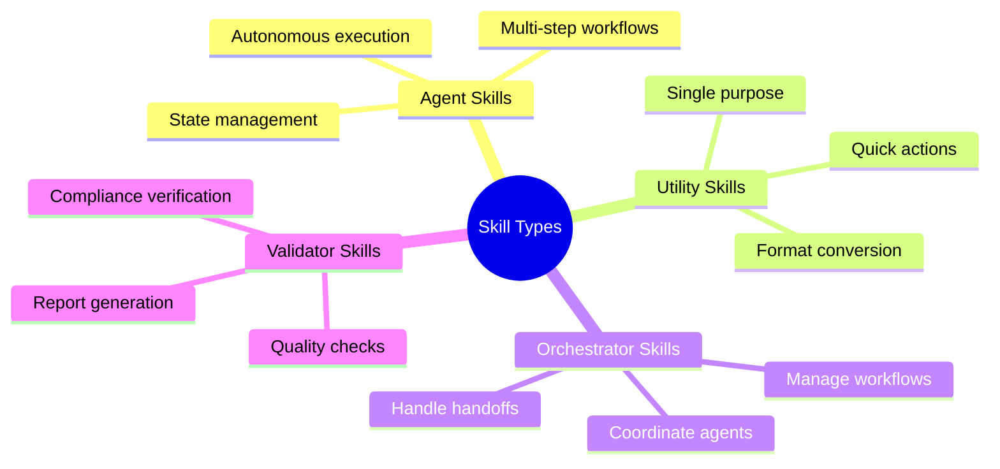

### Creating Skills

To create a new skill in this workspace:

1. **Define Purpose**: Clearly identify what the skill should do
2. **Choose Name**: Use kebab-case (e.g., `my-skill-name`)
3. **Write Description**: Include keywords, phrases, context, and exclusions
4. **Structure Content**: Follow the skill template
5. **Add Components**: Include scripts, templates, or references as needed
6. **Validate**: Ensure all validation checks pass

### Skill Communication Pattern

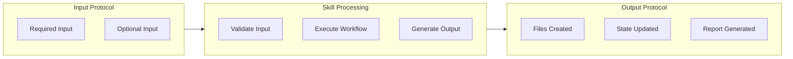

### Best Practices for Skills

| Practice | Description |
|----------|-------------|
| **Single Responsibility** | Each skill should do one thing well |
| **Clear Triggers** | Description should precisely define activation conditions |
| **Explicit Inputs** | Document all required and optional inputs |
| **Structured Outputs** | Define exact output formats |
| **Error Handling** | Include recovery procedures |
| **Idempotency** | Skills should be safely re-runnable |

---

## Workflow Rules

### Core Pattern: Plan → Confirm → Act

All operations in this workspace follow the **Plan → Confirm → Act** pattern to ensure quality and user control.

```mermaid
flowchart LR
    subgraph PLAN["PLAN MODE"]
        A[User Request] --> B[Analyze Requirements]
        B --> C[Create Plan]
        C --> D[Present Plan]
    end
    
    subgraph DECISION{"Decision"}
        D --> E{User Confirms?}
    end
    
    subgraph ACT["ACT MODE"]
        E -->|YES| F[Execute Plan]
        F --> G[Create Files]
        G --> H[Validate Output]
    end
    
    subgraph COMPLETE["Complete"]
        H --> I[Report Results]
    end
    
    E -->|NO/Modify| B
```

### Workflow Phases

The workflow operates in distinct phases with clear transitions:

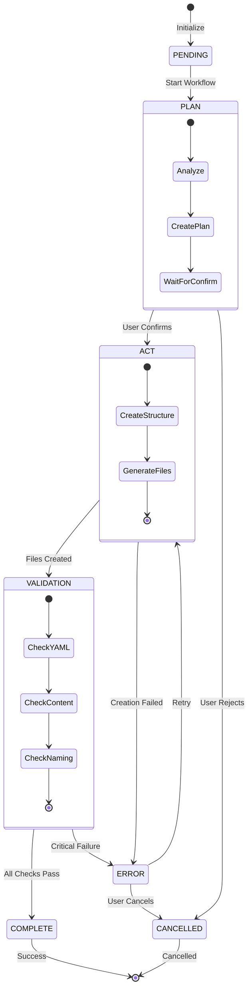

### State Transitions

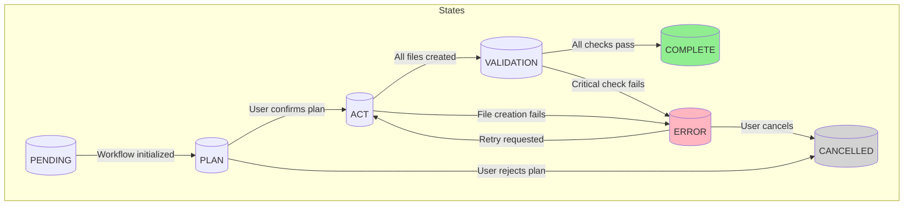

### State Management

Workflow state is tracked in `workflow_state.json`:

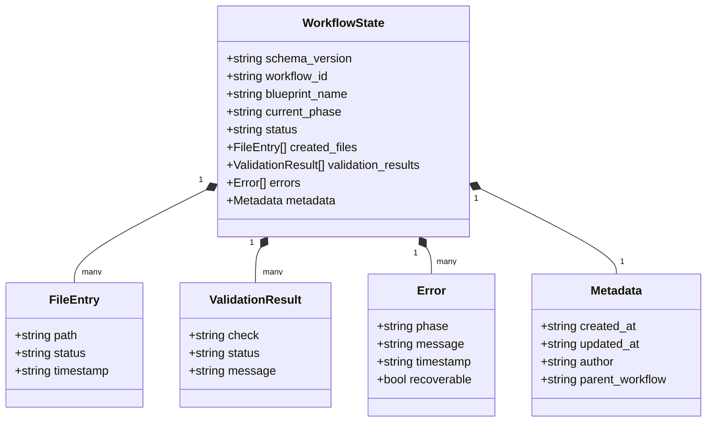

### State Schema

```json
{
  "schema_version": "1.0",
  "workflow_id": "unique-workflow-identifier",
  "blueprint_name": "skill-being-created",
  "current_phase": "PLAN|ACT|VALIDATION|COMPLETE",
  "status": "pending|in_progress|complete|error|cancelled",
  "created_files": [
    {
      "path": "relative/path/to/file",
      "status": "created|skipped|error",
      "timestamp": "ISO-8601-timestamp"
    }
  ],
  "validation_results": [
    {
      "check": "validation-check-name",
      "status": "pass|fail|warning",
      "message": "Details about the result"
    }
  ],
  "errors": [
    {
      "phase": "phase-where-error-occurred",
      "message": "Error description",
      "timestamp": "ISO-8601-timestamp",
      "recoverable": true
    }
  ],
  "metadata": {
    "created_at": "ISO-8601-timestamp",
    "updated_at": "ISO-8601-timestamp",
    "author": "user-or-system",
    "parent_workflow": "parent-workflow-id-if-any"
  }
}
```

---

## Validation Standards

All skills created in this workspace must pass validation checks before being considered complete.

### Validation Categories

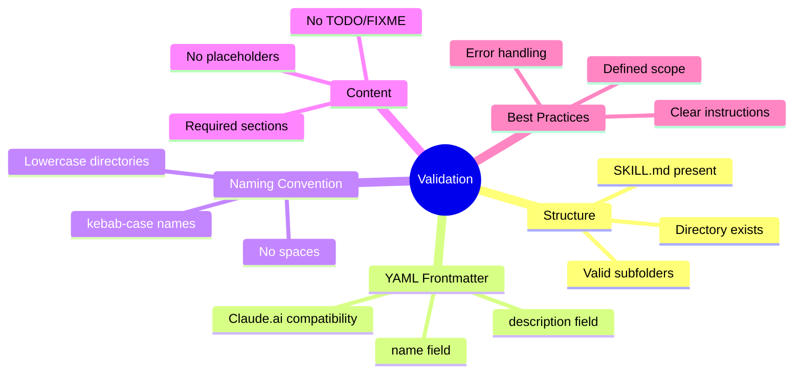

### YAML Frontmatter Requirements

#### Required Fields

| Field | Requirement | Example |
|-------|-------------|---------|
| `name` | Must be present, kebab-case | `skill-name` |
| `description` | Must be present, single-line | `Auto-triggers when...` |

#### Claude.ai Compatibility (Critical)

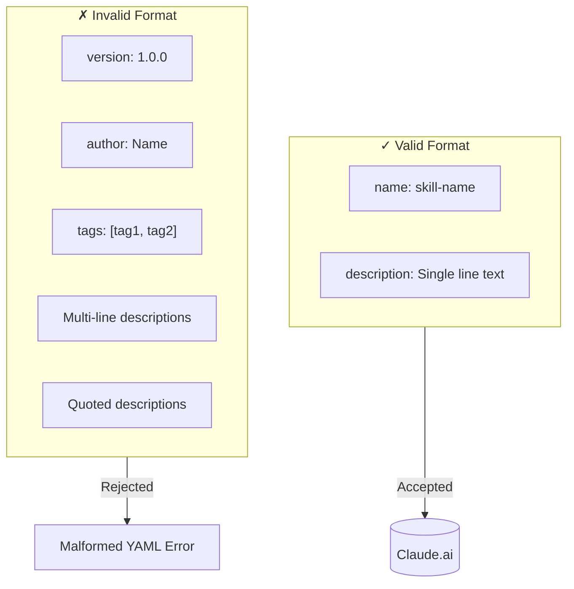

**Official Format:**
```yaml
---
name: skill-name
description: Single line description without quotes. Keywords include keyword1, keyword2. Phrases include phrase1, phrase2. Context is when to use this skill. DOES NOT trigger for exclusion cases.
---
```

**Rejected Format:**
```yaml
---
name: skill-name
description: "Quoted description"
version: 1.0.0
author: AuthorName
tags: [tag1, tag2]
---
```

### Validation Levels

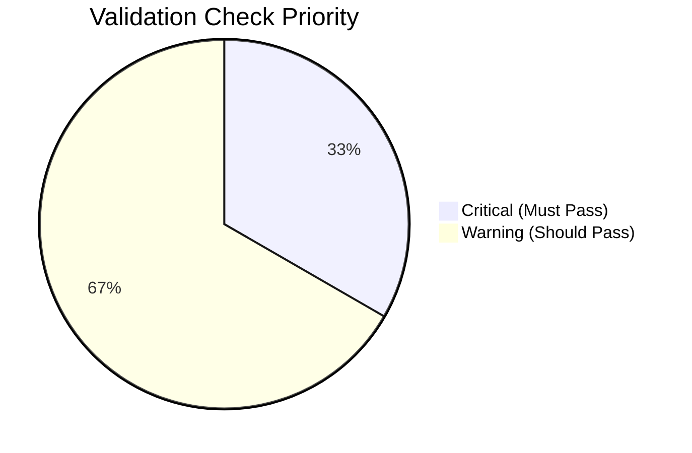

| Level | Checks | Behavior |
|-------|--------|----------|
| **Critical** | SKILL.md exists, Valid YAML, name present, description present, No placeholders | Must pass for skill to be valid |
| **Warning** | kebab-case naming, Optional YAML fields, Section completeness, Best practices | Should pass but skill can function |

### Validation Report Format

```json
{
  "skill_name": "example-skill",
  "validation_timestamp": "ISO-8601-timestamp",
  "overall_status": "pass|fail|warning",
  "summary": {
    "total_checks": 15,
    "passed": 12,
    "failed": 1,
    "warnings": 2
  },
  "results": [
    {
      "category": "yaml_frontmatter",
      "check": "name_field_present",
      "status": "pass",
      "message": "name field found: 'example-skill'"
    }
  ],
  "recommendations": [
    "Consider adding an 'Error Handling' section"
  ]
}
```

---

## Best Practices

### Core Principles

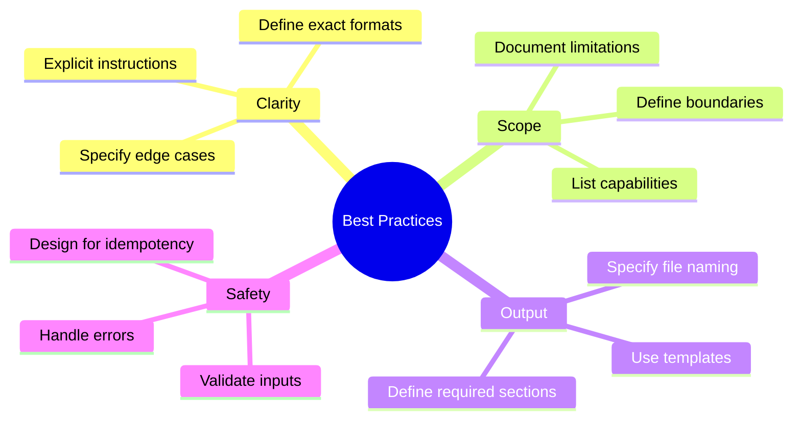

### Skill Structure Template

```markdown
---
name: skill-name
description: Precise description that controls when this skill activates
---

# Skill Title

Brief description of what this skill does.

## Mission

Clear statement of the skill's purpose.

## Input Protocol

### Required Input
- Item 1
- Item 2

### Optional Input
- Item 3

## Workflow

1. Step 1
2. Step 2
3. Step 3

## Output Format

Description of expected output.

## Error Handling

How errors are handled.

## Quality Checklist

- [ ] Checklist item 1
- [ ] Checklist item 2
```

### Description Writing Guidelines

The `description` field controls auto-activation:

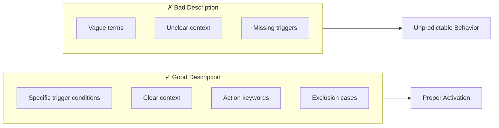

**Example:**
```yaml
# Good
description: AUTO-TRIGGERS when user provides ANY company URL for marketing analysis. Keywords include brand dna, brand voice. Phrases include analyze this website. Context is first phase of marketing campaign. DOES NOT trigger for general web scraping.

# Bad
description: Helps with brand stuff.
```

### Error Handling Pattern

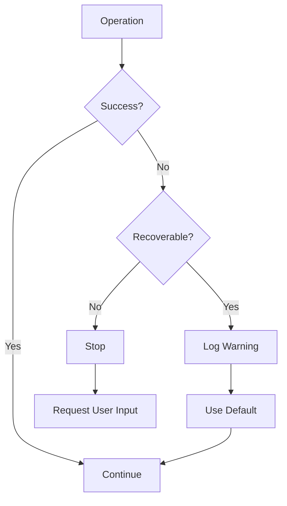

---

## Getting Started

### How to Use This Foundation

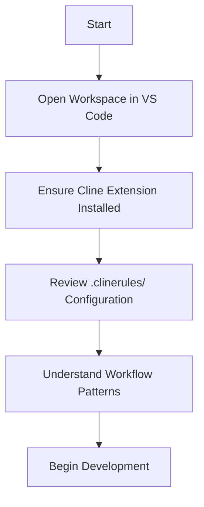

### Creating a New Skill

1. **Initiate Request**: Describe the skill you want to create
2. **Review Plan**: Cline will present a detailed plan in PLAN MODE
3. **Confirm**: Reply "YES" to approve the plan
4. **Toggle to ACT MODE**: Switch modes to execute
5. **Validate**: Review validation results
6. **Iterate**: Make adjustments if needed

### Workflow Commands

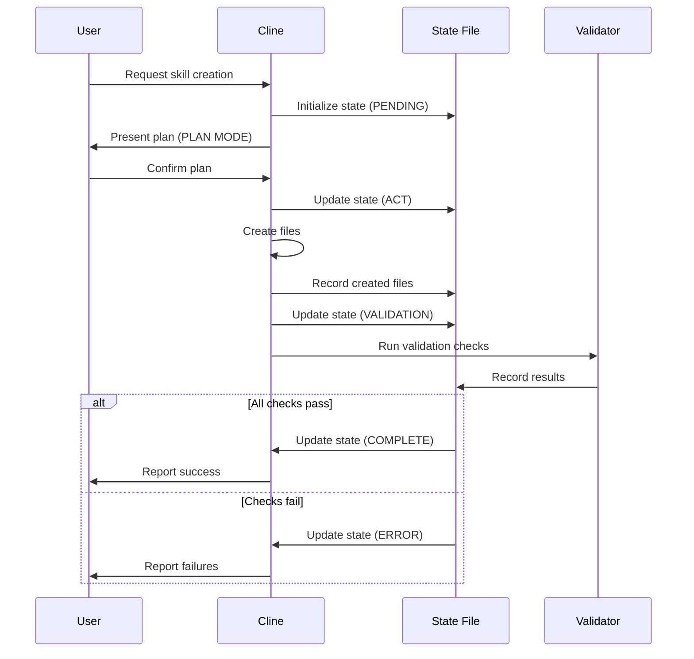

### File Location Rules

| Type | Location |
|------|----------|
| Configuration | `.clinerules/` |
| Documentation | `docs/` |
| MCP Servers | `mcp-servers/` |
| Workflow State | `.clinerules/workflows/workflow_state.json` |

---

## Quick Reference

### Workflow Phases

| Phase | Purpose | User Action Required |
|-------|---------|---------------------|
| PENDING | Initialized | None |
| PLAN | Requirements gathering | Review & confirm |
| ACT | Execute plan | None (auto) |
| VALIDATION | Quality checks | None (auto) |
| COMPLETE | Finished | None |
| ERROR | Failed | Retry or cancel |

### Status Codes

| Status | Description |
|--------|-------------|
| `pending` | Waiting to start |
| `in_progress` | Currently executing |
| `complete` | Successfully finished |
| `error` | Failed with errors |
| `cancelled` | User cancelled |

### Validation Checklist

- [ ] SKILL.md exists
- [ ] Valid YAML frontmatter
- [ ] `name` field present (kebab-case)
- [ ] `description` field present (single-line)
- [ ] No placeholder text (`{{...}}`)
- [ ] No TODO/FIXME comments
- [ ] Directory names use kebab-case

---

## References

- [Anthropic Claude Documentation](https://docs.anthropic.com/claude/docs)
- [Cline Skills Documentation](https://docs.cline.bot/customization/skills)
- [Prompt Engineering Guide](https://docs.anthropic.com/claude/docs/prompt-engineering)
- [Mermaid Documentation](https://mermaid.js.org/)

---

*Part of Cline Foundation Documentation*