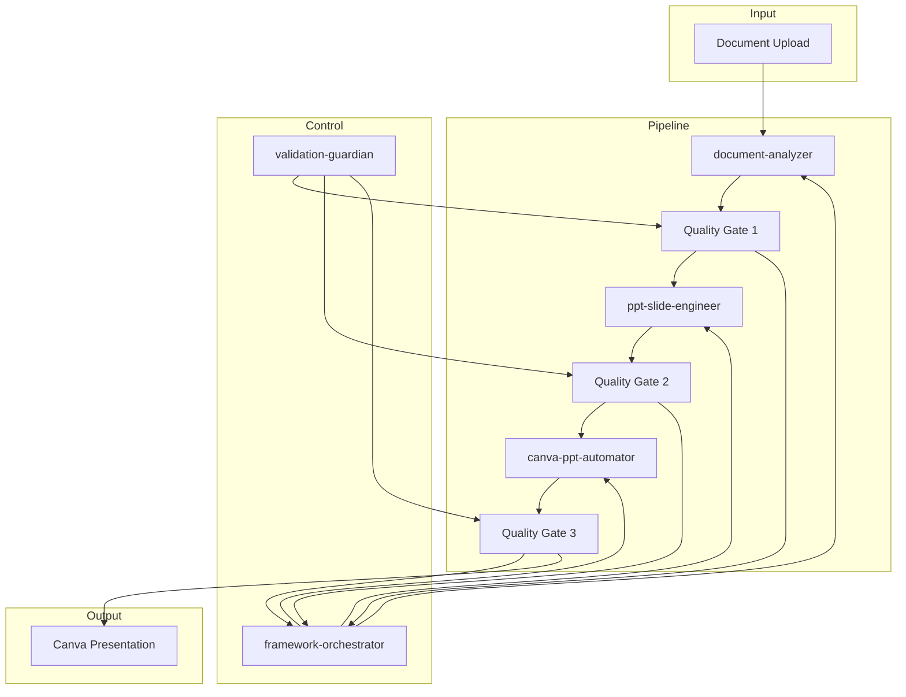
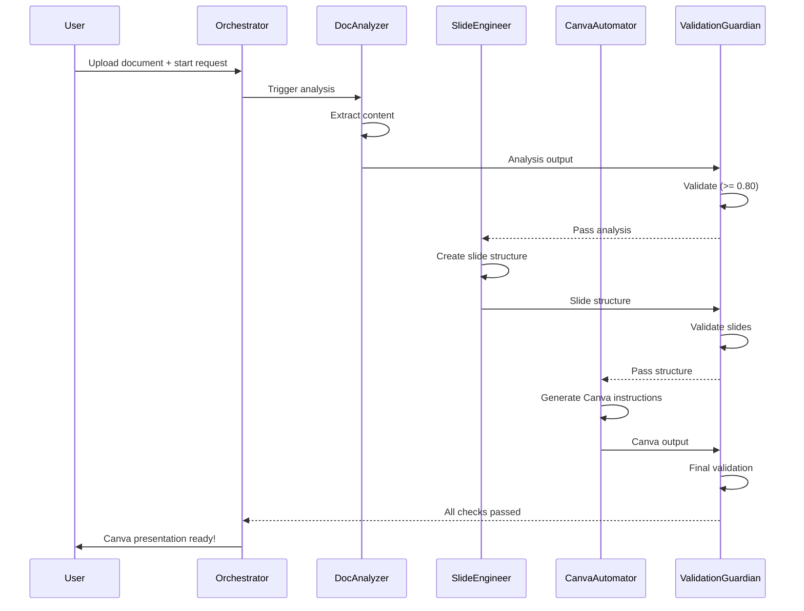

# Claude Canva PPT Framework

> Complete documentation for the document-to-Canva-PPT framework that transforms any document into a professional presentation in under 10 minutes.

---

## Table of Contents

1. [Framework Overview](#framework-overview)
2. [Architecture](#architecture)
3. [Skill Reference](#skill-reference)
4. [Workflow](#workflow)
5. [Claude.ai Integration](#claudeai-integration)
6. [Project Instructions Template](#project-instructions-template)
7. [Validation](#validation)
8. [Next Steps](#next-steps)

---

## Framework Overview

### Purpose

Transform any document (PDF, DOCX, TXT, MD) into a professional Canva presentation through a coordinated 5-skill pipeline.

### Target Audience
- Claude.ai users (Computer Use, Custom Skills, Project Instructions)
- AI assistants and automation tools
- Business professionals creating presentations
- Content creators converting documents to slides

### Key Features
- **End-to-End Pipeline**: Document upload → Canva implementation
- **5 Coordinated Skills**: Each with specific responsibility
- **Quality Gates**: Validation at every phase transition
- **Under 10 Minutes**: Complete workflow from document to presentation
- **Claude.ai Compatible**: Works with Computer Use, Custom Skills, and Project Instructions

- **State Management**: Persistent workflow state via `workflow_state.json`

---

## Architecture

### Folder Structure

```
claude-canva-ppt-framework/
├── README.md                          ← Quick start guide
├── CLINE-PPT-CANVA-FRAMEWORK.md  ← This file
├── workflow_state.json              ← Workflow state
│
├── document-analyzer/              ← SKILL 1
│   ├── SKILL.md
│   ├── templates/document-analysis-schema.json
│   └── references/content-extraction-patterns.md
│
├── ppt-slide-engineer/               ← SKILL 2
│   ├── SKILL.md
│   ├── templates/slide-structure-template.json
│   └── references/slide-design-principles.md
│
├── canva-ppt-automator/             ← SKILL 3
│   ├── SKILL.md
│   ├── scripts/canva-automation-helper.js
│   └── templates/canva-brand-config.json
│
├── framework-orchestrator/          ← SKILL 4
│   ├── SKILL.md
│   └── scripts/workflow-coordinator.py
│
├── validation-guardian/            ← SKILL 5
│   ├── SKILL.md
│   └── scripts/validate-output.py
│
└── Validations/
    └── framework-validation-report.md
```

### Architecture Diagram



---

## Skill Reference

### Skills Summary

| Skill | Name | Purpose | Trigger |
|------|------|---------|--------|
| 1 | `document-analyzer` | Extract and structure document content | Document upload for PPT conversion |
| 2 | `ppt-slide-engineer` | Create professional slide structure | Analysis output from document-analyzer |
| 3 | `canva-ppt-automator` | Generate Canva implementation instructions | Slide structure from ppt-slide-engineer |
| 4 | `framework-orchestrator` | Coordinate entire pipeline workflow | Full workflow request |
| 5 | `validation-guardian` | Quality validation at each phase | Phase completion events |

### Skill Details

#### 1. document-analyzer
| Property | Value |
|----------|-------|
| **Name** | `document-analyzer` |
| **Description** | AUTO-TRIGGERS when user uploads ANY document for PPT conversion |
| **Keywords** | analyze document, extract content, document structure, parse file |
| **Phrases** | turn this into slides, convert this document, make a presentation from |
| **Context** | First step of Canva PPT workflow after document upload |
| **Exclusions** | image-only files, audio files, non-document formats |

#### 2. ppt-slide-engineer
| Property | Value |
|----------|-------|
| **Name** | `ppt-slide-engineer` |
| **Description** | AUTO-TRIGGERS when document analysis is complete and slide creation is needed |
| **Keywords** | slide structure, slide outline, presentation flow, slide content |
| **Phrases** | create slides from analysis, build presentation structure, design slide deck |
| **Context** | Second step of Canva PPT workflow after document-analyzer completes |
| **Exclusions** | raw document analysis, final Canva output, non-slide tasks |

#### 3. canva-ppt-automator
| Property | Value |
|----------|-------|
| **Name** | `canva-ppt-automator` |
| **Description** | AUTO-TRIGGERS when slide structure is ready for Canva implementation |
| **Keywords** | canva, canva ppt, canva presentation, canva design, automate canva |
| **Phrases** | create in canva, build canva presentation, make canva slides, implement in canva |
| **Context** | Third step of Canva PPT workflow after ppt-slide-engineer completes |
| **Exclusions** | slide structure creation, document analysis, non-Canva platforms |

#### 4. framework-orchestrator
| Property | Value |
|----------|-------|
| **Name** | `framework-orchestrator` |
| **Description** | AUTO-TRIGGERS when user requests complete document-to-PPT conversion |
| **Keywords** | full workflow, complete conversion, end to end, orchestrate, coordinate |
| **Phrases** | convert entire document to canva, run full ppt workflow, start complete conversion |
| **Context** | Master controller for the entire claude-canva-ppt-framework |
| **Exclusions** | individual skill execution, partial workflows, non-framework tasks |

#### 5. validation-guardian
| Property | Value |
|----------|-------|
| **Name** | `validation-guardian` |
| **Description** | AUTO-TRIGGERS when any workflow phase completes and quality validation is needed |
| **Keywords** | validate, quality check, verify output, review quality |
| **Phrases** | validate the output, check quality, verify completion |
| **Context** | Quality gatekeeper that runs after each skill completion |
| **Exclusions** | skill execution, content creation, non-validation tasks |

---

## Workflow
### Pipeline Flowchart
```mermaid
flowchart LR
    START([Start]) --> DOC[/Upload Document]
    DOC --> INIT{Initialize Workflow}
    INIT --> ANALYZ[document-analyzer<br/>Extract Content]
    ANALYZ --> VG1{Validation Gate 1<br/>Confidence >= 0.80?}
    VG1 -- No --> FAIL[Failed]
    VG1 -- Yes --> SLIDE[ppt-slide-engineer<br/>Create Slides]
    SLIDE --> VG2{Validation Gate 2<br/>Slides Valid?}
    VG2 -- No --> FAIL
    VG2 -- Yes --> CANVA[canva-ppt-automator<br/>Generate Instructions]
    CANVA --> VG3{Validation Gate 3<br/>Instructions Complete?}
    VG3 -- No --> FAIL
    VG3 -- Yes --> COMPLETE[Complete]
    COMPLETE --> END([Canva Presentation Ready])
```

### Phase Descriptions
| Phase | Duration | Description |
|-------|----------|-------------|
| **Initialization** | 30 sec | Set up workflow state, validate input |
| **Document Analysis** | 2 min | Extract content, identify structure, map to slides |
| **Slide Engineering** | 2 min | Create slide structure, optimize content, add visual specs |
| **Canva Automation** | 2 min | Generate Canva instructions, configure layouts, set up exports |
| **Validation** | 30 sec | Quality checks at each phase transition |
| **Total** | ~7 min | Complete workflow from document to Canva-ready presentation |

### Skill Chaining


---

## Claude.ai Integration
### Integration Methods
| Method | Description | Best For |
|--------|-------------|---------|
| **Computer Use** | Claude controls browser to interact with Canva | Full automation with browser access |
| **Custom Skills** | Upload skills to Claude.ai for automatic activation | Reusable skills across projects |
| **Project Instructions** | Add framework to Claude Project settings | Project-specific automation |
| **Master Prompt** | Include framework in system prompt | One-time setup |

### Method 1: Computer Use
1. Enable Computer Use in Claude.ai settings
2. Claude can interact with Canva directly through browser control
3. Best for full automation when browser access is available

### Method 2: Custom Skills
1. Navigate to Claude.ai → Settings → Skills
2. Upload each SKILL.md file as a custom skill
3. Skills will auto-trigger based on keywords and phrases

### Method 3: Project Instructions
Add to Claude Project settings:
```
When the user uploads a document and requests a presentation or slide conversion, use the claude-canva-ppt-framework to transform the document into a professional Canva presentation.

Follow the workflow in CLINE-PPT-CANVA-FRAMEWORK.md to coordinate the 5 skills.
```

---

## Project Instructions Template
Copy and paste into your Claude Project Instructions:
```markdown
# Claude Canva PPT Framework Integration

You are operating with the claude-canva-ppt-framework, a coordinated 5-skill system that transforms documents into Canva presentations.

## Activation Triggers
- User uploads a document (PDF, DOCX, TXT, MD)
- User mentions: "presentation", "slides", "convert to Canva"
- User requests document-to-presentation conversion

## Workflow
1. **document-analyzer**: Extracts and structures document content
2. **ppt-slide-engineer**: Creates professional slide structure
3. **canva-ppt-automator**: Generates Canva implementation instructions
4. **framework-orchestrator**: Coordinates the entire pipeline
5. **validation-guardian**: Validates quality at each phase

## Usage
When user uploads a document:
1. Trigger framework-orchestrator for full workflow
2. Or trigger document-analyzer for individual analysis
3. Follow the pipeline through all 5 skills
4. Provide Canva implementation instructions to user

## Output
- Complete Canva implementation guide
- Step-by-step creation instructions
- Slide structure with visual specifications
- Export configurations (PDF, PPTX, link)
```

---

## Validation
### Quality Gates
| Gate | Phase | Threshold | Checks |
|------|-------|-----------|--------|
| **Gate 1** | After Analysis | Confidence >= 0.80 | Content extraction, structure identification |
| **Gate 2** | After Slide Engineering | All slides valid | Slide titles, bullet counts, visual specs |
| **Gate 3** | After Canva Automation | Instructions complete | Layout mapping, color validation, export config |

### Validation Checks
| Category | Checks | Severity |
|----------|--------|----------|
| **Structure** | SKILL.md exists, valid JSON, required fields | Critical |
| **Content** | No placeholders, no TODOs, sections complete | Critical |
| **Quality** | Confidence scores, bullet limits, title presence | Warning |

---

## Next Steps
### Getting Started
1. **Review the framework** - Read through this documentation
2. **Choose integration method** - Computer Use, Custom Skills, or Project Instructions
3. **Upload to Claude.ai** - Add skills or configure project
4. **Test with a document** - Upload a sample document
5. **Verify output** - Check Canva implementation instructions

### Advanced Usage
- **Custom Brand Guidelines**: Provide brand colors, fonts, logo specs
- **Template Selection**: Specify Canva template ID to use
- **Export Preferences**: Configure PDF, PPTX, or link output
- **Slide Count Control**: Set target slide count for presentations

### Support
- **Framework Documentation**: This file
- **Validation Report**: `Validations/framework-validation-report.md`
- **Individual Skills**: See SKILL.md in each skill folder

---

## Appendix
### File Inventory
| File | Type | Purpose |
|------|------|---------|
| `README.md` | Documentation | Quick start guide |
| `CLINE-PPT-CANVA-FRAMEWORK.md` | Documentation | This comprehensive guide |
| `workflow_state.json` | State | Workflow state management |
| `document-analyzer/SKILL.md` | Skill | Document analysis skill |
| `ppt-slide-engineer/SKILL.md` | Skill | Slide engineering skill |
| `canva-ppt-automator/SKILL.md` | Skill | Canva automation skill |
| `framework-orchestrator/SKILL.md` | Skill | Orchestration skill |
| `validation-guardian/SKILL.md` | Skill | Validation skill |

### Timing Summary
| Phase | Skill | Duration |
|-------|-------|----------|
| 1 | Initialization | 30 sec |
| 2 | Document Analysis | 2 min |
| 3 | Slide Engineering | 2 min |
| 4 | Canva Automation | 2 min |
| 5 | Validation | 30 sec |
| **Total** | **Complete Workflow** | **~7 min** |

---

*Claude Canva PPT Framework - Production Ready*