# Marketing Campaign System Framework Documentation

> **Comprehensive Guide to the Multi-Agent AI Marketing Campaign Framework**

---

## Table of Contents

1. [Framework Overview](#1-framework-overview)
2. [Architecture & Design](#2-architecture--design)
3. [Complete Folder Structure](#3-complete-folder-structure)
4. [Skills Reference](#4-skills-reference)
5. [Workflow Chaining Sequence](#5-workflow-chaining-sequence)
6. [Deliverables Summary](#6-deliverables-summary)
7. [Claude.ai Integration Guide](#7-claudeai-integration-guide)
8. [Ready-to-Use Templates](#8-ready-to-use-templates)
9. [Error Handling & Recovery](#9-error-handling--recovery)
10. [Next Steps for Users](#10-next-steps-for-users)
11. [Quick Reference](#11-quick-reference)

---

## 1. Framework Overview

### Purpose

The **Marketing Campaign System** is a production-ready multi-agent AI framework designed to automate the entire marketing campaign creation process—from initial brand analysis through final content delivery.

### Mission Statement

> Transform any company URL into a complete, professional marketing campaign with research documents, strategic plans, and SEO-optimized content—all generated automatically by specialized AI agents working in coordination.

### Core Value Proposition

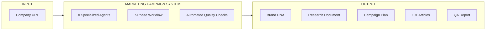

### Target Users

| User Type | Use Case |
|-----------|----------|
| **Marketing Teams** | Rapid campaign development and content production |
| **Marketing Agencies** | Scalable client campaign generation |
| **Small Business Owners** | DIY marketing without agency costs |
| **Content Strategists** | Research-backed content planning |
| **AI Developers** | Multi-agent system reference implementation |

### Key Features

| Feature | Description |
|---------|-------------|
| **Automated Brand Analysis** | Extracts voice, tone, and positioning from any website |
| **Comprehensive Research** | Competitor analysis, market sizing, industry trends |
| **Strategic Planning** | Positioning, messaging, and channel strategies |
| **Tactical Execution** | 90-day campaign plans with content calendars |
| **Content Generation** | SEO-optimized articles in brand voice |
| **Quality Assurance** | Automated validation of all deliverables |
| **State Management** | Trackable progress across all phases |

---

## 2. Architecture & Design

### System Architecture

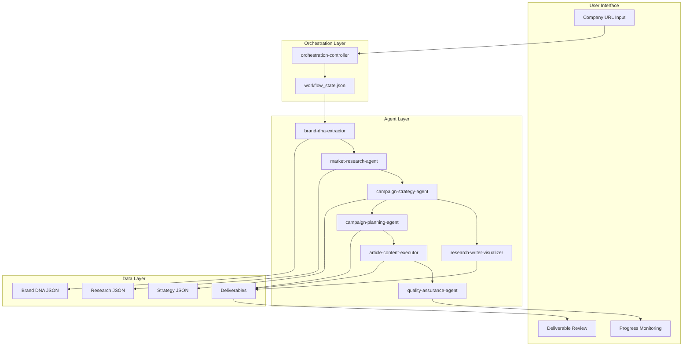

### Multi-Agent Coordination Model

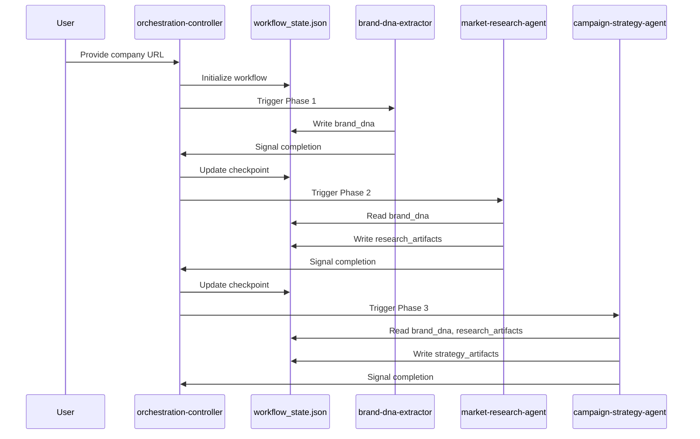

### State Management Approach

The framework uses a centralized state file (`workflow_state.json`) to:

1. **Track Progress**: Monitor current phase and completion percentage
2. **Store Artifacts**: Persist all extracted and generated data
3. **Enable Recovery**: Resume from any checkpoint on failure
4. **Validate Transitions**: Ensure phase prerequisites are met

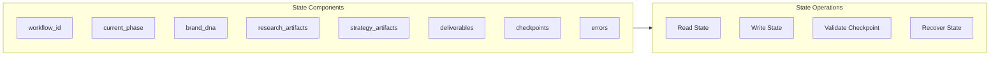

---

## 3. Complete Folder Structure

### Directory Tree

```
marketing-campaign-system/
│
├── README.md                                    # Entry point & quick start
├── MARKETING-CAMPAIGN-SYSTEM-FRAMEWORK.md       # This comprehensive guide
│
├── article-content-executor/                    # Phase 6: Content generation
│   └── SKILL.md                                 # Skill definition
│
├── brand-dna-extractor/                         # Phase 1: Brand extraction
│   └── SKILL.md                                 # Skill definition
│
├── campaign-planning-agent/                     # Phase 5: Tactical planning
│   ├── SKILL.md                                 # Skill definition
│   └── scripts/
│       └── create_campaign_plan.py              # Campaign plan generator
│
├── campaign-strategy-agent/                     # Phase 3: Strategy development
│   ├── SKILL.md                                 # Skill definition
│   └── references/
│       └── strategy-frameworks.md               # Strategy methodology reference
│
├── market-research-agent/                       # Phase 2: Market research
│   ├── SKILL.md                                 # Skill definition
│   └── references/
│       └── research-frameworks.md               # Research methodology reference
│
├── orchestration/                               # Workflow coordination
│   ├── orchestration-workflow.md                # Workflow phase definitions
│   └── workflow_state.json                      # Central state file
│
├── orchestration-controller/                    # Central coordinator
│   ├── SKILL.md                                 # Skill definition
│   └── scripts/
│       └── phase_validator.py                   # Phase validation script
│
├── quality-assurance-agent/                     # Phase 7: Quality validation
│   ├── SKILL.md                                 # Skill definition
│   └── scripts/
│       └── run_qa_checks.py                     # QA validation script
│
└── research-writer-visualizer/                  # Phase 4: Document creation
    ├── SKILL.md                                 # Skill definition
    └── scripts/
        └── create_visualizations.js             # Visualization generator
```

### Folder Structure Diagram

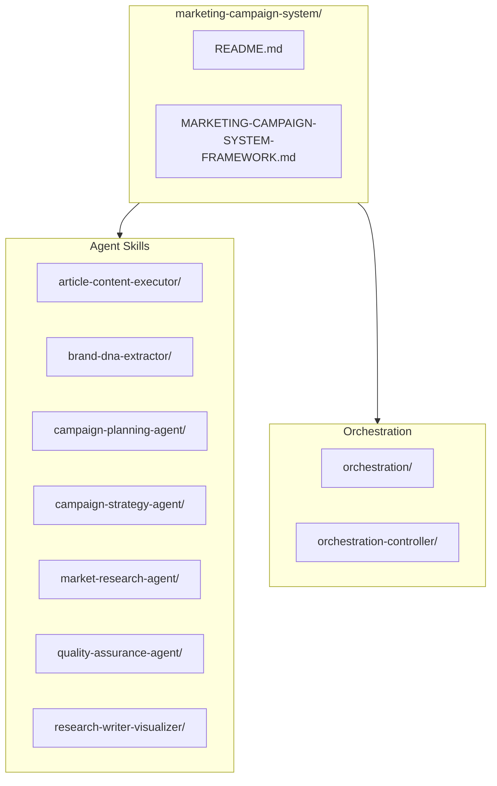

### File Descriptions

| File/Folder | Type | Purpose |
|-------------|------|---------|
| `README.md` | Documentation | Entry point with quick start guide |
| `MARKETING-CAMPAIGN-SYSTEM-FRAMEWORK.md` | Documentation | Comprehensive framework guide |
| `*/SKILL.md` | Skill Definition | Agent instructions and schemas |
| `*/scripts/` | Automation | Python/JavaScript helper scripts |
| `*/references/` | Reference | Methodology and framework docs |
| `orchestration/` | State | Workflow definitions and state |
| `workflow_state.json` | State | Central state management file |

---

## 4. Skills Reference

### Skills Overview Table

| Skill Name | Phase | Primary Function | Auto-Trigger Condition |
|------------|-------|------------------|------------------------|
| `brand-dna-extractor` | 1 | Extract brand identity | Company URL provided |
| `market-research-agent` | 2 | Conduct market research | Brand DNA complete |
| `campaign-strategy-agent` | 3 | Develop campaign strategy | Research complete |
| `research-writer-visualizer` | 4 | Create research document | Strategy complete |
| `campaign-planning-agent` | 5 | Generate tactical plan | Strategy complete |
| `article-content-executor` | 6 | Generate article content | Campaign plan complete |
| `quality-assurance-agent` | 7 | Validate deliverables | Articles complete |
| `orchestration-controller` | All | Coordinate workflow | Multi-phase coordination |

---

### Skill 1: brand-dna-extractor

#### YAML Frontmatter

```yaml
---
name: brand-dna-extractor
description: AUTO-TRIGGERS when user provides ANY company URL for marketing analysis. Keywords include brand dna, brand voice, brand identity, tone analysis, company positioning. Phrases include analyze this website, extract brand from, understand this company brand. Context is first phase of ANY marketing campaign workflow after initialization. DOES NOT trigger for general web scraping, competitor analysis (use market-research-agent), or non-brand tasks.
---
```

#### Activation Details

| Component | Values |
|-----------|--------|
| **Keywords** | brand dna, brand voice, brand identity, tone analysis, company positioning |
| **Phrases** | analyze this website, extract brand from, understand this company brand |
| **Context** | First phase of marketing campaign workflow |
| **Exclusions** | General web scraping, competitor analysis, non-brand tasks |

#### Mission

Transform a company website URL into a comprehensive Brand DNA profile capturing brand voice, tone characteristics, positioning, target audience signals, and competitive differentiators.

#### Input Requirements

| Input | Source | Required |
|-------|--------|----------|
| `company_url` | workflow_state.json | Yes |
| `current_phase` | workflow_state.json | Must be "brand_extraction" or "initialization" |

#### Output Schema

```json
{
  "brand_dna": {
    "company_info": {
      "name": "Company Name",
      "tagline": "Company tagline",
      "industry": "Industry"
    },
    "voice_and_tone": {
      "primary_tone": "professional|casual|friendly|authoritative",
      "formality_level": 0.7,
      "emotional_temperature": 0.5,
      "do_keywords": ["innovative", "reliable"],
      "dont_keywords": ["cheap", "basic"],
      "sentence_style": "concise|detailed",
      "voice_characteristics": ["warm", "expert"]
    },
    "positioning": {
      "value_proposition": "Clear value statement",
      "unique_differentiators": ["Differentiator 1", "Differentiator 2"],
      "competitive_advantages": ["Advantage 1", "Advantage 2"]
    },
    "target_audience": {
      "primary_audience": {
        "demographics": {},
        "psychographics": {}
      },
      "pain_points": ["Pain 1", "Pain 2"],
      "goals": ["Goal 1", "Goal 2"]
    }
  }
}
```

#### Quality Checklist

- [ ] At least 5 pages analyzed
- [ ] Primary tone identified
- [ ] Value proposition extracted
- [ ] Target audience defined
- [ ] Confidence score >= 0.7

---

### Skill 2: market-research-agent

#### YAML Frontmatter

```yaml
---
name: market-research-agent
description: AUTO-TRIGGERS when brand DNA is complete and market research is needed. Keywords include market research, competitor analysis, industry analysis, market size, competitive landscape. Phrases include research market, analyze competitors, industry analysis, market assessment. Context is second phase of marketing campaign workflow after brand extraction. DOES NOT trigger for brand analysis, strategy development, or content creation.
---
```

#### Activation Details

| Component | Values |
|-----------|--------|
| **Keywords** | market research, competitor analysis, industry analysis, market size, competitive landscape |
| **Phrases** | research market, analyze competitors, industry analysis, market assessment |
| **Context** | Second phase of marketing campaign workflow |
| **Exclusions** | Brand analysis, strategy development, content creation |

#### Mission

Deliver actionable market intelligence through systematic research covering competitive landscape, industry trends, market sizing, and audience insights.

#### Input Requirements

| Input | Source | Required |
|-------|--------|----------|
| `brand_dna.company_info` | workflow_state.json | Yes |
| `current_phase` | workflow_state.json | Must be "market_research" |

#### Output Schema

```json
{
  "research_artifacts": {
    "competitor_analysis": {
      "competitors": [
        {
          "name": "Competitor Name",
          "strengths": [],
          "weaknesses": [],
          "positioning": ""
        }
      ],
      "positioning_map": {},
      "gap_analysis": []
    },
    "industry_trends": {
      "emerging_trends": [],
      "market_drivers": [],
      "challenges": []
    },
    "market_sizing": {
      "tam": 0,
      "sam": 0,
      "som": 0,
      "growth_rate": 0
    },
    "audience_insights": {
      "personas": [],
      "pain_points": [],
      "decision_criteria": []
    }
  }
}
```

#### Quality Checklist

- [ ] 5-10 competitors analyzed
- [ ] Industry trends identified
- [ ] Market sizing complete
- [ ] Audience personas defined
- [ ] workflow_state.json updated

---

### Skill 3: campaign-strategy-agent

#### YAML Frontmatter

```yaml
---
name: campaign-strategy-agent
description: AUTO-TRIGGERS when market research is complete and campaign strategy is needed. Keywords include campaign strategy, marketing strategy, strategic plan, positioning strategy, content strategy. Phrases include develop campaign strategy, create marketing strategy, define positioning, build content strategy. Context is third phase of marketing campaign workflow after market research. DOES NOT trigger for market research, content creation, or campaign planning.
---
```

#### Activation Details

| Component | Values |
|-----------|--------|
| **Keywords** | campaign strategy, marketing strategy, strategic plan, positioning strategy, content strategy |
| **Phrases** | develop campaign strategy, create marketing strategy, define positioning, build content strategy |
| **Context** | Third phase of marketing campaign workflow |
| **Exclusions** | Market research, content creation, campaign planning |

#### Mission

Transform market research insights into actionable campaign strategy with clear positioning, messaging frameworks, content pillars, and channel recommendations.

#### Input Requirements

| Input | Source | Required |
|-------|--------|----------|
| `brand_dna` | workflow_state.json | Yes |
| `research_artifacts` | workflow_state.json | Yes |
| `current_phase` | workflow_state.json | Must be "strategy_development" |

#### Output Schema

```json
{
  "strategy_artifacts": {
    "positioning": {
      "statement": "Positioning statement",
      "differentiators": [],
      "competitive_advantage": ""
    },
    "messaging": {
      "primary_message": "",
      "supporting_messages": [],
      "tone_guidelines": {}
    },
    "content_themes": {
      "pillars": [],
      "topics_per_pillar": {}
    },
    "channel_strategy": {
      "primary_channels": [],
      "secondary_channels": [],
      "tactics": {}
    },
    "kpi_targets": {
      "primary_kpis": [],
      "secondary_kpis": []
    }
  }
}
```

#### Quality Checklist

- [ ] Positioning statement defined
- [ ] Messaging framework complete
- [ ] 3-5 content pillars identified
- [ ] Channel strategy documented
- [ ] KPIs established
- [ ] workflow_state.json updated

---

### Skill 4: research-writer-visualizer

#### YAML Frontmatter

```yaml
---
name: research-writer-visualizer
description: AUTO-TRIGGERS when campaign strategy is complete and research document is needed. Keywords include research document, market research report, create document, visualizations, data presentation. Phrases include write research document, create market report, generate visualizations, build research report. Context is fourth phase of marketing campaign workflow after strategy development. DOES NOT trigger for strategy development, content creation, or article writing.
---
```

#### Activation Details

| Component | Values |
|-----------|--------|
| **Keywords** | research document, market research report, create document, visualizations, data presentation |
| **Phrases** | write research document, create market report, generate visualizations, build research report |
| **Context** | Fourth phase of marketing campaign workflow |
| **Exclusions** | Strategy development, content creation, article writing |

#### Mission

Transform research artifacts and strategy into a comprehensive, professionally formatted research document with charts, graphs, and visual data representations suitable for stakeholder presentation.

#### Input Requirements

| Input | Source | Required |
|-------|--------|----------|
| `brand_dna` | workflow_state.json | Yes |
| `research_artifacts` | workflow_state.json | Yes |
| `strategy_artifacts` | workflow_state.json | Yes |
| `current_phase` | workflow_state.json | Must be "research_writing" |

#### Output Schema

```json
{
  "deliverables": {
    "research_document_path": "/path/to/Market_Research_Document.docx",
    "document_metadata": {
      "page_count": 32,
      "word_count": 8500,
      "visualizations": 6,
      "sections": 9
    }
  }
}
```

#### Document Structure

| Section | Pages | Content |
|---------|-------|---------|
| Cover Page | 1 | Title, branding |
| Executive Summary | 2-3 | Key findings |
| Market Overview | 4-6 | Size, segmentation |
| Competitive Analysis | 5-7 | Competitor profiles |
| Industry Trends | 3-5 | Emerging patterns |
| Target Audience | 4-6 | Personas, journey |
| Recommendations | 3-5 | Strategic advice |
| Appendix | 2-4 | Sources, methodology |

#### Quality Checklist

- [ ] 25-40 pages generated
- [ ] All sections complete
- [ ] 5+ visualizations included
- [ ] Brand tone applied
- [ ] Data sources cited
- [ ] workflow_state.json updated

---

### Skill 5: campaign-planning-agent

#### YAML Frontmatter

```yaml
---
name: campaign-planning-agent
description: AUTO-TRIGGERS when campaign strategy is complete and tactical planning is needed. Keywords include campaign plan, content calendar, editorial plan, marketing calendar, tactical plan. Phrases include create campaign plan, build content calendar, develop editorial schedule, plan marketing activities. Context is fifth phase of marketing campaign workflow after strategy development. DOES NOT trigger for strategy development, research, or content creation.
---
```

#### Activation Details

| Component | Values |
|-----------|--------|
| **Keywords** | campaign plan, content calendar, editorial plan, marketing calendar, tactical plan |
| **Phrases** | create campaign plan, build content calendar, develop editorial schedule, plan marketing activities |
| **Context** | Fifth phase of marketing campaign workflow |
| **Exclusions** | Strategy development, research, content creation |

#### Mission

Transform campaign strategy into actionable tactical plans with detailed timelines, content calendars, resource allocation, and budget distribution across 90-day campaign cycles.

#### Input Requirements

| Input | Source | Required |
|-------|--------|----------|
| `strategy_artifacts` | workflow_state.json | Yes |
| `brand_dna` | workflow_state.json | Yes |
| `current_phase` | workflow_state.json | Must be "campaign_planning" |

#### Output Schema

```json
{
  "deliverables": {
    "campaign_plan_path": "/path/to/Campaign_Plan.xlsx",
    "plan_metadata": {
      "total_articles": 10,
      "total_social_posts": 45,
      "total_emails": 12,
      "campaign_duration_days": 90,
      "total_budget": 50000
    }
  }
}
```

#### Excel Workbook Structure (8 Sheets)

| Sheet | Purpose | Contents |
|-------|---------|----------|
| Overview | Executive summary | Goals, KPIs, budget summary |
| Timeline | 90-day schedule | Phases, milestones, deadlines |
| Content Calendar | Editorial plan | Articles, social, email dates |
| Channel Mix | Distribution | Platform allocation, frequency |
| Budget | Financial plan | Allocations, contingencies |
| Resources | Team assignments | Roles, responsibilities, hours |
| KPIs | Success metrics | Targets, tracking methods |
| Risk Register | Risk management | Risks, mitigations, owners |

#### Quality Checklist

- [ ] All 8 sheets complete
- [ ] 90-day timeline populated
- [ ] Budget balanced
- [ ] Resources assigned
- [ ] KPIs defined
- [ ] workflow_state.json updated

---

### Skill 6: article-content-executor

#### YAML Frontmatter

```yaml
---
name: article-content-executor
description: AUTO-TRIGGERS when campaign plan is complete and article content is needed. Keywords include write articles, create content, blog posts, generate articles. Phrases include generate article content, write blog posts, create content pieces. Context is sixth phase of marketing campaign workflow after campaign planning. DOES NOT trigger for campaign planning, strategy development, or research.
---
```

#### Activation Details

| Component | Values |
|-----------|--------|
| **Keywords** | write articles, create content, blog posts, generate articles |
| **Phrases** | generate article content, write blog posts, create content pieces |
| **Context** | Sixth phase of marketing campaign workflow |
| **Exclusions** | Campaign planning, strategy development, research |

#### Mission

Create high-quality, SEO-optimized article content that aligns with brand voice, content themes, and campaign strategy. Each article includes proper frontmatter, internal linking, and calls-to-action.

#### Input Requirements

| Input | Source | Required |
|-------|--------|----------|
| `brand_dna.voice_and_tone` | workflow_state.json | Yes |
| `strategy_artifacts.content_themes` | workflow_state.json | Yes |
| `deliverables.campaign_plan_path` | workflow_state.json | Yes |
| `current_phase` | workflow_state.json | Must be "article_execution" |

#### Article Structure

```markdown
---
title: "Article Title"
description: "Meta description (150-160 chars)"
author: "Author Name"
date: "2024-01-15"
category: "Category Name"
tags: ["tag1", "tag2", "tag3"]
keywords: ["primary keyword", "secondary keyword"]
reading_time: "5 min read"
featured_image: "/images/article-slug.jpg"
cta: "primary|secondary|none"
internal_links:
  - "/related-article-1"
  - "/related-article-2"
---

# Article Title

## Introduction (100-150 words)
- Hook
- Problem statement
- Article preview

## Main Content (3-5 H2 sections)
- H3 subsections
- Bullet points
- Statistics/data
- Examples

## Conclusion (100-150 words)
- Summary
- Key takeaways
- CTA
```

#### Output Schema

```json
{
  "deliverables": {
    "article_paths": [
      "/path/to/articles/article-1.md",
      "/path/to/articles/article-2.md"
    ],
    "article_metadata": {
      "total_articles": 10,
      "total_words": 15000,
      "avg_words_per_article": 1500,
      "categories_covered": 5,
      "internal_links_created": 25
    }
  }
}
```

#### Quality Standards

| Metric | Target |
|--------|--------|
| Word Count | 1,200-2,000 words |
| Reading Level | 8th grade (Flesch-Kincaid) |
| Flesch Reading Ease | 60-70 |
| Sentence Length | 15-20 words avg |
| Paragraph Length | 3-5 sentences |
| Subheadings | 4-6 per article |

#### Quality Checklist

- [ ] 10+ articles generated
- [ ] All frontmatter complete
- [ ] Brand tone applied
- [ ] SEO optimized
- [ ] Internal links included
- [ ] CTAs placed
- [ ] Word count met
- [ ] Readability checked
- [ ] workflow_state.json updated

---

### Skill 7: quality-assurance-agent

#### YAML Frontmatter

```yaml
---
name: quality-assurance-agent
description: AUTO-TRIGGERS when article content is complete and quality review is needed. Keywords include quality check, QA review, validate content, content audit, quality assurance. Phrases include check quality, review content, validate articles, run QA. Context is final phase of marketing campaign workflow after content execution. DOES NOT trigger for content creation, strategy development, or planning.
---
```

#### Activation Details

| Component | Values |
|-----------|--------|
| **Keywords** | quality check, QA review, validate content, content audit, quality assurance |
| **Phrases** | check quality, review content, validate articles, run QA |
| **Context** | Final phase of marketing campaign workflow |
| **Exclusions** | Content creation, strategy development, planning |

#### Mission

Ensure all campaign deliverables meet quality standards, brand compliance, SEO requirements, and consistency guidelines before final delivery.

#### Input Requirements

| Input | Source | Required |
|-------|--------|----------|
| `deliverables.article_paths` | workflow_state.json | Yes |
| `deliverables.research_document_path` | workflow_state.json | Yes |
| `deliverables.campaign_plan_path` | workflow_state.json | Yes |
| `current_phase` | workflow_state.json | Must be "quality_assurance" |

#### Quality Check Categories

| Category | Checks | Threshold |
|----------|--------|-----------|
| Brand Voice | Tone consistency, keyword compliance | 90% match |
| SEO Quality | Meta descriptions, titles, readability | 85% score |
| Content Quality | Word count, structure, completeness | 95% pass |
| Deliverables | File validity, format compliance | 100% pass |

#### Output Schema

```json
{
  "quality_reports": {
    "brand_voice": {
      "status": "pass|fail|warning",
      "score": 0.92,
      "issues": []
    },
    "seo_quality": {
      "status": "pass",
      "score": 0.88,
      "issues": []
    },
    "content_quality": {
      "status": "pass",
      "score": 0.95,
      "articles_reviewed": 10
    },
    "overall": {
      "status": "pass",
      "total_score": 0.91,
      "ready_for_delivery": true
    }
  }
}
```

#### Quality Checklist

- [ ] Brand voice validated
- [ ] SEO checks passed
- [ ] Content quality verified
- [ ] Deliverables validated
- [ ] Issues documented
- [ ] workflow_state.json updated

---

### Skill 8: orchestration-controller

#### YAML Frontmatter

```yaml
---
name: orchestration-controller
description: AUTO-TRIGGERS when multi-agent campaign workflow needs coordination. Keywords include orchestration, workflow control, agent coordination, phase management, workflow controller. Phrases include coordinate workflow, manage campaign phases, orchestrate agents, control workflow state. Context is central controller for entire marketing campaign system. DOES NOT trigger for individual agent tasks, research, or content creation.
---
```

#### Activation Details

| Component | Values |
|-----------|--------|
| **Keywords** | orchestration, workflow control, agent coordination, phase management, workflow controller |
| **Phrases** | coordinate workflow, manage campaign phases, orchestrate agents, control workflow state |
| **Context** | Central controller for entire marketing campaign system |
| **Exclusions** | Individual agent tasks, research, content creation |

#### Mission

Orchestrate the entire marketing campaign workflow by managing state, validating phase transitions, coordinating agent execution, and ensuring deliverable quality across all phases.

#### Input Requirements

| Input | Source | Required |
|-------|--------|----------|
| `company_url` | workflow_state.json | Yes |
| `current_phase` | workflow_state.json | Yes |

#### Workflow Phase Management

| Phase | Agent | Trigger Condition |
|-------|-------|-------------------|
| 1. Initialization | orchestration-controller | User provides company URL |
| 2. Brand Extraction | brand-dna-extractor | Phase 1 complete |
| 3. Market Research | market-research-agent | Phase 2 complete |
| 4. Strategy Development | campaign-strategy-agent | Phase 3 complete |
| 5. Campaign Planning | campaign-planning-agent | Phase 4 complete |
| 6. Research Writing | research-writer-visualizer | Phase 4 complete |
| 7. Article Execution | article-content-executor | Phase 5 complete |
| 8. Quality Assurance | quality-assurance-agent | Phase 7 complete |

#### Quality Checklist

- [ ] Workflow state initialized
- [ ] Phase transitions validated
- [ ] Agent handoffs coordinated
- [ ] Error handling active
- [ ] Progress tracked

---

## 5. Workflow Chaining Sequence

### 7-Phase Workflow Flowchart

```mermaid
flowchart LR
    subgraph Phase1["Phase 1"]
        P1[brand-dna-extractor]
    end
    
    subgraph Phase2["Phase 2"]
        P2[market-research-agent]
    end
    
    subgraph Phase3["Phase 3"]
        P3[campaign-strategy-agent]
    end
    
    subgraph Phase4["Phase 4"]
        P4[research-writer-visualizer]
    end
    
    subgraph Phase5["Phase 5"]
        P5[campaign-planning-agent]
    end
    
    subgraph Phase6["Phase 6"]
        P6[article-content-executor]
    end
    
    subgraph Phase7["Phase 7"]
        P7[quality-assurance-agent]
    end
    
    P1 -->|brand_dna_complete| P2
    P2 -->|research_complete| P3
    P3 -->|strategy_complete| P4
    P3 -->|strategy_complete| P5
    P5 -->|campaign_plan_complete| P6
    P6 -->|articles_complete| P7
    P7 -->|qa_passed| DELIVERY[Final Delivery]
    
    style P1 fill:#e3f2fd
    style P2 fill:#e8f5e9
    style P3 fill:#fff3e0
    style P4 fill:#fce4ec
    style P5 fill:#f3e5f5
    style P6 fill:#e0f7fa
    style P7 fill:#fff8e1
    style DELIVERY fill:#c8e6c9
```

### Phase Transition Diagram

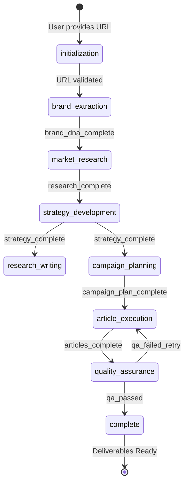

### Checkpoint System

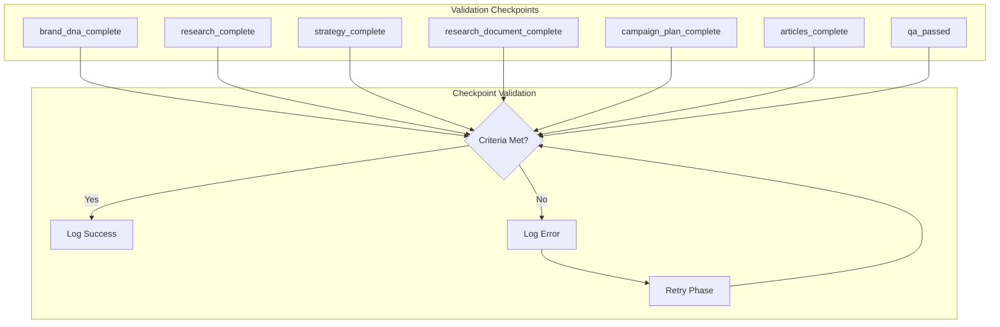

### Checkpoint Validation Criteria

| Checkpoint | Required Criteria |
|------------|-------------------|
| `brand_dna_complete` | Company info populated, Voice and tone defined, At least 3 core values, Value proposition present |
| `research_complete` | Market overview complete, At least 3 competitors analyzed, Industry trends identified, Sources documented |
| `strategy_complete` | Positioning strategy defined, Channel strategy complete, Content themes established, KPIs set |
| `research_document_complete` | 25-40 pages generated, 5+ visualizations included, All sections complete, Brand tone applied |
| `campaign_plan_complete` | All 8 sheets generated, Timeline complete, Budget allocated, Content calendar populated |
| `articles_complete` | 10+ articles generated, All frontmatter complete, SEO optimized, Brand voice consistent |
| `qa_passed` | Brand voice validated, SEO checks passed, Content quality verified, All deliverables present |

---

## 6. Deliverables Summary

### Output Files Overview

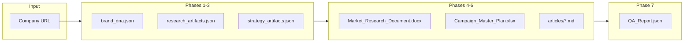

### Deliverables Table

| Phase | Deliverable | Format | Location | Validation |
|-------|-------------|--------|----------|------------|
| 1 | Brand DNA Profile | JSON | workflow_state.json | 5+ pages analyzed, tone identified |
| 2 | Research Artifacts | JSON | workflow_state.json | 5-10 competitors, trends identified |
| 3 | Strategy Document | JSON | workflow_state.json | Positioning defined, KPIs set |
| 4 | Research Document | DOCX | /deliverables/ | 25-40 pages, 5+ visualizations |
| 5 | Campaign Plan | XLSX | /deliverables/ | 8 sheets, 90-day timeline |
| 6 | Articles | MD | /deliverables/articles/ | 10+ articles, SEO optimized |
| 7 | QA Report | JSON | workflow_state.json | All checks passed |

### Quality Standards by Deliverable

| Deliverable | Quality Metrics |
|-------------|-----------------|
| **Brand DNA** | Confidence score >= 0.7, All required fields populated |
| **Research Document** | 25-40 pages, 5+ visualizations, All sections complete |
| **Campaign Plan** | 8 sheets complete, Budget balanced, Resources assigned |
| **Articles** | 1,200-2,000 words each, Flesch Reading Ease 60-70, SEO optimized |
| **QA Report** | Brand voice >= 90%, SEO >= 85%, Content >= 95% |

---

## 7. Claude.ai Integration Guide

### Integration Methods Overview

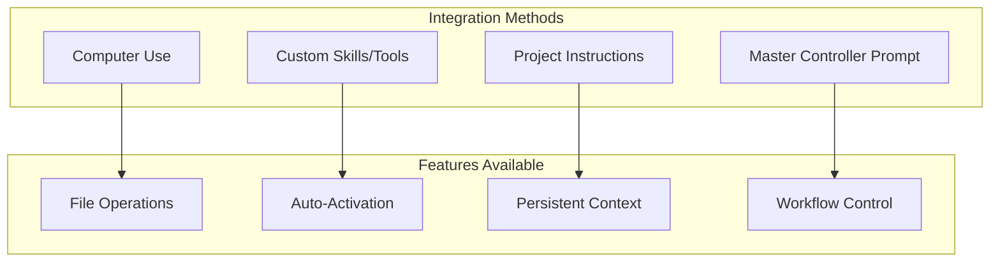

### Method 1: Computer Use

**Best For**: Automated file operations and script execution

**Setup Steps**:

1. Enable Computer Use in Claude.ai settings
2. Grant file system access to campaign directory
3. Load framework files into context

**Capabilities**:
- Read/write files automatically
- Execute Python/JavaScript scripts
- Manage workflow_state.json
- Generate deliverables directly

### Method 2: Custom Skills/Tools

**Best For**: Reusable skill activation across projects

**Setup Steps**:

1. Navigate to Claude.ai Settings → Skills
2. Create new Skill for each agent
3. Copy SKILL.md content (YAML frontmatter + instructions)
4. Configure activation triggers

**Skill Configuration Format**:

```yaml
---
name: brand-dna-extractor
description: AUTO-TRIGGERS when user provides ANY company URL for marketing analysis. Keywords include brand dna, brand voice, brand identity, tone analysis, company positioning. Phrases include analyze this website, extract brand from, understand this company brand. Context is first phase of ANY marketing campaign workflow after initialization. DOES NOT trigger for general web scraping, competitor analysis, or non-brand tasks.
---
```

### Method 3: Project Instructions

**Best For**: Persistent context across conversations

**Setup Steps**:

1. Create new Claude.ai Project
2. Add framework documentation to Project Knowledge
3. Configure Project Instructions (see template below)
4. Start conversations within the project

**Advantages**:
- Framework always in context
- No need to reload skills
- Conversation history preserved
- Multiple campaign support

### Method 4: Master Controller Prompt

**Best For**: Single-conversation workflow control

**Setup Steps**:

1. Start new Claude conversation
2. Paste Master Controller Prompt
3. Provide company URL
4. Watch automated workflow

---

## 8. Ready-to-Use Templates

### Project Instructions Template

Copy and paste this into Claude.ai Project Instructions:

```markdown
# Marketing Campaign System - Project Instructions

## Framework Location
This project uses the Marketing Campaign System framework.

## Active Framework Path
claude-skill-framework/marketing-campaign-system/

## Workflow Protocol

### Phase Sequence
1. **Brand Extraction** - Extract brand DNA from company URL
2. **Market Research** - Conduct competitor and industry analysis
3. **Strategy Development** - Create positioning and messaging
4. **Research Writing** - Generate research document with visualizations
5. **Campaign Planning** - Build 90-day tactical plan
6. **Article Execution** - Generate 10+ SEO-optimized articles
7. **Quality Assurance** - Validate all deliverables

### State Management
- Track progress in workflow_state.json
- Validate checkpoints before phase transitions
- Log errors with recovery actions

### Deliverable Standards
- Brand DNA: Confidence score >= 0.7
- Research Document: 25-40 pages, 5+ visualizations
- Campaign Plan: 8 sheets, 90-day timeline
- Articles: 1,200-2,000 words, SEO optimized
- QA Report: All checks passed

### Available Skills

| Skill | Trigger | Phase |
|-------|---------|-------|
| brand-dna-extractor | Company URL provided | 1 |
| market-research-agent | Brand DNA complete | 2 |
| campaign-strategy-agent | Research complete | 3 |
| research-writer-visualizer | Strategy complete | 4 |
| campaign-planning-agent | Strategy complete | 5 |
| article-content-executor | Plan complete | 6 |
| quality-assurance-agent | Articles complete | 7 |
| orchestration-controller | Multi-phase coordination | All |

### Usage Instructions

To start a new campaign:
1. Provide company URL
2. Specify target market (optional)
3. Define campaign objectives (optional)
4. System will auto-activate appropriate skills

Example prompt:
"Analyze https://example.com for a marketing campaign targeting small business owners with lead generation objectives."
```

### Master Controller Prompt

Copy and paste this to start a complete campaign:

```markdown
# Marketing Campaign System - Master Controller

You are operating as the Marketing Campaign System Controller.

## Framework Context
You have access to a multi-agent marketing campaign framework with 8 specialized skills:

1. brand-dna-extractor - Extracts brand identity from URLs
2. market-research-agent - Conducts market research
3. campaign-strategy-agent - Develops campaign strategy
4. research-writer-visualizer - Creates research documents
5. campaign-planning-agent - Generates tactical plans
6. article-content-executor - Produces SEO articles
7. quality-assurance-agent - Validates deliverables
8. orchestration-controller - Coordinates workflow

## Your Mission

When provided with a company URL, execute the complete 7-phase workflow:

### Phase 1: Brand DNA Extraction
- Analyze company website (homepage, about, products, blog)
- Extract voice, tone, positioning, target audience
- Output: brand_dna object

### Phase 2: Market Research
- Analyze 5-10 competitors
- Identify industry trends
- Calculate market sizing (TAM/SAM/SOM)
- Output: research_artifacts object

### Phase 3: Strategy Development
- Define positioning statement
- Create messaging framework
- Establish content pillars
- Set KPIs
- Output: strategy_artifacts object

### Phase 4: Research Document
- Generate 25-40 page document
- Include 5+ visualizations
- Apply brand tone
- Output: Market_Research_Document.docx

### Phase 5: Campaign Planning
- Create 8-sheet Excel workbook
- Build 90-day timeline
- Allocate budget
- Output: Campaign_Master_Plan.xlsx

### Phase 6: Article Content
- Generate 10+ SEO-optimized articles
- Apply brand voice
- Include proper frontmatter
- Output: articles/*.md

### Phase 7: Quality Assurance
- Validate brand voice (90%+ match)
- Check SEO quality (85%+ score)
- Verify content quality (95%+ pass)
- Output: QA_Report.json

## Execution Protocol

1. Await company URL input
2. Confirm campaign parameters
3. Execute phases sequentially
4. Validate checkpoints between phases
5. Report progress after each phase
6. Deliver final package on completion

## Error Handling

If any phase fails:
1. Log error details
2. Attempt recovery (max 3 retries)
3. Request user input if unrecoverable

Ready to begin. Please provide:
- Company URL
- Target market (optional)
- Campaign objectives (optional)
```

---

## 9. Error Handling & Recovery

### Error Codes Reference

| Code | Phase | Description | Recovery Action |
|------|-------|-------------|-----------------|
| E001 | Brand DNA | URL fetch failed | Try alternative URLs |
| E002 | Research | Insufficient data | Expand search parameters |
| E003 | Strategy | Low confidence | Re-run with adjusted inputs |
| E004 | Document | Generation failed | Regenerate failed sections |
| E005 | Planning | Resource conflict | Adjust timeline/budget |
| E006 | Content | Quality threshold not met | Rewrite failed articles |
| E007 | QA | Validation failed | Fix identified issues |

### Error Recovery Flow

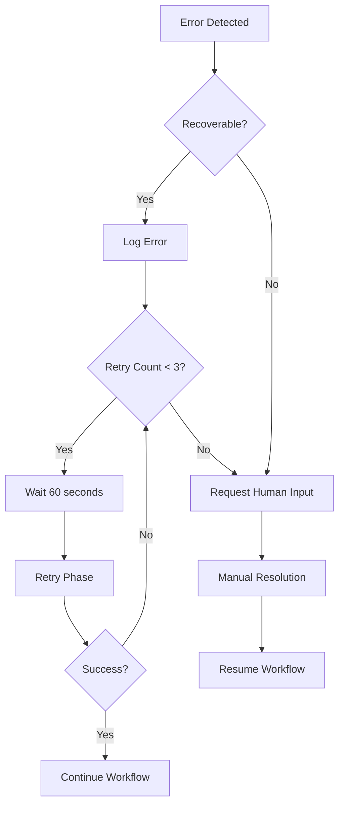

### Retry Logic

```
MAX_RETRIES = 3
RETRY_DELAY = 60  # seconds

on_error:
1. Log error to workflow_state.errors
2. Increment retry_count
3. If retry_count < MAX_RETRIES:
   - Wait RETRY_DELAY
   - Retry current phase
4. Else:
   - Mark workflow as failed
   - Request human intervention
```

### Recovery Commands

| Command | Purpose |
|---------|---------|
| `retry` | Retry current phase |
| `rollback --checkpoint <name>` | Return to previous checkpoint |
| `skip --phase <name>` | Skip failed phase (with warning) |
| `status` | Display current workflow state |

---

## 10. Next Steps for Users

### Getting Started Checklist

- [ ] Review this documentation completely
- [ ] Choose integration method (Project Instructions recommended)
- [ ] Set up Claude.ai Project with framework
- [ ] Prepare company URL for analysis
- [ ] Define target market and objectives
- [ ] Start first campaign

### Best Practices

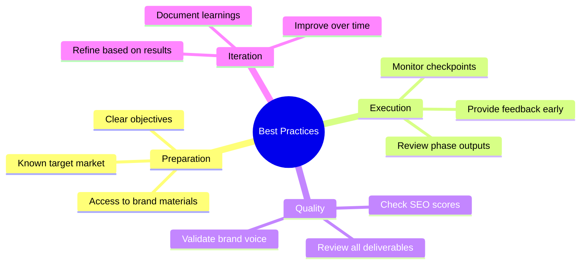

### Troubleshooting Guide

| Issue | Possible Cause | Solution |
|-------|----------------|----------|
| Skill not activating | Trigger not matched | Use explicit keywords from description |
| Low confidence score | Insufficient website content | Provide additional brand materials |
| Phase validation failed | Missing required fields | Check output schema compliance |
| Content quality issues | Brand tone mismatch | Review brand_dna.voice_and_tone |
| Slow execution | Complex website | Allow more processing time |

### Advanced Usage

#### Custom Brand Guidelines

Provide additional brand context:

```
Additional brand guidelines:
- Avoid technical jargon
- Emphasize customer success stories
- Use conversational, friendly tone
- Include industry-specific terminology
```

#### Multi-Campaign Management

Run multiple campaigns in parallel:

1. Create separate workflow_state.json per campaign
2. Use unique workflow_id for each
3. Track progress independently

#### Integration with External Tools

Export deliverables to:
- Google Drive (via API)
- Notion (via API)
- Content Management Systems
- Marketing Automation Platforms

---

## 11. Quick Reference

### Skills Cheat Sheet

| Skill | Keywords | Phase | Output |
|-------|----------|-------|--------|
| `brand-dna-extractor` | brand dna, brand voice, tone | 1 | brand_dna.json |
| `market-research-agent` | market research, competitors | 2 | research_artifacts.json |
| `campaign-strategy-agent` | campaign strategy, positioning | 3 | strategy_artifacts.json |
| `research-writer-visualizer` | research document, visualizations | 4 | .docx |
| `campaign-planning-agent` | campaign plan, content calendar | 5 | .xlsx |
| `article-content-executor` | write articles, create content | 6 | .md files |
| `quality-assurance-agent` | quality check, QA review | 7 | qa_report.json |
| `orchestration-controller` | orchestration, workflow control | All | workflow_state.json |

### Workflow Phases Summary

| Phase | Agent | Checkpoint | Key Deliverable |
|-------|-------|------------|-----------------|
| 1 | brand-dna-extractor | brand_dna_complete | Brand DNA Profile |
| 2 | market-research-agent | research_complete | Research Artifacts |
| 3 | campaign-strategy-agent | strategy_complete | Strategy Document |
| 4 | research-writer-visualizer | research_document_complete | Research Document (DOCX) |
| 5 | campaign-planning-agent | campaign_plan_complete | Campaign Plan (XLSX) |
| 6 | article-content-executor | articles_complete | 10+ Articles (MD) |
| 7 | quality-assurance-agent | qa_passed | QA Report |

### Command Reference

| Command | Description |
|---------|-------------|
| `init --company "Name" --url "URL"` | Initialize new campaign |
| `run-all` | Execute complete workflow |
| `run --phase <name>` | Run specific phase |
| `status` | Display current status |
| `validate --checkpoint <name>` | Validate checkpoint |
| `retry` | Retry current phase |
| `rollback --checkpoint <name>` | Rollback to checkpoint |

### File Locations

| File | Path |
|------|------|
| State File | `orchestration/workflow_state.json` |
| Workflow Definition | `orchestration/orchestration-workflow.md` |
| Brand DNA | `workflow_state.json → brand_dna` |
| Research | `workflow_state.json → research_artifacts` |
| Strategy | `workflow_state.json → strategy_artifacts` |
| Deliverables | `/deliverables/` |

---

## Appendix: State Schema Reference

### workflow_state.json Complete Schema

```json
{
  "workflow_id": "campaign-${timestamp}",
  "version": "1.0.0",
  "created_at": "ISO-8601-timestamp",
  "updated_at": "ISO-8601-timestamp",
  
  "status": {
    "current_phase": "initialization",
    "overall_status": "in_progress",
    "completion_percentage": 0,
    "ready_for_delivery": false
  },
  
  "campaign_parameters": {
    "company_name": null,
    "website_url": null,
    "industry": null,
    "target_market": null,
    "campaign_objectives": [],
    "campaign_duration_months": 12,
    "budget_range": null,
    "primary_channels": [],
    "content_requirements": {
      "article_count": 10,
      "word_count_range": "1200-2000"
    }
  },
  
  "brand_dna": { },
  "research_artifacts": { },
  "strategy_artifacts": { },
  "deliverables": { },
  
  "phase_history": [ ],
  "checkpoints": { },
  "errors": [ ],
  
  "metadata": {
    "framework_version": "1.0.0",
    "total_phases": 7,
    "estimated_duration_hours": null,
    "actual_duration_hours": null,
    "last_agent_used": null,
    "retry_count": 0
  }
}
```

---

*Part of Marketing Campaign System Framework*

*Version 1.0.0*