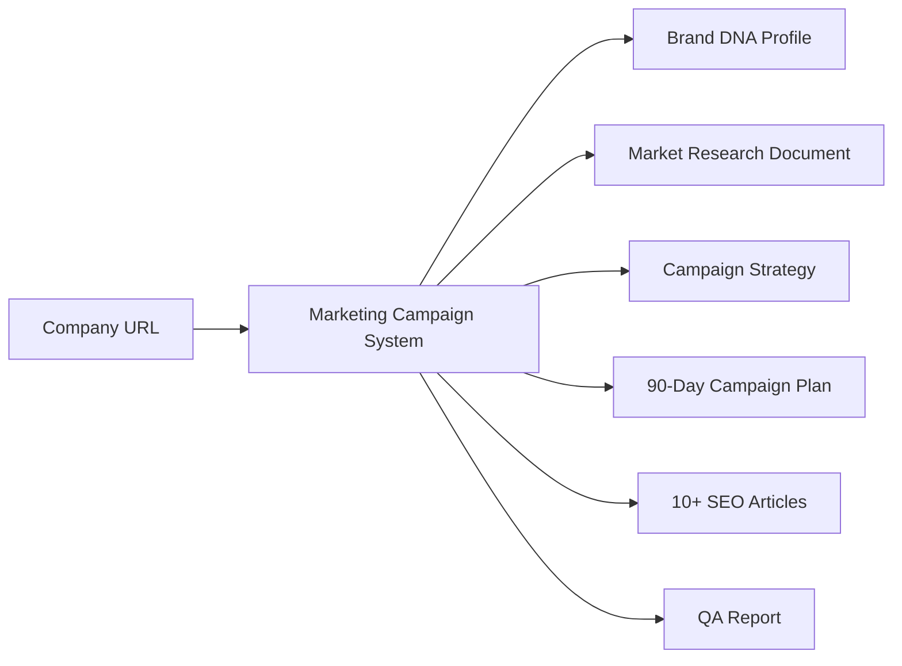
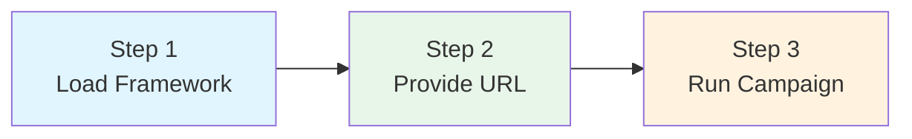
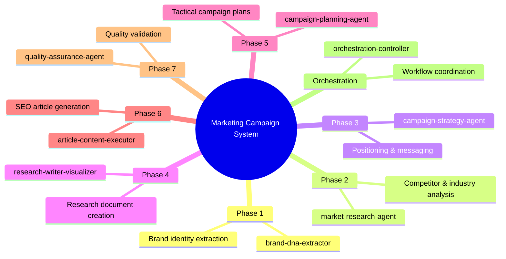

# Marketing Campaign System Framework

> **Multi-Agent AI Framework for End-to-End Marketing Campaign Generation**

---

## Overview

The **Marketing Campaign System** is a comprehensive multi-agent AI framework that transforms a single company URL into a complete, production-ready marketing campaign—including research documents, campaign plans, and SEO-optimized content.

### What This Framework Does



### Key Capabilities

| Capability | Description |
|------------|-------------|
| **Brand Extraction** | Analyzes company websites to extract voice, tone, and positioning |
| **Market Research** | Conducts competitor analysis, industry trends, and market sizing |
| **Strategy Development** | Creates positioning, messaging, and channel strategies |
| **Campaign Planning** | Generates 90-day tactical plans with content calendars |
| **Content Generation** | Produces 10+ SEO-optimized articles in brand voice |
| **Quality Assurance** | Validates all deliverables against quality standards |

---

## Quick Start

### Prerequisites

- Claude.ai account (Pro recommended) or Cline extension
- Company URL to analyze
- Target market information

### 3-Step Setup



#### Step 1: Load Framework into Claude.ai

1. Open Claude.ai Settings → Projects
2. Create new Project: "Marketing Campaign"
3. Add Project Instructions from [`MARKETING-CAMPAIGN-SYSTEM-FRAMEWORK.md`](./MARKETING-CAMPAIGN-SYSTEM-FRAMEWORK.md)

#### Step 2: Provide Company URL

```
Analyze https://example-company.com for a marketing campaign.
Target market: Small business owners
Campaign objective: Lead generation
```

#### Step 3: Watch the Magic

The framework automatically:
1. Extracts brand DNA from the website
2. Conducts market research
3. Develops campaign strategy
4. Creates tactical plans
5. Generates article content
6. Runs quality assurance

---

## Framework at a Glance

### 8 Specialized Agents



### Agent Quick Reference

| Agent | Trigger | Output |
|-------|---------|--------|
| `brand-dna-extractor` | Company URL provided | Brand DNA Profile (JSON) |
| `market-research-agent` | Brand DNA complete | Research Artifacts (JSON) |
| `campaign-strategy-agent` | Research complete | Strategy Document (JSON) |
| `research-writer-visualizer` | Strategy complete | Research Document (DOCX) |
| `campaign-planning-agent` | Strategy complete | Campaign Plan (XLSX) |
| `article-content-executor` | Plan complete | 10+ Articles (MD) |
| `quality-assurance-agent` | Articles complete | QA Report (JSON) |
| `orchestration-controller` | Multi-phase coordination | Workflow State (JSON) |

---

## Folder Structure

```
marketing-campaign-system/
│
├── README.md                                    # This file
├── MARKETING-CAMPAIGN-SYSTEM-FRAMEWORK.md       # Comprehensive documentation
│
├── article-content-executor/                    # Phase 6: Content generation
│   └── SKILL.md
│
├── brand-dna-extractor/                         # Phase 1: Brand extraction
│   └── SKILL.md
│
├── campaign-planning-agent/                     # Phase 5: Tactical planning
│   ├── SKILL.md
│   └── scripts/
│       └── create_campaign_plan.py
│
├── campaign-strategy-agent/                     # Phase 3: Strategy development
│   ├── SKILL.md
│   └── references/
│       └── strategy-frameworks.md
│
├── market-research-agent/                       # Phase 2: Market research
│   ├── SKILL.md
│   └── references/
│       └── research-frameworks.md
│
├── orchestration/                               # Workflow state management
│   ├── orchestration-workflow.md
│   └── workflow_state.json
│
├── orchestration-controller/                    # Central coordinator
│   ├── SKILL.md
│   └── scripts/
│       └── phase_validator.py
│
├── quality-assurance-agent/                     # Phase 7: Quality validation
│   ├── SKILL.md
│   └── scripts/
│       └── run_qa_checks.py
│
└── research-writer-visualizer/                  # Phase 4: Document creation
    ├── SKILL.md
    └── scripts/
        └── create_visualizations.js
```

---

## Documentation Guide

| Document | Purpose |
|----------|---------|
| **[README.md](./README.md)** | Quick start and overview (this file) |
| **[MARKETING-CAMPAIGN-SYSTEM-FRAMEWORK.md](./MARKETING-CAMPAIGN-SYSTEM-FRAMEWORK.md)** | Complete framework documentation |
| **[orchestration-workflow.md](./orchestration/orchestration-workflow.md)** | Workflow phase definitions |

### Individual Skill Documentation

Each skill folder contains a `SKILL.md` with:
- Activation triggers and keywords
- Input/output schemas
- Workflow steps
- Quality checklists

---

## Integration Options

### Claude.ai Integration

| Method | Best For | Setup |
|--------|----------|-------|
| **Project Instructions** | Persistent campaigns | Add framework to Project settings |
| **Custom Skills** | Reusable across projects | Configure in Claude settings |
| **Computer Use** | Automated file operations | Enable Computer Use feature |

### Cline Integration

1. Copy framework to your workspace
2. Add `.clinerules/` configuration
3. Skills auto-activate based on context

### Standalone Usage

Use the framework as reference documentation for any AI assistant capable of following structured instructions.

---

## Deliverables Summary

Running a complete campaign workflow produces:

| Deliverable | Format | Description |
|-------------|--------|-------------|
| Brand DNA Profile | JSON | Voice, tone, positioning analysis |
| Market Research | DOCX | 25-40 page research document |
| Campaign Plan | XLSX | 8-sheet tactical workbook |
| Articles | MD | 10+ SEO-optimized articles |
| QA Report | JSON | Quality validation results |

---

## Support

- **Full Documentation**: [`MARKETING-CAMPAIGN-SYSTEM-FRAMEWORK.md`](./MARKETING-CAMPAIGN-SYSTEM-FRAMEWORK.md)
- **Workflow Details**: [`orchestration/orchestration-workflow.md`](./orchestration/orchestration-workflow.md)
- **State Schema**: [`orchestration/workflow_state.json`](./orchestration/workflow_state.json)

---

*Part of Marketing Campaign System Framework*