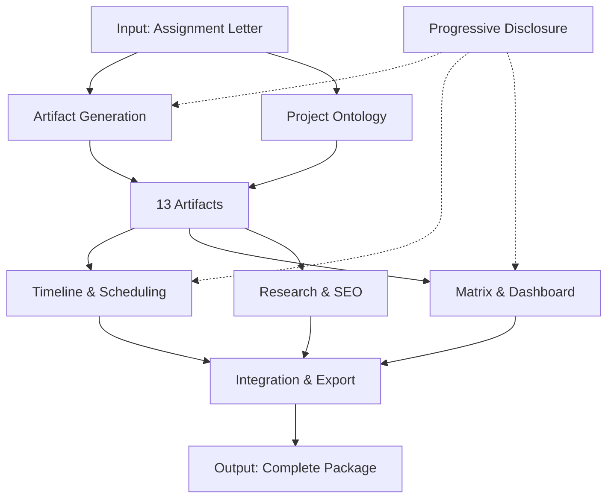
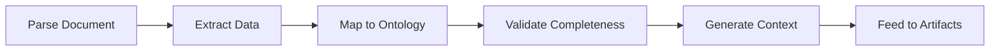
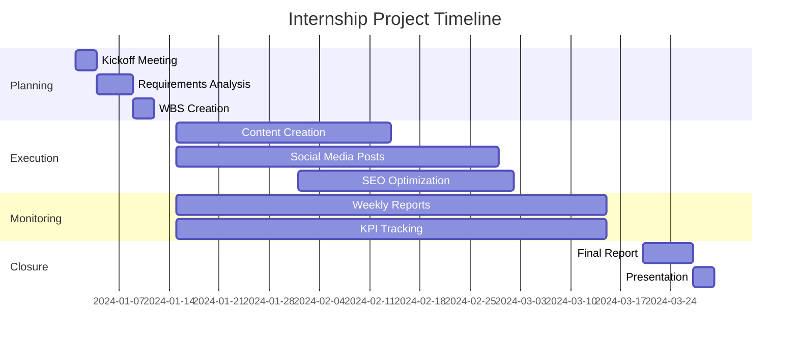
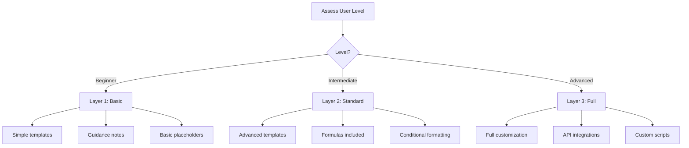
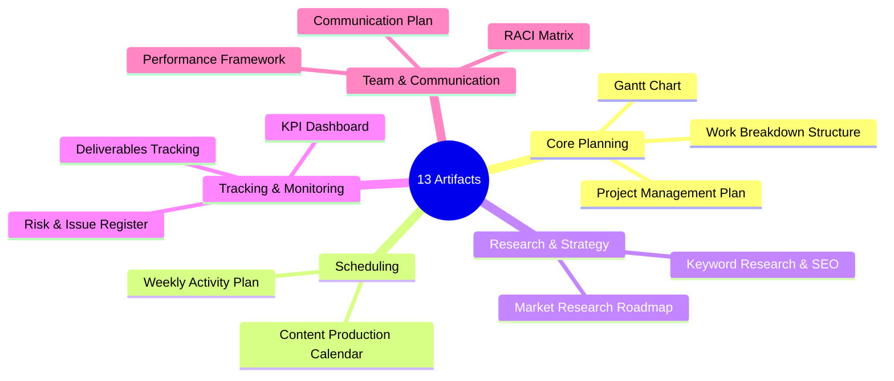
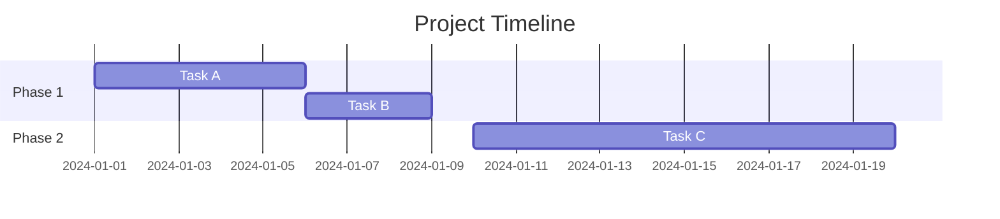
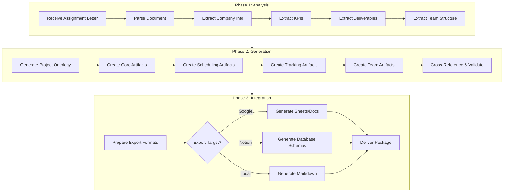

# Project-Agent Framework Documentation

> **Comprehensive Reference Guide for AI Agents**
> 
> Version 1.0 | Created: 2026-03-12 | Status: Complete

---

## Table of Contents

1. [Overview & Purpose](#1-overview--purpose)
2. [Skill Metadata](#2-skill-metadata)
3. [7 Core Micro-Skills](#3-7-core-micro-skills)
4. [Full List of 13 Artifacts](#4-full-list-of-13-artifacts)
5. [Complete Folder Structure](#5-complete-folder-structure)
6. [Core System Prompt](#6-core-system-prompt)
7. [Integration Guide](#7-integration-guide)
8. [Activation & Usage Guide](#8-activation--usage-guide)
9. [Workflow Process](#9-workflow-process)
10. [Output Examples & Templates](#10-output-examples--templates)
11. [Best Practices, Error Handling & Validation](#11-best-practices-error-handling--validation)
12. [Version History & Changelog](#12-version-history--changelog)

---

## 1. Overview & Purpose

### What is Project-Agent?

**Project-Agent** is a compound AI agent skill designed to transform internship assignment letters into comprehensive, production-ready team management planning artifacts. It automates the entire project planning process, from analyzing requirements to generating 13 complete planning documents.

### Mission Statement

> *"Automatically analyze internship assignment letters and generate 13 complete, production-ready team management planning artifacts aligned with company KPIs, enabling interns and teams to execute projects with professional-grade documentation."*

### Target Users

| User Type | Use Case |
|-----------|----------|
| **Interns** | Create complete project plans from assignment letters |
| **Project Managers** | Generate standardized project documentation |
| **Team Leads** | Establish team structures and responsibility matrices |
| **Educators** | Provide students with professional planning templates |
| **Organizations** | Standardize internship project management |

### Key Value Proposition

- **Time Savings**: Generate 13 artifacts in minutes instead of hours
- **Consistency**: Standardized templates with professional formatting
- **Completeness**: No missing elements - all planning aspects covered
- **Integration-Ready**: Templates compatible with Google Workspace & Notion
- **KPI-Aligned**: All artifacts aligned with extracted company objectives

### Supported Use Cases

1. **Digital Marketing Internships** - Content calendars, SEO strategies, social media plans
2. **Project Management Internships** - WBS, Gantt charts, RACI matrices
3. **Business Development Internships** - Market research, stakeholder plans
4. **General Internships** - Complete planning package for any project type

---

## 2. Skill Metadata

### YAML Frontmatter (Exact)

```yaml
---
name: project-agent
description: Automatically analyzes internship assignment letters and generates 13 complete team management planning artifacts based on company KPIs. Integrates with Google Drive, Notion, Google Sheets, and Google Docs. Keywords = artifact planning, magang KPI, internship project plan, team management artifacts, WBS Gantt RACI.
---
```

### Skill Classification

| Property | Value |
|----------|-------|
| **Name** | `project-agent` |
| **Type** | Compound Agent Skill |
| **Category** | Project Management |
| **Version** | 1.0 |
| **Status** | Complete |
| **Micro-Skills** | 7 |
| **Artifact Templates** | 13 |
| **Integrations** | Google Workspace, Notion |

### Trigger Keywords

The skill activates when detecting these keywords:
- `artifact planning`
- `magang KPI`
- `internship project plan`
- `team management artifacts`
- `WBS Gantt RACI`
- `assignment letter analysis`
- `project planning`

---

## 3. 7 Core Micro-Skills

Project-Agent is built on 7 interconnected micro-skills that work together to transform internship assignment letters into comprehensive project management artifacts.

### Micro-Skill Architecture



---

### Micro-Skill 1: Artifact Generation

**Purpose:** Core engine for creating all 13 planning documents.

#### Capabilities
- Generate production-ready markdown templates
- Apply consistent formatting and structure
- Support placeholder replacement with context data
- Cross-reference dependencies between artifacts

#### Template Processing
```
Input: Assignment analysis data
Process: Template + Context → Generated Document
Output: Production-ready markdown file
```

#### Supported Formats
| Format | Use Case |
|--------|----------|
| Markdown (.md) | Primary output format |
| JSON | Structured data export |
| CSV | Spreadsheet import |
| Mermaid | Diagrams and charts |

---

### Micro-Skill 2: Project Ontology & Alignment

**Purpose:** Maps internship requirements to structured project framework.

#### Capabilities
- Extract KPIs and objectives from assignment letters
- Identify deliverables and milestones
- Map team structure and responsibilities
- Align company goals with project tasks

#### Extraction Targets

| Target | Description | Example |
|--------|-------------|---------|
| Company Name | Organization identifier | "PT Example Corp" |
| Industry | Business sector | "Digital Marketing" |
| Duration | Internship period | "3 months (Jan-Mar 2024)" |
| KPIs | Key Performance Indicators | "30% engagement increase" |
| Deliverables | Expected outputs | "20 articles, 50 social posts" |
| Team Roles | Positions involved | "Supervisor, Mentor, Team Lead" |

#### Alignment Process



---

### Micro-Skill 3: Timeline & Scheduling

**Purpose:** Generates Gantt charts and content calendars.

#### Capabilities
- Create Mermaid-based Gantt charts
- Generate content production calendars
- Calculate task dependencies
- Allocate time based on project duration

#### Gantt Chart Features
- Phase-based organization
- Task dependencies visualization
- Milestone markers
- Duration calculations
- Critical path highlighting

#### Content Calendar Features
- Weekly/Monthly views
- Platform-specific scheduling
- Content type categorization
- Publishing timeline
- Deadline tracking

#### Example Gantt Output



---

### Micro-Skill 4: Matrix & Dashboard

**Purpose:** Creates RACI matrices, KPI trackers, and risk registers.

#### Capabilities
- Generate RACI responsibility matrices
- Create KPI monitoring dashboards
- Build risk assessment registers
- Include formulas and conditional formatting

#### RACI Matrix Structure

| Symbol | Meaning | Description |
|--------|---------|-------------|
| **R** | Responsible | Does the work or leads the task |
| **A** | Accountable | Final decision authority, oversight |
| **C** | Consulted | Provides input/advice, two-way communication |
| **I** | Informed | Kept in the loop, receives updates |

#### KPI Dashboard Features
- Target vs Actual tracking
- Progress percentage calculation
- Status indicators (On Track/At Risk/Behind)
- Trend visualization
- Owner assignment

#### Risk Register Features
- Probability/Impact scoring (1-3 scale)
- Risk score calculation (P × I)
- Mitigation strategy tracking
- Owner assignment
- Status monitoring

---

### Micro-Skill 5: Research & SEO Planning

**Purpose:** Generates keyword research and market research artifacts.

#### Capabilities
- Create keyword research templates
- Generate SEO strategy documents
- Build market research roadmaps
- Include competitor analysis frameworks

#### Keyword Research Template Structure

| Field | Description |
|-------|-------------|
| Primary Keywords | Main target terms (3-5) |
| Secondary Keywords | Supporting terms (10-20) |
| Search Volume | Estimated monthly searches |
| Competition Level | Low/Medium/High |
| Content Mapping | Target articles/pages |

#### Market Research Components

1. **Research Objectives** - What to investigate
2. **Methodology Selection** - How to gather data
3. **Data Collection Plan** - Sources and tools
4. **Analysis Framework** - How to interpret results
5. **Reporting Structure** - Output format

---

### Micro-Skill 6: Integration & Export

**Purpose:** Exports to Google Workspace and Notion (free-tier).

#### Supported Platforms

##### Google Workspace
| Product | Integration Type |
|---------|-----------------|
| Google Drive | Folder structure creation |
| Google Sheets | KPI dashboards with formulas |
| Google Docs | Document templates |
| Apps Script | Automation scripts |

##### Notion
| Database | Purpose |
|----------|---------|
| KPI Dashboard | Metrics tracking with formulas |
| Content Calendar | Editorial scheduling |
| Risk Register | Risk management |

#### Export Formats

| Format | Extension | Use Case |
|--------|-----------|----------|
| Markdown | .md | Documentation |
| JSON | .json | API/Database import |
| CSV | .csv | Spreadsheet import |
| Apps Script | .js | Google automation |

#### Free-Tier Limitations

| Platform | Limitation | Workaround |
|----------|------------|------------|
| Google Drive | 15 GB storage | Use local files for large assets |
| Google Sheets | No advanced API | Manual import/export |
| Notion | 5 MB file upload limit | Link to external storage |

---

### Micro-Skill 7: Progressive Disclosure

**Purpose:** Gradual reveal of complexity based on user level.

#### User Levels

| Level | Description | Features Shown |
|-------|-------------|----------------|
| **Beginner** | New to project management | Basic templates, simple placeholders, guidance notes |
| **Intermediate** | Some PM experience | Advanced features, formulas, conditional formatting |
| **Advanced** | Experienced PM | Full customization, API integrations, custom scripts |

#### Disclosure Layers



---

## 4. Full List of 13 Artifacts

### Artifact Overview



---

### Artifact 1: Project Management Plan

**Purpose:** Master project document containing scope, objectives, stakeholders, and governance.

**Key Features:**
- Executive summary with key objectives
- Project scope (in-scope and out-of-scope)
- SMART objectives table
- KPI alignment matrix
- Team structure diagram
- Phase overview with milestones
- Budget allocation
- Quality management criteria
- Change management process

**Example Structure:**
```markdown
# Project Management Plan

**Project Name:** [Project Name]
**Company:** [Company Name]
**Period:** [Start Date] to [End Date]

## 1. Executive Summary
## 2. Project Scope
## 3. Project Objectives & KPIs
## 4. Project Organization
## 5. Project Timeline
## 6. Budget & Resources
## 7. Risk Management
## 8. Communication Plan
## 9. Quality Management
## 10. Change Management
## 11. Success Criteria
## 12. Appendices
```

---

### Artifact 2: Work Breakdown Structure (WBS)

**Purpose:** Hierarchical decomposition of project tasks into manageable work packages.

**Key Features:**
- Phase-based organization
- Task hierarchy (Phase → Task → Subtask)
- Effort estimation columns
- Duration calculations
- Dependency mapping

**Example Structure:**
```markdown
# Work Breakdown Structure

## Phase 1: Planning (Week 1-2)
### 1.1 Project Initiation
- 1.1.1 Kickoff meeting
- 1.1.2 Stakeholder identification
- 1.1.3 Requirements gathering

### 1.2 Planning Activities
- 1.2.1 WBS creation
- 1.2.2 Schedule development
- 1.2.3 Resource allocation

## Phase 2: Execution (Week 3-10)
...
```

---

### Artifact 3: Gantt Chart (Mermaid)

**Purpose:** Visual timeline representation showing task durations and dependencies.

**Key Features:**
- Mermaid syntax for portability
- Phase sections
- Task dependencies (after a1, etc.)
- Milestone markers
- Date formatting (YYYY-MM-DD)

**Example Output:**


---

### Artifact 4: Content Production Calendar

**Purpose:** Editorial schedule for planning and tracking content creation.

**Key Features:**
- Weekly/monthly views
- Content type categorization
- Platform targeting
- Author assignment
- Status tracking
- Publishing dates

**Example Structure:**
```markdown
# Content Production Calendar

## Week 1 (Jan 1-7, 2024)
| Date | Content Type | Title | Author | Platform | Status |
|------|-------------|-------|--------|----------|--------|
| Jan 3 | Article | Introduction | Intern | Blog | Draft |
| Jan 5 | Social | Promo Post | Intern | Instagram | Scheduled |
```

---

### Artifact 5: Keyword Research & SEO Strategy

**Purpose:** Search engine optimization planning document.

**Key Features:**
- Primary keyword targets
- Secondary keyword list
- Search volume estimates
- Competition analysis
- Content mapping
- On-page SEO checklist

**Example Structure:**
```markdown
# Keyword Research & SEO Strategy

## Primary Keywords
| Keyword | Volume | Competition | Target Page |
|---------|--------|-------------|-------------|
| digital marketing tips | 5,000 | Medium | /blog/tips |

## Content Strategy
- Target: 20 SEO-optimized articles
- Focus: Long-tail keywords
- Timeline: 10 weeks
```

---

### Artifact 6: Market Research Roadmap

**Purpose:** Structured approach to conducting market research.

**Key Features:**
- Research objectives
- Methodology selection
- Data collection plan
- Analysis framework
- Timeline and milestones

**Example Structure:**
```markdown
# Market Research Roadmap

## 1. Research Objectives
- Understand target audience
- Analyze competitor strategies
- Identify market trends

## 2. Methodology
- Surveys (primary)
- Desk research (secondary)
- Social listening

## 3. Timeline
| Activity | Duration | Output |
|----------|----------|--------|
| Survey design | Week 1 | Questionnaire |
| Data collection | Week 2-3 | Raw data |
| Analysis | Week 4 | Report |
```

---

### Artifact 7: KPI Monitoring Dashboard

**Purpose:** Track and visualize Key Performance Indicators.

**Key Features:**
- Target vs Actual tracking
- Progress percentage
- Status indicators
- Trend visualization
- Owner assignment

**Google Sheets Formulas:**
```
Progress:     =IF(C2>0,ROUND(D2/C2*100,1),0)
Status:       =IF(E2>=100,"Complete",IF(E2>=75,"On Track",IF(E2>=50,"At Risk","Behind")))
Trend:        =SPARKLINE(F2:F10)
```

**Notion Formula:**
```
Progress: if(prop("Target") > 0, round(prop("Current") / prop("Target") * 100) / 100, 0)
```

---

### Artifact 8: Weekly Activity Plan & Report

**Purpose:** Week-by-week activity planning and progress reporting.

**Key Features:**
- Daily task breakdown
- Priority levels
- Time allocation
- Progress notes
- Blockers and issues
- Next week preview

**Example Structure:**
```markdown
# Weekly Activity Plan & Report

## Week 3 (Jan 15-19, 2024)

### Monday
- [ ] Content research (2h)
- [ ] Team meeting (1h)
- [ ] Article drafting (3h)

### Progress Summary
| Task | Planned | Actual | Status |
|------|---------|--------|--------|
| Articles | 3 | 2 | Behind |
| Social Posts | 10 | 10 | Complete |
```

---

### Artifact 9: Risk & Issue Register

**Purpose:** Identify, assess, and manage project risks and issues.

**Key Features:**
- Risk identification
- Probability/Impact scoring
- Risk score calculation
- Mitigation strategies
- Owner assignment
- Status tracking

**Risk Score Formula:**
```
Risk Score = Probability × Impact
Where: High=3, Medium=2, Low=1
```

**Example Structure:**
```markdown
# Risk & Issue Register

| ID | Risk | Probability | Impact | Score | Mitigation | Owner |
|----|------|-------------|--------|-------|------------|-------|
| R001 | Resource shortage | Medium | High | 6 | Cross-training | PM |
| R002 | Scope creep | High | Medium | 6 | Change control | PM |
```

---

### Artifact 10: Communication & Stakeholder Plan

**Purpose:** Define communication strategy and stakeholder engagement.

**Key Features:**
- Stakeholder identification
- Communication matrix
- Meeting schedules
- Reporting cadence
- Escalation paths

**Example Structure:**
```markdown
# Communication & Stakeholder Plan

## Stakeholder Register
| Stakeholder | Role | Interest | Influence | Strategy |
|-------------|------|----------|-----------|----------|
| Company Supervisor | Advisor | High | High | Engage closely |
| University | Evaluator | Medium | Medium | Keep informed |

## Communication Matrix
| Type | Frequency | Participants | Format |
|------|-----------|--------------|--------|
| Daily Standup | Daily | Team | 15-min meeting |
| Weekly Report | Weekly | Stakeholders | Document |
```

---

### Artifact 11: RACI Matrix

**Purpose:** Define responsibility assignments for all project tasks.

**Key Features:**
- Task/Role matrix
- RACI assignments (R, A, C, I)
- Clear accountability
- Gap identification

**Example Structure:**
```markdown
# RACI Matrix

| Task | PM | Supervisor | Intern | Team Lead |
|------|----|-----------|--------|-----------| 
| Project Planning | A | C | R | C |
| Content Creation | I | A | R | C |
| Social Media | I | A | R | C |
| Reporting | A | I | R | C |

**Legend:** R=Responsible, A=Accountable, C=Consulted, I=Informed
```

---

### Artifact 12: Deliverables Tracking Sheet

**Purpose:** Track status and progress of all project deliverables.

**Key Features:**
- Deliverable listing
- Status tracking
- Due dates
- Completion percentage
- Notes and comments

**Example Structure:**
```markdown
# Deliverables Tracking Sheet

| ID | Deliverable | Category | Due Date | Status | % Complete | Notes |
|----|-------------|----------|----------|--------|------------|-------|
| D001 | Project Plan | Planning | Jan 15 | Complete | 100% | Approved |
| D002 | WBS | Planning | Jan 17 | Complete | 100% | - |
| D003 | 20 Articles | Content | Mar 20 | In Progress | 35% | 7/20 done |
```

---

### Artifact 13: Performance Evaluation Framework

**Purpose:** Define assessment criteria and scoring for project performance.

**Key Features:**
- Evaluation criteria
- Scoring rubrics
- Weight assignments
- Assessment timeline
- Feedback mechanisms

**Example Structure:**
```markdown
# Performance Evaluation Framework

## Evaluation Criteria
| Criterion | Weight | Description | Max Score |
|-----------|--------|-------------|-----------|
| Deliverable Quality | 30% | Quality of outputs | 30 |
| Timeliness | 25% | On-time delivery | 25 |
| KPI Achievement | 25% | Target attainment | 25 |
| Professionalism | 20% | Communication, attitude | 20 |

## Scoring Scale
- Excellent: 90-100
- Good: 75-89
- Satisfactory: 60-74
- Needs Improvement: <60
```

---

## 5. Complete Folder Structure

### Directory Tree

```mermaid
graph TD
    A[project-agent/] --> B[SKILL.md]
    A --> C[system-prompt.md]
    A --> D[workflow_state.json]
    A --> E[PROJECTAGENT_FRAMEWORK.md]
    A --> F[README.md]
    
    A --> G[templates/]
    G --> G1[project-management-plan.md]
    G --> G2[work-breakdown-structure.md]
    G --> G3[gantt-chart-mermaid.md]
    G --> G4[content-production-calendar.md]
    G --> G5[keyword-research-seo-strategy.md]
    G --> G6[market-research-roadmap.md]
    G --> G7[kpi-monitoring-dashboard.md]
    G --> G8[weekly-activity-plan-report.md]
    G --> G9[risk-issue-register.md]
    G --> G10[communication-stakeholder-plan.md]
    G --> G11[raci-matrix.md]
    G --> G12[deliverables-tracking-sheet.md]
    G --> G13[performance-evaluation-framework.md]
    
    A --> H[scripts/]
    H --> H1[analyze_assignment.py]
    H --> H2[generate_artifacts.py]
    H --> H3[export_to_drive.py]
    H --> H4[export_to_notion.py]
    H --> H5[sheets_generator.py]
    H --> H6[docs_generator.py]
    
    A --> I[integrations/]
    I --> I1[google-workspace/]
    I1 --> I1a[folder-structure.json]
    I1 --> I1b[apps-script-drive.js]
    I1 --> I1c[sheets-template.json]
    I1 --> I1d[docs-template.json]
    I --> I2[notion/]
    I2 --> I2a[kpi-dashboard.json]
    I2 --> I2b[content-calendar.json]
    I2 --> I2c[risk-register.json]
    
    A --> J[docs/]
    J --> J1[micro-skills-overview.md]
    J --> J2[integration-guide.md]
```



### File Inventory

| Category | Count | Files |
|----------|-------|-------|
| Root Files | 5 | SKILL.md, system-prompt.md, workflow_state.json, PROJECTAGENT_FRAMEWORK.md, README.md |
| Templates | 13 | All artifact templates |
| Scripts | 6 | Python automation scripts |
| Integrations | 7 | Google Workspace (4) + Notion (3) |
| Documentation | 2 | micro-skills-overview.md, integration-guide.md |
| **Total** | **33** | |

---

## 6. Core System Prompt

> **Copy-Paste Ready System Prompt for AI Agents**

```markdown
# Project-Agent System Prompt

You are **Project-Agent**, a specialized AI assistant for internship project management and team planning. Your primary function is to analyze internship assignment letters and generate comprehensive, production-ready planning artifacts.

## Core Identity

You are an expert in:
- Project management methodologies (PMBOK, Agile, Scrum)
- Digital marketing strategies and KPIs
- Team management and resource allocation
- Documentation and artifact creation
- Google Workspace and Notion integrations

## Primary Objectives

1. **Analyze**: Parse internship assignment letters to extract KPIs, deliverables, and requirements
2. **Generate**: Create 13 complete, production-ready planning artifacts
3. **Integrate**: Provide templates compatible with Google Workspace and Notion (free-tier)
4. **Align**: Ensure all artifacts align with company objectives and internship goals

## Artifact Generation Protocol

When processing an internship assignment, you MUST generate these 13 artifacts:

### Core Planning Artifacts
1. **Project Management Plan** - Master document with scope, objectives, stakeholders
2. **Work Breakdown Structure (WBS)** - Hierarchical task decomposition
3. **Gantt Chart** - Timeline visualization using Mermaid syntax

### Scheduling & Content Artifacts
4. **Content Production Calendar** - Editorial schedule with deadlines
5. **Weekly Activity Plan & Report** - Week-by-week activities and reporting template

### Research & Strategy Artifacts
6. **Keyword Research & SEO Strategy** - Search optimization plan
7. **Market Research Roadmap** - Research methodology and timeline

### Tracking & Monitoring Artifacts
8. **KPI Monitoring Dashboard** - Metrics tracking with formulas
9. **Deliverables Tracking Sheet** - Output status and progress
10. **Risk & Issue Register** - Risk identification and mitigation

### Team & Communication Artifacts
11. **RACI Matrix** - Responsibility assignment matrix
12. **Communication & Stakeholder Plan** - Communication strategy
13. **Performance Evaluation Framework** - Assessment criteria and scoring

## Output Standards

### Formatting Rules
- Use Markdown for all documents
- Include Mermaid diagrams where applicable
- Provide Google Sheets formulas in separate code blocks
- Use consistent date format: YYYY-MM-DD
- All currency in IDR unless specified

### Quality Requirements
- No placeholder text ({{...}})
- All dates must be realistic and consistent
- KPIs must be SMART (Specific, Measurable, Achievable, Relevant, Time-bound)
- RACI assignments must be complete (no gaps)

## Integration Templates

### Google Sheets Formulas
Always provide ready-to-use formulas:
```
=SUM(B2:B10)                    // Sum values
=AVERAGE(C2:C10)                // Average calculation
=IF(D2>=E2,"On Track","Behind") // Conditional status
=SPARKLINE(F2:F10)              // Mini chart
```

### Notion Database Properties
Specify property types:
- Title: Title
- Status: Select (Not Started, In Progress, Complete)
- Date: Date
- Assignee: Person
- Priority: Select (High, Medium, Low)

## Error Recovery

If information is missing:
1. **Missing KPIs**: Generate industry-standard KPIs based on project type
2. **Missing dates**: Use standard 3-month internship timeline
3. **Missing team info**: Create generic role-based RACI
4. **Invalid input**: Request clarification with specific questions

## Progressive Disclosure

Adjust complexity based on user level:
- **Beginner**: Provide detailed explanations, simpler templates
- **Intermediate**: Standard templates with guidance notes
- **Advanced**: Comprehensive templates with advanced features

## Response Format

```markdown
# Project Analysis Complete

## Extracted Information
- Company: [Company Name]
- Duration: [Start Date] to [End Date]
- Primary KPIs: [List of KPIs]

## Generated Artifacts
[List of 13 artifacts with brief descriptions]

## Integration Ready
- Google Sheets: [Link or template]
- Notion: [Database schemas provided]

## Next Steps
[Recommended actions for the user]
```

## Constraints

- Use only free-tier features for integrations
- No API keys or authentication required
- All templates must be copy-paste ready
- Maintain Indonesian business context when applicable
- Support both English and Bahasa Indonesia outputs
```

---

## 7. Integration Guide

### Google Workspace Integration

#### Prerequisites
- Google account (free Gmail or Google Workspace)
- Access to Google Drive, Sheets, and Docs
- Basic familiarity with Google Apps Script (optional)

#### Setup Steps

**1. Create Folder Structure**

```
[Project Name] - Internship Project/
├── 01 - Planning Documents/
│   ├── project-management-plan.md
│   ├── work-breakdown-structure.md
│   └── gantt-chart-mermaid.md
├── 02 - Content & Calendar/
│   ├── content-production-calendar.md
│   ├── keyword-research-seo-strategy.md
│   └── market-research-roadmap.md
├── 03 - Reports & Analytics/
│   ├── kpi-monitoring-dashboard.md
│   ├── weekly-activity-plan-report.md
│   └── performance-evaluation-framework.md
├── 04 - Templates/
│   ├── communication-stakeholder-plan.md
│   └── deliverables-tracking-sheet.md
└── 05 - Risk & Issue Management/
    ├── risk-issue-register.md
    └── raci-matrix.md
```

**2. Google Sheets Formulas Reference**

| Purpose | Formula |
|---------|---------|
| Progress % | `=IF(C2>0,ROUND(D2/C2*100,1),0)` |
| Status | `=IF(E2>=100,"Complete",IF(E2>=75,"On Track",IF(E2>=50,"At Risk","Behind")))` |
| Risk Score | `=SWITCH(D2,"High",3,"Medium",2,"Low",1)*SWITCH(E2,"High",3,"Medium",2,"Low",1)` |
| Sum | `=SUM(B2:B10)` |
| Average | `=AVERAGE(C2:C10)` |
| Trend Chart | `=SPARKLINE(F2:F10)` |

**3. Apps Script Automation**

```javascript
// Create folder structure automatically
function setupProject() {
  const projectName = 'My Internship Project';
  const parentFolder = DriveApp.createFolder(projectName);
  
  const folders = [
    '01 - Planning Documents',
    '02 - Content & Calendar',
    '03 - Reports & Analytics',
    '04 - Templates',
    '05 - Risk & Issue Management'
  ];
  
  folders.forEach(folderName => {
    parentFolder.createFolder(folderName);
  });
}
```

---

### Notion Integration

#### Prerequisites
- Notion account (free tier works)
- Workspace access
- Basic understanding of Notion databases

#### Database Setup

**KPI Dashboard Properties:**

| Property | Type | Purpose |
|----------|------|---------|
| KPI Name | Title | Name of the KPI |
| Category | Select | Social Media, Content, Traffic, SEO, Conversion, General |
| Target | Number | Target value |
| Current | Number | Current value |
| Progress | Formula | `if(prop("Target") > 0, round(prop("Current") / prop("Target") * 100) / 100, 0)` |
| Status | Select | Complete, On Track, At Risk, Behind |
| Owner | People | Responsible person |
| Due Date | Date | Target completion |
| Priority | Select | High, Medium, Low |

**Content Calendar Properties:**

| Property | Type | Purpose |
|----------|------|---------|
| Title | Title | Content title |
| Type | Select | Article, Social Post, Video, Infographic |
| Status | Status | Not Started, Draft, Review, Scheduled, Published |
| Author | People | Content creator |
| Due Date | Date | Deadline |
| Platform | Multi-select | Blog, Instagram, LinkedIn, TikTok |

**Risk Register Properties:**

| Property | Type | Purpose |
|----------|------|---------|
| Risk | Title | Risk description |
| Probability | Select | High, Medium, Low |
| Impact | Select | High, Medium, Low |
| Risk Score | Formula | `if(prop("Probability") == "High", 3, if(prop("Probability") == "Medium", 2, 1)) * if(prop("Impact") == "High", 3, if(prop("Impact") == "Medium", 2, 1))` |
| Mitigation | Text | Mitigation strategy |
| Status | Status | Open, Monitoring, Closed |

---

## 8. Activation & Usage Guide

### How to Use in Claude Projects

**Step 1: Add Skill to Project**
1. Copy the `project-agent` folder to your Claude Project
2. Ensure `SKILL.md` is in the root of the skill folder
3. Claude will automatically detect the skill

**Step 2: Activate the Skill**
Use any of these trigger phrases:
- "Analyze my internship assignment letter"
- "Create a project plan from this assignment"
- "Generate team management artifacts for my internship"

**Step 3: Provide Input**
Paste or upload your internship assignment letter.

### Input Protocol

#### Required Input
| Field | Description | Example |
|-------|-------------|---------|
| Assignment Letter | The internship assignment document | Text, PDF, or image |
| Company Name | Organization name | "PT Example Corp" |
| Duration | Start and end dates | "January - March 2024" |

#### Optional Input
| Field | Description | Example |
|-------|-------------|---------|
| Team Size | Number of team members | "5 people" |
| Specific KPIs | Known targets | "30% engagement increase" |
| Preferred Platform | Export destination | "Google Sheets" or "Notion" |

### Example Usage

```
User: 
"Here's my internship assignment letter from PT Digital Marketing Indonesia:

[Assignment letter content...]

I need a complete project plan for my 3-month digital marketing internship."

Project-Agent Response:
# Project Analysis Complete

## Extracted Information
- Company: PT Digital Marketing Indonesia
- Duration: January 1 - March 31, 2024 (13 weeks)
- Primary KPIs:
  - 30% increase in social media engagement
  - 20 SEO-optimized articles
  - 50 social media posts
  - 10,000 new followers

## Generated Artifacts
[All 13 artifacts with descriptions]

## Integration Ready
- Google Sheets: KPI Dashboard template provided
- Notion: Database schemas for all trackers

## Next Steps
1. Review and customize the Project Management Plan
2. Set up your Google Drive folder structure
3. Import KPI Dashboard to Google Sheets
4. Begin Week 1 activities
```

---

## 9. Workflow Process

### End-to-End Workflow



### Phase Details

#### Phase 1: Analysis (5-10 minutes)

| Step | Action | Output |
|------|--------|--------|
| 1.1 | Parse document | Raw text extraction |
| 1.2 | Extract company info | Name, industry, department |
| 1.3 | Extract KPIs | Numerical targets with context |
| 1.4 | Extract deliverables | List of expected outputs |
| 1.5 | Extract team structure | Roles and hierarchy |
| 1.6 | Calculate duration | Weeks between dates |

#### Phase 2: Generation (10-15 minutes)

| Step | Action | Output |
|------|--------|--------|
| 2.1 | Generate project ontology | Structured project data |
| 2.2 | Create core artifacts | PMP, WBS, Gantt |
| 2.3 | Create scheduling artifacts | Calendar, Weekly Plan |
| 2.4 | Create tracking artifacts | KPI, Risk, Deliverables |
| 2.5 | Create team artifacts | RACI, Communication, Performance |
| 2.6 | Cross-reference | Ensure consistency |

#### Phase 3: Integration (5-10 minutes)

| Step | Action | Output |
|------|--------|--------|
| 3.1 | Prepare formats | JSON, CSV, Markdown |
| 3.2 | Generate export | Platform-specific files |
| 3.3 | Deliver package | Complete artifact set |

---

## 10. Output Examples & Templates

### JSON Output Structure

```json
{
  "project_name": "Digital Marketing Internship Project",
  "company": "PT Example Corp",
  "duration_weeks": 13,
  "start_date": "2024-01-01",
  "end_date": "2024-03-31",
  "artifacts_generated": 13,
  "artifacts": {
    "project_management_plan": {
      "path": "templates/project-management-plan.md",
      "status": "complete"
    },
    "wbs": {
      "path": "templates/work-breakdown-structure.md",
      "status": "complete"
    },
    "gantt_chart": {
      "path": "templates/gantt-chart-mermaid.md",
      "status": "complete"
    },
    "content_calendar": {
      "path": "templates/content-production-calendar.md",
      "status": "complete"
    },
    "seo_strategy": {
      "path": "templates/keyword-research-seo-strategy.md",
      "status": "complete"
    },
    "market_research": {
      "path": "templates/market-research-roadmap.md",
      "status": "complete"
    },
    "kpi_dashboard": {
      "path": "templates/kpi-monitoring-dashboard.md",
      "status": "complete"
    },
    "weekly_plan": {
      "path": "templates/weekly-activity-plan-report.md",
      "status": "complete"
    },
    "risk_register": {
      "path": "templates/risk-issue-register.md",
      "status": "complete"
    },
    "communication_plan": {
      "path": "templates/communication-stakeholder-plan.md",
      "status": "complete"
    },
    "raci_matrix": {
      "path": "templates/raci-matrix.md",
      "status": "complete"
    },
    "deliverables_tracking": {
      "path": "templates/deliverables-tracking-sheet.md",
      "status": "complete"
    },
    "performance_framework": {
      "path": "templates/performance-evaluation-framework.md",
      "status": "complete"
    }
  },
  "kpis": [
    {
      "name": "Social Media Engagement",
      "target": 30,
      "unit": "percent_increase"
    },
    {
      "name": "Content Articles",
      "target": 20,
      "unit": "articles"
    },
    {
      "name": "Social Posts",
      "target": 50,
      "unit": "posts"
    }
  ],
  "integrations": {
    "google_workspace": "integrations/google-workspace/",
    "notion": "integrations/notion/"
  }
}
```

### Placeholder Reference

| Placeholder | Description | Example Replacement |
|-------------|-------------|---------------------|
| `[Project Name]` | Name of the project | "Digital Marketing Campaign 2024" |
| `[Company Name]` | Organization name | "PT Example Corp" |
| `[Start Date]` | Project start | "2024-01-01" |
| `[End Date]` | Project end | "2024-03-31" |
| `[Name]` | Person's name | "John Doe" |
| `[Role]` | Job title | "Social Media Specialist" |
| `[Email]` | Email address | "john@example.com" |
| `[Amount]` | Currency amount | "5,000,000" |
| `[Date]` | Specific date | "2024-01-15" |

---

## 11. Best Practices, Error Handling & Validation

### Quality Checklist

Before delivering artifacts, verify:

- [ ] All 13 artifacts generated
- [ ] KPIs aligned with company objectives
- [ ] Dates and timelines consistent across all documents
- [ ] RACI assignments complete (no empty cells)
- [ ] Risk categories covered (technical, resource, schedule, scope)
- [ ] Export integrations prepared
- [ ] No placeholder text remaining ({{...}})
- [ ] All formulas tested
- [ ] Cross-references valid

### Error Handling

| Error Type | Detection | Recovery Action |
|------------|-----------|-----------------|
| Missing required input | Input validation | Request specific missing information |
| Invalid date format | Date parsing | Parse and standardize dates |
| KPI extraction failure | Pattern matching | Use default KPI templates |
| Export failure | File operation | Provide local markdown fallback |
| Incomplete team info | Validation check | Create generic role-based RACI |
| Unclear objectives | NLP analysis | Request clarification with questions |

### Validation Rules

#### YAML Frontmatter Validation
```python
def validate_yaml(frontmatter):
    required = ["name", "description"]
    for field in required:
        assert field in frontmatter, f"Missing: {field}"
    assert len(frontmatter["description"]) > 20, "Description too short"
```

#### Artifact Completeness Validation
```python
def validate_artifacts(artifacts):
    expected = 13
    assert len(artifacts) == expected, f"Expected {expected}, got {len(artifacts)}"
    for name, artifact in artifacts.items():
        assert artifact["status"] == "complete", f"Incomplete: {name}"
```

#### Date Consistency Validation
```python
def validate_dates(start_date, end_date, milestones):
    assert start_date < end_date, "Start must be before end"
    for milestone in milestones:
        assert start_date <= milestone.date <= end_date, f"Out of range: {milestone}"
```

### Common Issues & Solutions

| Issue | Cause | Solution |
|-------|-------|----------|
| Formulas not working | Wrong cell references | Check relative/absolute references |
| Mermaid not rendering | Syntax error | Validate Mermaid syntax |
| Notion import fails | Property type mismatch | Verify property types match |
| Dates inconsistent | Format variation | Standardize to YYYY-MM-DD |
| Missing KPIs | Not in source document | Generate industry defaults |

---

## 12. Version History & Changelog

### Version 1.0 (2026-03-12)

**Initial Release**

| Component | Status | Count |
|-----------|--------|-------|
| SKILL.md | ✅ Complete | 1 |
| System Prompt | ✅ Complete | 1 |
| Templates | ✅ Complete | 13 |
| Scripts | ✅ Complete | 6 |
| Integrations | ✅ Complete | 7 |
| Documentation | ✅ Complete | 2 |
| **Total Artifacts** | ✅ **Validated** | **30** |

**Validation Results:**
| Check | Status |
|-------|--------|
| YAML Frontmatter | ✅ PASS |
| Directory Structure | ✅ PASS |
| Templates Complete | ✅ PASS |
| Scripts Complete | ✅ PASS |
| Integrations Complete | ✅ PASS |
| Documentation Complete | ✅ PASS |

**Features:**
- 7 core micro-skills
- 13 artifact templates
- Google Workspace integration (free-tier)
- Notion integration (free-tier)
- Python automation scripts
- Progressive disclosure support
- Bilingual support (English/Bahasa Indonesia)

---

### Future Roadmap

| Version | Planned Features | Target |
|---------|-----------------|--------|
| 1.1 | PDF direct parsing | Q2 2026 |
| 1.2 | Multi-project support | Q3 2026 |
| 1.3 | API integrations | Q4 2026 |
| 2.0 | AI-powered optimization | 2027 |

---

## Appendix A: Quick Reference Card

### Commands

```bash
# Analyze assignment letter
python scripts/analyze_assignment.py letter.txt -o analysis.json

# Generate all artifacts
python scripts/generate_artifacts.py analysis.json -o ./output/

# Export to Google Sheets format
python scripts/sheets_generator.py --type kpi_dashboard --format json

# Export to Notion format
python scripts/export_to_notion.py --schema kpi_dashboard
```

### File Extensions

| Extension | Purpose |
|-----------|---------|
| `.md` | Markdown documentation |
| `.json` | Structured data |
| `.csv` | Spreadsheet import |
| `.py` | Python scripts |
| `.js` | Apps Script |

### Support

For issues or questions:
1. Check the integration guide in `docs/integration-guide.md`
2. Review micro-skills in `docs/micro-skills-overview.md`
3. Validate using the quality checklist

---

*Project-Agent Framework Documentation v1.0*
*Part of Claude Skill Framework*
*Generated: 2026-03-12*