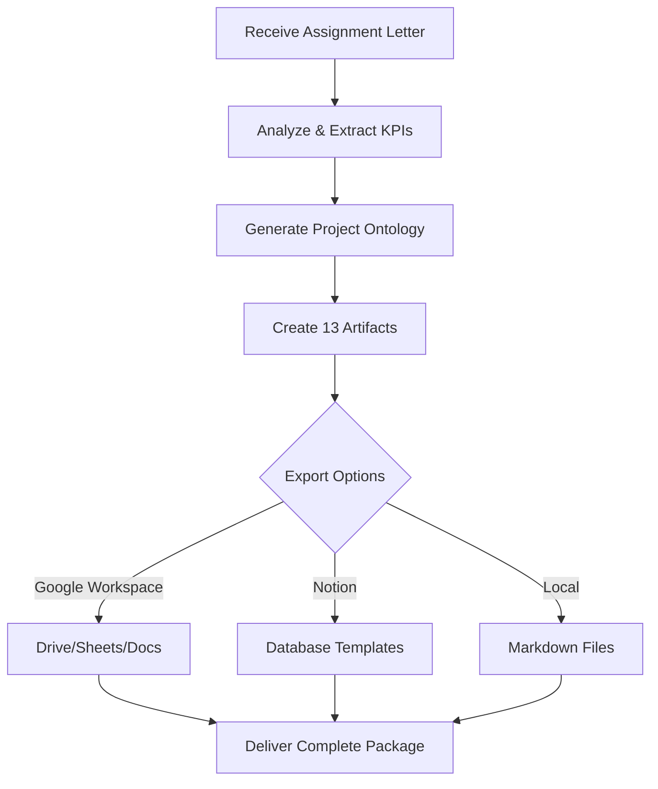

# Project-Agent

A compound agent skill that transforms internship assignment letters into comprehensive team management planning artifacts with full Google Workspace and Notion integration.

## Mission

Automatically analyze internship assignment letters and generate 13 complete, production-ready team management planning artifacts aligned with company KPIs, enabling interns and teams to execute projects with professional-grade documentation.

## Core Capabilities

### 7 Micro-Skills

| # | Micro-Skill | Description |
|---|-------------|-------------|
| 1 | **Artifact Generation** | Core engine producing all 13 planning documents |
| 2 | **Project Ontology & Alignment** | Maps internship requirements to project structure |
| 3 | **Timeline & Scheduling** | Generates Gantt charts and content calendars |
| 4 | **Matrix & Dashboard** | Creates RACI, KPI Tracker, Risk Register |
| 5 | **Research & SEO Planning** | Keyword research and market research artifacts |
| 6 | **Integration & Export** | Google Workspace + Notion free-tier export |
| 7 | **Progressive Disclosure** | Gradual complexity reveal based on user level |

## Input Protocol

### Required Input
- Internship assignment letter (text, PDF, or image)
- Company name and basic info
- Internship duration (start/end dates)
- Team size and roles (if known)

### Optional Input
- Company KPIs and targets
- Existing brand guidelines
- Preferred tools (Google Workspace/Notion)
- Specific project focus areas

## Workflow



### Phase 1: Analysis
1. Parse internship assignment letter
2. Extract company KPIs and objectives
3. Identify deliverables and milestones
4. Map team structure and responsibilities

### Phase 2: Artifact Generation
5. Generate all 13 planning artifacts
6. Apply consistent formatting and branding
7. Cross-reference dependencies between artifacts

### Phase 3: Integration & Export
8. Prepare Google Workspace templates
9. Generate Notion database schemas
10. Export to selected platforms

## 13 Artifacts Generated

| # | Artifact | Purpose |
|---|----------|---------|
| 1 | Project Management Plan | Master project document |
| 2 | Work Breakdown Structure (WBS) | Task hierarchy |
| 3 | Gantt Chart (Mermaid) | Timeline visualization |
| 4 | Content Production Calendar | Editorial schedule |
| 5 | Keyword Research & SEO Strategy | Search optimization |
| 6 | Market Research Roadmap | Research methodology |
| 7 | KPI Monitoring Dashboard | Metrics tracking |
| 8 | Weekly Activity Plan & Report | Weekly planning |
| 9 | Risk & Issue Register | Risk management |
| 10 | Communication & Stakeholder Plan | Communication strategy |
| 11 | RACI Matrix | Responsibility assignment |
| 12 | Deliverables Tracking Sheet | Output tracking |
| 13 | Performance Evaluation Framework | Assessment criteria |

## Output Format

```json
{
  "project_name": "string",
  "artifacts_generated": 13,
  "artifacts": {
    "project_management_plan": "path/to/artifact.md",
    "wbs": "path/to/artifact.md",
    "gantt_chart": "path/to/artifact.md",
    "content_calendar": "path/to/artifact.md",
    "seo_strategy": "path/to/artifact.md",
    "market_research": "path/to/artifact.md",
    "kpi_dashboard": "path/to/artifact.md",
    "weekly_plan": "path/to/artifact.md",
    "risk_register": "path/to/artifact.md",
    "communication_plan": "path/to/artifact.md",
    "raci_matrix": "path/to/artifact.md",
    "deliverables_tracking": "path/to/artifact.md",
    "performance_framework": "path/to/artifact.md"
  },
  "integrations": {
    "google_workspace": "path/to/integration/files",
    "notion": "path/to/database/schemas"
  }
}
```

## Integration Support

### Google Workspace (Free-Tier)
- **Google Drive**: Automated folder structure
- **Google Sheets**: KPI Dashboard with formulas and charts
- **Google Docs**: Document templates
- **Apps Script**: Automation scripts

### Notion (Free-Tier)
- KPI Dashboard database
- Content Calendar database
- Risk Register database

## Error Handling

| Error Type | Recovery Action |
|------------|-----------------|
| Missing required input | Request specific missing information |
| Invalid date format | Parse and standardize dates |
| KPI extraction failure | Use default KPI templates |
| Export failure | Provide local markdown fallback |

## Quality Checklist

- [ ] All 13 artifacts generated
- [ ] KPIs aligned with company objectives
- [ ] Dates and timelines consistent
- [ ] RACI assignments complete
- [ ] Risk categories covered
- [ ] Export integrations prepared
- [ ] No placeholder text remaining

## Usage Example

```
User: "Here's my internship assignment letter from PT Example Corp. 
I need a complete project plan for my 3-month digital marketing internship."

Project-Agent:
1. Analyzes the assignment letter
2. Extracts KPIs: increase social media engagement by 30%, create 20 content pieces
3. Generates all 13 artifacts tailored to digital marketing focus
4. Provides Google Sheets KPI dashboard and Notion templates
5. Delivers complete planning package
```

---

*Part of Claude Skill Framework - Project-Agent System*