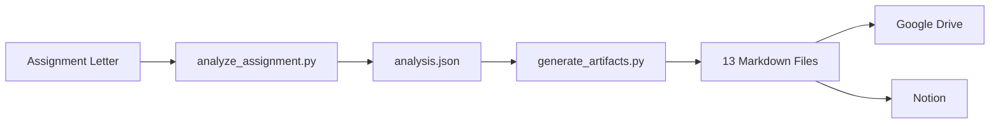

# Integration Guide

This guide explains how to set up and use the Google Workspace and Notion integrations for the Project-Agent skill.

---

## Overview

Project-Agent supports two main integration platforms:
1. **Google Workspace** (Drive, Sheets, Docs)
2. **Notion** (Databases, Pages)

Both integrations are designed to work with **free-tier accounts** and require no paid API access.

---

## Google Workspace Integration

### Prerequisites
- Google account (free Gmail or Google Workspace)
- Access to Google Drive, Sheets, and Docs
- Basic familiarity with Google Apps Script (optional, for automation)

### Setup Steps

#### 1. Create Folder Structure
1. Go to [Google Drive](https://drive.google.com)
2. Create a new folder: `[Project Name] - Internship Project`
3. Create subfolders:
   - `01 - Planning Documents`
   - `02 - Content & Calendar`
   - `03 - Reports & Analytics`
   - `04 - Templates`
   - `05 - Risk & Issue Management`

#### 2. Using Apps Script (Optional Automation)
1. Go to [Google Apps Script](https://script.google.com)
2. Create a new project
3. Copy the contents of `integrations/google-workspace/apps-script-drive.js`
4. Run `setupProject()` to automatically create folders and sheets

#### 3. Import Templates

**For Google Sheets:**
1. Create new spreadsheet
2. Import structure from `integrations/google-workspace/sheets-template.json`
3. Or manually set up columns based on template

**For Google Docs:**
1. Create new document
2. Copy structure from markdown templates in `templates/`
3. Apply formatting as needed

### Available Templates

| Template | File | Purpose |
|----------|------|---------|
| KPI Dashboard | `sheets-template.json` | Track KPIs with formulas |
| Content Calendar | `sheets-template.json` | Plan content production |
| Risk Register | `sheets-template.json` | Manage project risks |
| Project Plan | `docs-template.json` | Master project document |
| Weekly Report | `docs-template.json` | Weekly progress reports |

### Sheets Formulas Reference

**Progress Calculation:**
```
=IF(C2>0,ROUND(D2/C2*100,1),0)
```

**Status Auto-Update:**
```
=IF(E2>=100,"Complete",IF(E2>=75,"On Track",IF(E2>=50,"At Risk","Behind")))
```

**Risk Score:**
```
=SWITCH(D2,"High",3,"Medium",2,"Low",1)*SWITCH(E2,"High",3,"Medium",2,"Low",1)
```

---

## Notion Integration

### Prerequisites
- Notion account (free tier works)
- Workspace access
- Basic understanding of Notion databases

### Setup Steps

#### 1. Create Databases

**KPI Dashboard:**
1. Create new database in Notion
2. Add properties as defined in `integrations/notion/kpi-dashboard.json`
3. Set up views (Table, Board, Timeline)

**Content Calendar:**
1. Create new database
2. Add properties from `integrations/notion/content-calendar.json`
3. Enable Calendar view

**Risk Register:**
1. Create new database
2. Add properties from `integrations/notion/risk-register.json`
3. Configure Board view by Status

#### 2. Database Properties Reference

**KPI Dashboard Properties:**
| Property | Type | Purpose |
|----------|------|---------|
| KPI Name | Title | Name of the KPI |
| Category | Select | Category classification |
| Target | Number | Target value |
| Current | Number | Current value |
| Progress | Formula | Auto-calculated progress |
| Status | Select | Status indicator |
| Owner | People | Responsible person |
| Due Date | Date | Target completion |

**Content Calendar Properties:**
| Property | Type | Purpose |
|----------|------|---------|
| Title | Title | Content title |
| Type | Select | Content type |
| Status | Status | Workflow status |
| Author | People | Content creator |
| Due Date | Date | Deadline |
| Platform | Multi-select | Publishing platforms |

**Risk Register Properties:**
| Property | Type | Purpose |
|----------|------|---------|
| Risk | Title | Risk description |
| Probability | Select | Likelihood |
| Impact | Select | Severity |
| Risk Score | Formula | Auto-calculated score |
| Mitigation | Text | Mitigation strategy |
| Status | Status | Current status |

#### 3. Notion Formulas

**Progress Formula:**
```
if(prop("Target") > 0, round(prop("Current") / prop("Target") * 100) / 100, 0)
```

**Risk Score Formula:**
```
if(prop("Probability") == "High", 3, if(prop("Probability") == "Medium", 2, 1)) * if(prop("Impact") == "High", 3, if(prop("Impact") == "Medium", 2, 1))
```

---

## Python Scripts Usage

### analyze_assignment.py
Analyzes internship assignment letters and extracts key information.

```bash
python scripts/analyze_assignment.py assignment.txt --output analysis.json
```

### generate_artifacts.py
Generates all 13 artifacts from analysis data.

```bash
python scripts/generate_artifacts.py analysis.json --output ./output/
```

### sheets_generator.py
Generates Google Sheets templates.

```bash
python scripts/sheets_generator.py --type kpi_dashboard --format json
```

### export_to_notion.py
Generates Notion database schemas.

```bash
python scripts/export_to_notion.py --schema kpi_dashboard
```

---

## Workflow Integration

### Recommended Workflow



### Step-by-Step Process

1. **Analyze** assignment letter
   ```bash
   python scripts/analyze_assignment.py letter.txt -o analysis.json
   ```

2. **Generate** all artifacts
   ```bash
   python scripts/generate_artifacts.py analysis.json -o ./project/
   ```

3. **Export** to platforms
   - Upload markdown files to Google Drive
   - Create Notion databases from JSON schemas
   - Import CSV data to Google Sheets

4. **Customize** as needed
   - Replace placeholders with actual values
   - Add project-specific content
   - Configure sharing and permissions

---

## Troubleshooting

### Common Issues

**Google Sheets formulas not working:**
- Ensure correct cell references
- Check for circular dependencies
- Verify regional settings (comma vs semicolon)

**Notion formulas showing errors:**
- Property names must match exactly
- Check formula syntax for Notion (different from Excel)
- Ensure property types are correct

**Apps Script errors:**
- Check permissions for Drive access
- Verify folder IDs are correct
- Run authentication flow if needed

### Getting Help

1. Check template files for correct structure
2. Review JSON schemas for property definitions
3. Test with sample data first
4. Consult platform documentation:
   - [Google Apps Script Docs](https://developers.google.com/apps-script)
   - [Notion API Docs](https://developers.notion.com/)

---

## Free-Tier Limitations

### Google Workspace (Free)
- 15 GB storage shared across Drive, Gmail, Photos
- No advanced API access
- Manual import/export required

### Notion (Free)
- Unlimited pages and blocks for personal use
- Limited file uploads (5 MB per file)
- No advanced team features

### Workarounds
- Use local files for large assets
- Link to external storage for files
- Batch operations to stay within limits

---

*Part of Project-Agent Skill Documentation*