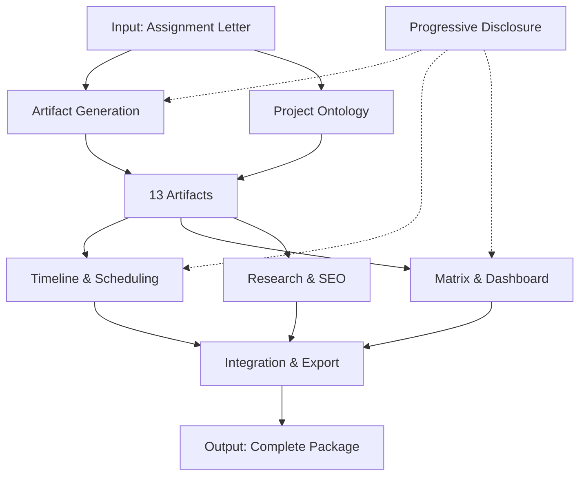
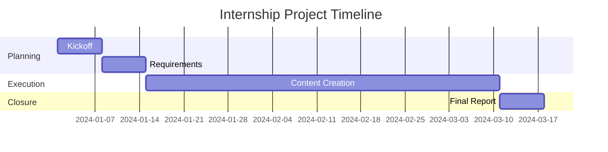

# 7 Core Micro-Skills Overview

**Project-Agent** is built on 7 interconnected micro-skills that work together to transform internship assignment letters into comprehensive project management artifacts.

---

## Micro-Skill Architecture



---

## 1. Artifact Generation Skill

**Purpose:** Core engine for creating all 13 planning documents.

### Capabilities
- Generate production-ready markdown templates
- Apply consistent formatting and structure
- Support placeholder replacement with context data
- Cross-reference dependencies between artifacts

### 13 Artifacts Generated
| # | Artifact | Purpose |
|---|----------|---------|
| 1 | Project Management Plan | Master project document |
| 2 | Work Breakdown Structure | Task hierarchy |
| 3 | Gantt Chart (Mermaid) | Timeline visualization |
| 4 | Content Production Calendar | Editorial schedule |
| 5 | Keyword Research & SEO Strategy | Search optimization |
| 6 | Market Research Roadmap | Research methodology |
| 7 | KPI Monitoring Dashboard | Metrics tracking |
| 8 | Weekly Activity Plan & Report | Weekly planning |
| 9 | Risk & Issue Register | Risk management |
| 10 | Communication & Stakeholder Plan | Communication strategy |
| 11 | RACI Matrix | Responsibility assignment |
| 12 | Deliverables Tracking Sheet | Output tracking |
| 13 | Performance Evaluation Framework | Assessment criteria |

### Usage
```
User provides: Assignment letter + context
Skill generates: All 13 artifacts with consistent formatting
```

---

## 2. Project Ontology & Alignment Skill

**Purpose:** Maps internship requirements to structured project framework.

### Capabilities
- Extract KPIs and objectives from assignment letters
- Identify deliverables and milestones
- Map team structure and responsibilities
- Align company goals with project tasks

### Extraction Targets
- Company name and industry
- Internship duration and dates
- Key Performance Indicators (KPIs)
- Expected deliverables
- Team roles and supervisors

### Alignment Process
1. **Parse** assignment document
2. **Extract** structured data
3. **Map** to project ontology
4. **Validate** completeness
5. **Generate** context for artifacts

---

## 3. Timeline & Scheduling Skill

**Purpose:** Generates Gantt charts and content calendars.

### Capabilities
- Create Mermaid-based Gantt charts
- Generate content production calendars
- Calculate task dependencies
- Allocate time based on project duration

### Gantt Chart Features
- Phase-based organization
- Task dependencies visualization
- Milestone markers
- Duration calculations

### Content Calendar Features
- Weekly/Monthly views
- Platform-specific scheduling
- Content type categorization
- Publishing timeline

### Example Output


---

## 4. Matrix & Dashboard Skill

**Purpose:** Creates RACI matrices, KPI trackers, and risk registers.

### Capabilities
- Generate RACI responsibility matrices
- Create KPI monitoring dashboards
- Build risk assessment registers
- Include formulas and conditional formatting

### RACI Matrix
| Task | Responsible | Accountable | Consulted | Informed |
|------|-------------|-------------|-----------|----------|
| Content Creation | Intern | Supervisor | Team Lead | Manager |
| Social Media | Intern | Marketing Lead | - | Supervisor |
| Reporting | Intern | Supervisor | - | Manager |

### KPI Dashboard Features
- Target vs Actual tracking
- Progress percentage calculation
- Status indicators (On Track/At Risk/Behind)
- Trend visualization

### Risk Register Features
- Probability/Impact scoring
- Risk score calculation
- Mitigation tracking
- Owner assignment

---

## 5. Research & SEO Planning Skill

**Purpose:** Generates keyword research and market research artifacts.

### Capabilities
- Create keyword research templates
- Generate SEO strategy documents
- Build market research roadmaps
- Include competitor analysis frameworks

### Keyword Research Template
- Primary keywords
- Secondary keywords
- Search volume estimates
- Competition analysis
- Content mapping

### Market Research Components
- Research objectives
- Methodology selection
- Data collection plan
- Analysis framework
- Reporting structure

---

## 6. Integration & Export Skill

**Purpose:** Exports to Google Workspace and Notion (free-tier).

### Supported Platforms

#### Google Workspace
- **Google Drive:** Folder structure creation
- **Google Sheets:** KPI dashboards with formulas
- **Google Docs:** Document templates
- **Apps Script:** Automation scripts

#### Notion
- **KPI Dashboard:** Database with formulas
- **Content Calendar:** Calendar database
- **Risk Register:** Database with views

### Export Formats
- Markdown (.md)
- JSON (for APIs)
- CSV (for spreadsheets)
- Google Apps Script (.js)

### Free-Tier Limitations
- No paid API access required
- Uses manual import/export
- Template-based approach

---

## 7. Progressive Disclosure Skill

**Purpose:** Gradual reveal of complexity based on user level.

### User Levels
1. **Beginner:** Basic templates with guidance
2. **Intermediate:** Advanced features exposed
3. **Advanced:** Full customization available

### Disclosure Layers

| Level | Features Shown |
|-------|---------------|
| 1 | Basic templates, simple placeholders |
| 2 | Formulas, conditional formatting |
| 3 | API integrations, custom scripts |

### Implementation
- Start with essential artifacts
- Add complexity progressively
- Provide contextual help
- Offer "advanced" toggles

---

## Micro-Skill Interaction

```
Input: Assignment Letter
    ↓
[Ontology & Alignment] → Extracts structure
    ↓
[Artifact Generation] → Creates 13 documents
    ↓
[Timeline & Scheduling] → Adds temporal dimension
[Matrix & Dashboard] → Adds tracking
[Research & SEO] → Adds strategy
    ↓
[Integration & Export] → Delivers to platforms
    ↓
[Progressive Disclosure] → Adjusts complexity
    ↓
Output: Complete Planning Package
```

---

## Best Practices

### For Artifact Generation
1. Always start with complete assignment analysis
2. Use consistent placeholders across all artifacts
3. Validate cross-references between documents

### For Integration
1. Test with free-tier accounts first
2. Use templates as starting points
3. Customize based on specific needs

### For Progressive Disclosure
1. Assess user experience level early
2. Provide clear upgrade paths
3. Document advanced features separately

---

*Part of Project-Agent Skill Documentation*