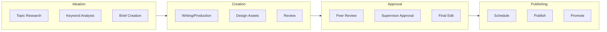
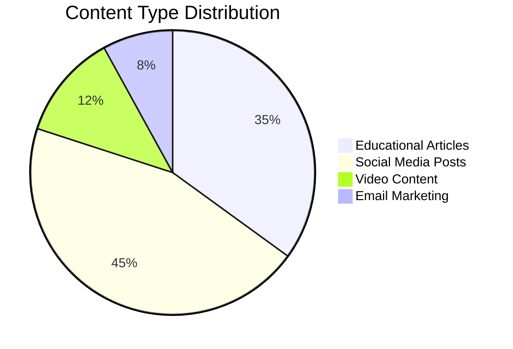
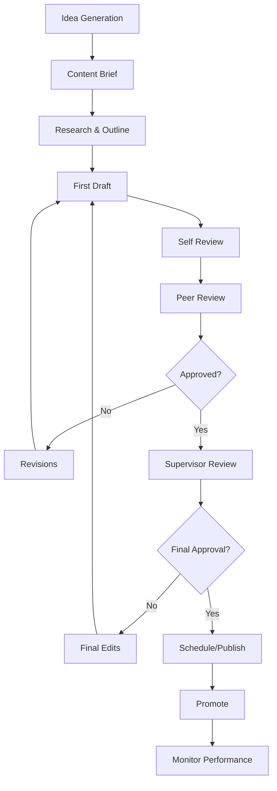

# Content Production Calendar

**Project Name:** [Project Name]
**Company:** [Company Name]
**Period:** [Start Date] to [End Date]
**Version:** 1.0

---

## Calendar Overview

This content production calendar provides a comprehensive schedule for all content creation, publishing, and distribution activities during the internship period.

---

## Monthly Content Summary

| Month | Articles | Social Posts | Videos | Email | Total Pieces |
|-------|----------|--------------|--------|-------|--------------|
| Month 1 | 3 | 30 | 4 | 2 | 39 |
| Month 2 | 4 | 30 | 4 | 2 | 40 |
| Month 3 | 3 | 30 | 4 | 2 | 39 |
| **Total** | **10** | **90** | **12** | **6** | **118** |

---

## Week-by-Week Content Calendar

### Month 1: Foundation & Launch

#### Week 1 (Dates: [Start] - [End])

| Day | Content Type | Title/Topic | Platform | Owner | Status |
|-----|--------------|-------------|----------|-------|--------|
| Mon | Article | Introduction to [Topic] | Blog | Writer | Not Started |
| Tue | Social | Teaser Post | Instagram | Social | Not Started |
| Wed | Social | Industry Tip | LinkedIn | Social | Not Started |
| Thu | Social | Behind the Scenes | TikTok | Social | Not Started |
| Fri | Social | Weekly Roundup | All Platforms | Social | Not Started |
| Sat | Social | Engagement Post | Instagram | Social | Not Started |
| Sun | Social | Motivation Post | LinkedIn | Social | Not Started |

#### Week 2 (Dates: [Date] - [Date])

| Day | Content Type | Title/Topic | Platform | Owner | Status |
|-----|--------------|-------------|----------|-------|--------|
| Mon | Article | [Topic 2] | Blog | Writer | Not Started |
| Tue | Social | Article Promotion | All Platforms | Social | Not Started |
| Wed | Video | Tutorial/How-to | YouTube/TikTok | Video | Not Started |
| Thu | Social | User Engagement | Instagram | Social | Not Started |
| Fri | Email | Newsletter #1 | Email | Writer | Not Started |
| Sat | Social | Community Q&A | LinkedIn | Social | Not Started |
| Sun | Social | Weekly Recap | All Platforms | Social | Not Started |

#### Week 3 (Dates: [Date] - [Date])

| Day | Content Type | Title/Topic | Platform | Owner | Status |
|-----|--------------|-------------|----------|-------|--------|
| Mon | Article | [Topic 3] | Blog | Writer | Not Started |
| Tue | Social | Infographic | Instagram | Designer | Not Started |
| Wed | Social | Case Study Snippet | LinkedIn | Social | Not Started |
| Thu | Video | Product/Service Feature | TikTok | Video | Not Started |
| Fri | Social | Poll/Survey | All Platforms | Social | Not Started |
| Sat | Social | User Spotlight | Instagram | Social | Not Started |
| Sun | Social | Industry News | LinkedIn | Social | Not Started |

#### Week 4 (Dates: [Date] - [Date])

| Day | Content Type | Title/Topic | Platform | Owner | Status |
|-----|--------------|-------------|----------|-------|--------|
| Mon | Article | [Topic 4] | Blog | Writer | Not Started |
| Tue | Social | Article Teaser | All Platforms | Social | Not Started |
| Wed | Social | Tips Thread | LinkedIn | Social | Not Started |
| Thu | Video | Tutorial Part 2 | YouTube/TikTok | Video | Not Started |
| Fri | Email | Newsletter #2 | Email | Writer | Not Started |
| Sat | Social | Monthly Recap | All Platforms | Social | Not Started |
| Sun | Planning | Next Month Planning | Internal | Team | Not Started |

---

### Month 2: Growth & Engagement

#### Week 5-8 Content Schedule

| Week | Articles | Social Posts | Videos | Email | Key Campaign |
|------|----------|--------------|--------|-------|--------------|
| Week 5 | 1 | 10 | 1 | 0 | Campaign Launch |
| Week 6 | 1 | 10 | 1 | 1 | Engagement Push |
| Week 7 | 1 | 10 | 1 | 0 | Community Building |
| Week 8 | 1 | 10 | 1 | 1 | Mid-Project Review |

#### Week 5 Detail (Dates: [Date] - [Date])

| Day | Content Type | Title/Topic | Platform | Owner | Status |
|-----|--------------|-------------|----------|-------|--------|
| Mon | Article | [Topic 5] | Blog | Writer | Not Started |
| Tue | Social | Campaign Launch | All Platforms | Social | Not Started |
| Wed | Video | Campaign Video | All Platforms | Video | Not Started |
| Thu | Social | Campaign Update | Instagram | Social | Not Started |
| Fri | Social | Engagement Post | TikTok | Social | Not Started |
| Sat | Social | User Content Share | Instagram | Social | Not Started |
| Sun | Social | Week Summary | LinkedIn | Social | Not Started |

---

### Month 3: Optimization & Closure

#### Week 9-12 Content Schedule

| Week | Articles | Social Posts | Videos | Email | Key Focus |
|------|----------|--------------|--------|-------|-----------|
| Week 9 | 1 | 10 | 1 | 0 | Optimization |
| Week 10 | 1 | 10 | 1 | 1 | Performance |
| Week 11 | 1 | 10 | 1 | 0 | Documentation |
| Week 12 | 0 | 10 | 1 | 1 | Project Closure |

---

## Content Pipeline Status

---

## Platform-Specific Calendars

### Instagram Content Calendar

| Date | Post Type | Caption/Hashtags | Story | Reel | Status |
|------|-----------|------------------|-------|------|--------|
| [Date] | Carousel | [Caption] #hashtags | ✅ | ❌ | Not Started |
| [Date] | Single Image | [Caption] #hashtags | ✅ | ✅ | Not Started |
| [Date] | Reel | [Caption] #hashtags | ✅ | ✅ | Not Started |

### LinkedIn Content Calendar

| Date | Post Type | Topic | Article Link | Status |
|------|-----------|-------|--------------|--------|
| [Date] | Text Post | Industry Insight | ❌ | Not Started |
| [Date] | Article | [Topic] | ✅ | Not Started |
| [Date] | Carousel | Tips & Tricks | ❌ | Not Started |

### TikTok Content Calendar

| Date | Content Type | Duration | Sound/Trend | Hashtags | Status |
|------|--------------|----------|-------------|----------|--------|
| [Date] | Tutorial | 60s | Original | #fyp #tutorial | Not Started |
| [Date] | Trend | 15s | Trending | #viral #trend | Not Started |
| [Date] | Behind Scenes | 30s | Popular | #behindthescenes | Not Started |

---

## Content Categories Distribution

### Content Mix

| Category | Percentage | Count | Purpose |
|----------|------------|-------|---------|
| Educational | 35% | 41 | Value & Authority |
| Promotional | 20% | 24 | Product/Service Awareness |
| Engagement | 25% | 29 | Community Building |
| Behind-the-Scenes | 10% | 12 | Brand Humanization |
| User-Generated | 10% | 12 | Social Proof |

---

## Editorial Workflow

### Content Creation Process

### Review Checklist

- [ ] Content aligns with brand voice
- [ ] SEO keywords included
- [ ] Images/media optimized
- [ ] Links working
- [ ] Call-to-action included
- [ ] Spelling/grammar checked
- [ ] Platform requirements met

---

## Content Repository

### Article Backlog

| ID | Title | Status | Priority | Due Date | Owner |
|----|-------|--------|----------|----------|-------|
| A001 | [Title 1] | Draft | High | [Date] | Writer |
| A002 | [Title 2] | Research | Medium | [Date] | Writer |
| A003 | [Title 3] | Idea | Low | [Date] | Writer |

### Social Media Backlog

| ID | Platform | Content Type | Topic | Status | Due Date |
|----|----------|--------------|-------|--------|----------|
| S001 | Instagram | Carousel | [Topic] | Draft | [Date] |
| S002 | LinkedIn | Article | [Topic] | Idea | [Date] |
| S003 | TikTok | Tutorial | [Topic] | Script | [Date] |

---

## Publishing Schedule

### Daily Publishing Times

| Platform | Best Time (WIB) | Frequency | Notes |
|----------|-----------------|-----------|-------|
| Instagram Feed | 11:00, 19:00 | 1-2/day | Weekdays |
| Instagram Story | 09:00, 12:00, 18:00 | 3/day | Daily |
| TikTok | 19:00, 21:00 | 1/day | Daily |
| LinkedIn | 08:00, 17:00 | 1/day | Weekdays |
| Blog | 10:00 | 2-3/week | Mon, Wed, Fri |
| Email | 10:00 | 1/week | Tuesday |

---

## Performance Tracking

### Weekly Metrics Template

| Metric | Week 1 | Week 2 | Week 3 | Week 4 | Target |
|--------|--------|--------|--------|--------|--------|
| Blog Views | | | | | [Target] |
| Instagram Reach | | | | | [Target] |
| LinkedIn Impressions | | | | | [Target] |
| TikTok Views | | | | | [Target] |
| Email Open Rate | | | | | [Target] |
| Engagement Rate | | | | | [Target] |

---

## Content Calendar Change Log

| Version | Date | Change | Author |
|---------|------|--------|--------|
| 1.0 | [Date] | Initial calendar created | PM |

---

*Content Production Calendar - [Project Name] - Version 1.0*