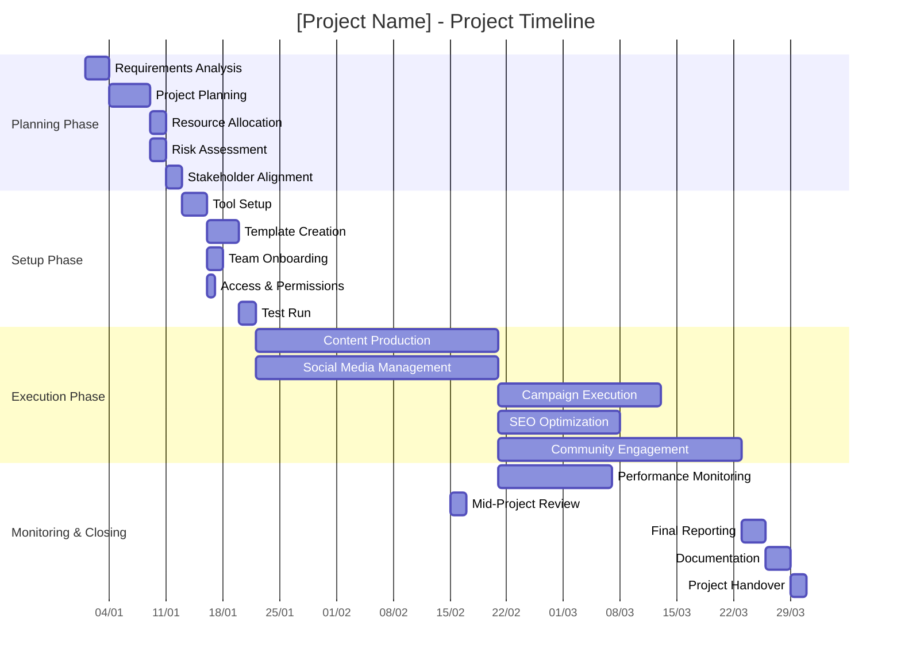
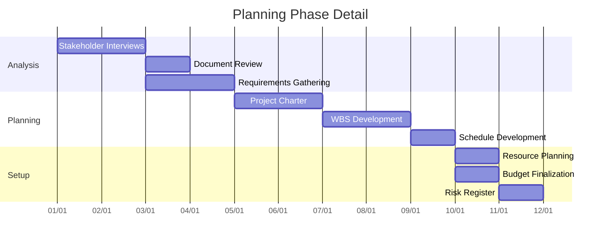
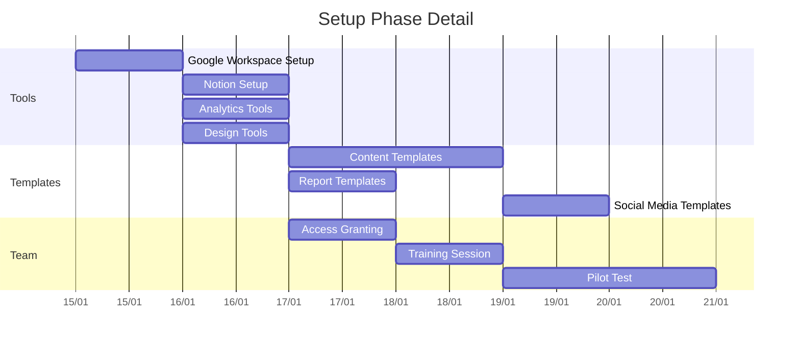
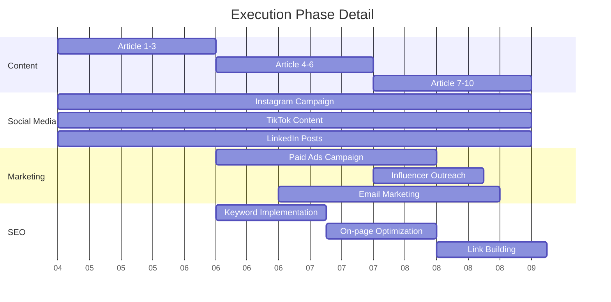
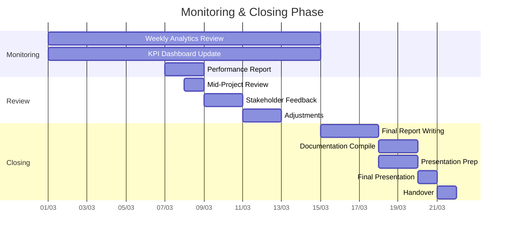
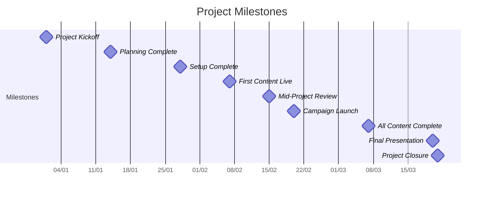

# Gantt Chart (Mermaid)

**Project Name:** [Project Name]
**Company:** [Company Name]
**Period:** [Start Date] to [End Date]
**Version:** 1.0

---

## Project Timeline Overview

This Gantt chart visualizes the complete project timeline using Mermaid syntax, compatible with Markdown editors, Notion, and documentation tools.

---

## Complete Project Gantt Chart



---

## Phase 1: Planning Phase (Week 1-2)



### Planning Phase Tasks

| Task | Start | End | Duration | Owner | Dependencies |
|------|-------|-----|----------|-------|--------------|
| Stakeholder Interviews | [Date] | [Date] | 2 days | PM | None |
| Document Review | [Date] | [Date] | 1 day | PM | Interviews |
| Requirements Gathering | [Date] | [Date] | 2 days | Team Lead | Interviews |
| Project Charter | [Date] | [Date] | 2 days | PM | Requirements |
| WBS Development | [Date] | [Date] | 2 days | PM | Charter |
| Schedule Development | [Date] | [Date] | 1 day | PM | WBS |
| Resource Planning | [Date] | [Date] | 1 day | PM | Schedule |
| Budget Finalization | [Date] | [Date] | 1 day | PM | Schedule |
| Risk Register | [Date] | [Date] | 1 day | PM | Resources, Budget |

---

## Phase 2: Setup Phase (Week 3-4)



### Setup Phase Tasks

| Task | Start | End | Duration | Owner | Dependencies |
|------|-------|-----|----------|-------|--------------|
| Google Workspace Setup | [Date] | [Date] | 1 day | Tech Lead | Planning Complete |
| Notion Setup | [Date] | [Date] | 1 day | Tech Lead | Google Setup |
| Analytics Tools | [Date] | [Date] | 1 day | Analytics | Google Setup |
| Design Tools | [Date] | [Date] | 1 day | Designer | Google Setup |
| Content Templates | [Date] | [Date] | 2 days | Writer | Notion Setup |
| Report Templates | [Date] | [Date] | 1 day | PM | Notion Setup |
| Social Media Templates | [Date] | [Date] | 1 day | Social Media | Content Templates |
| Access Granting | [Date] | [Date] | 1 day | Tech Lead | All Tools |
| Training Session | [Date] | [Date] | 1 day | PM | Access |
| Pilot Test | [Date] | [Date] | 2 days | Team | Templates, Training |

---

## Phase 3: Execution Phase (Week 5-10)



### Execution Phase Tasks

| Task | Start | End | Duration | Owner | Dependencies |
|------|-------|-----|----------|-------|--------------|
| Article 1-3 | [Date] | [Date] | 10 days | Writer | Setup Complete |
| Article 4-6 | [Date] | [Date] | 10 days | Writer | Article 1-3 |
| Article 7-10 | [Date] | [Date] | 10 days | Writer | Article 4-6 |
| Instagram Campaign | [Date] | [Date] | 30 days | Social Media | Setup Complete |
| TikTok Content | [Date] | [Date] | 30 days | Social Media | Setup Complete |
| LinkedIn Posts | [Date] | [Date] | 30 days | Social Media | Setup Complete |
| Paid Ads Campaign | [Date] | [Date] | 14 days | Marketing | Article 1-3 |
| Influencer Outreach | [Date] | [Date] | 7 days | Marketing | Article 4-6 |
| Email Marketing | [Date] | [Date] | 14 days | Marketing | Mid-phase |
| Keyword Implementation | [Date] | [Date] | 7 days | SEO | Article 1-3 |
| On-page Optimization | [Date] | [Date] | 7 days | SEO | Keywords |
| Link Building | [Date] | [Date] | 7 days | SEO | On-page |

---

## Phase 4: Monitoring & Closing (Week 11-12)



### Closing Phase Tasks

| Task | Start | End | Duration | Owner | Dependencies |
|------|-------|-----|----------|-------|--------------|
| Weekly Analytics Review | [Date] | [Date] | 14 days | Analytics | Execution |
| KPI Dashboard Update | [Date] | [Date] | 14 days | PM | Execution |
| Performance Report | [Date] | [Date] | 2 days | PM | Week 1 Data |
| Mid-Project Review | [Date] | [Date] | 1 day | PM | Performance Report |
| Stakeholder Feedback | [Date] | [Date] | 2 days | PM | Review |
| Adjustments | [Date] | [Date] | 2 days | Team | Feedback |
| Final Report Writing | [Date] | [Date] | 3 days | PM | All Data |
| Documentation Compile | [Date] | [Date] | 2 days | Team | Final Report |
| Presentation Prep | [Date] | [Date] | 2 days | PM | Final Report |
| Final Presentation | [Date] | [Date] | 1 day | PM | Docs, Presentation |
| Handover | [Date] | [Date] | 1 day | PM | Presentation |

---

## Milestones Timeline



---

## Critical Path

```mermaid
flowchart LR
    A[Requirements] --> B[Project Plan]
    B --> C[Resource Allocation]
    C --> D[Tool Setup]
    D --> E[Template Creation]
    E --> F[Content Production]
    F --> G[Campaign Execution]
    G --> H[Performance Monitoring]
    H --> I[Final Report]
    I --> J[Handover]
    
    style A fill:#ff6b6b
    style B fill:#ff6b6b
    style D fill:#ff6b6b
    style F fill:#ff6b6b
    style G fill:#ff6b6b
    style I fill:#ff6b6b
    style J fill:#ff6b6b
```



### Critical Path Tasks

| Task | Duration | Float | Critical |
|------|----------|-------|----------|
| Requirements Analysis | 3 days | 0 | ✅ Yes |
| Project Planning | 5 days | 0 | ✅ Yes |
| Tool Setup | 3 days | 0 | ✅ Yes |
| Content Production | 30 days | 0 | ✅ Yes |
| Campaign Execution | 20 days | 0 | ✅ Yes |
| Final Reporting | 3 days | 0 | ✅ Yes |
| Handover | 1 day | 0 | ✅ Yes |

---

## Resource Loading

### Weekly Resource Allocation

```mermaid
xychart-beta
    title "Weekly Hours by Resource Type"
    x-axis [Week 1, Week 2, Week 3, Week 4, Week 5, Week 6, Week 7, Week 8, Week 9, Week 10, Week 11, Week 12]
    y-axis "Hours" 0 --> 50
    bar [40, 40, 30, 30, 20, 20, 20, 20, 20, 20, 30, 40]
    bar [20, 20, 30, 30, 40, 40, 40, 40, 40, 40, 30, 20]
    bar [10, 10, 20, 20, 30, 30, 30, 30, 30, 30, 20, 10]
```



---

## Usage Instructions

### How to Use This Gantt Chart

1. **Copy the Mermaid code** from any section above
2. **Paste into** any Mermaid-compatible editor:
   - Notion (with Mermaid block)
   - GitHub/GitLab Markdown
   - VS Code with Mermaid extension
   - Online editors: mermaid.live

3. **Customize dates** by modifying the `dateFormat` and date values
4. **Add tasks** using the syntax: `Task Name :id, start-date, duration`

### Mermaid Gantt Syntax Reference

```
gantt
    title Chart Title
    dateFormat YYYY-MM-DD
    
    section Section Name
    Task 1     :t1, 2026-01-01, 5d
    Task 2     :t2, after t1, 3d
    Milestone  :milestone, m1, 2026-01-15, 0d
```

---

## Gantt Chart Change Log

| Version | Date | Change Description | Author |
|---------|------|-------------------|--------|
| 1.0 | [Date] | Initial Gantt chart created | PM |

---

*Gantt Chart - [Project Name] - Version 1.0*