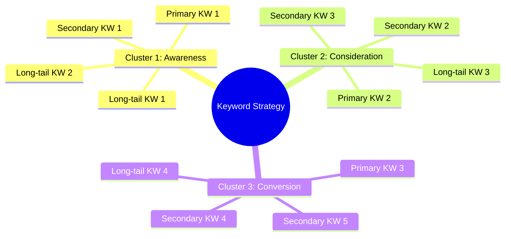
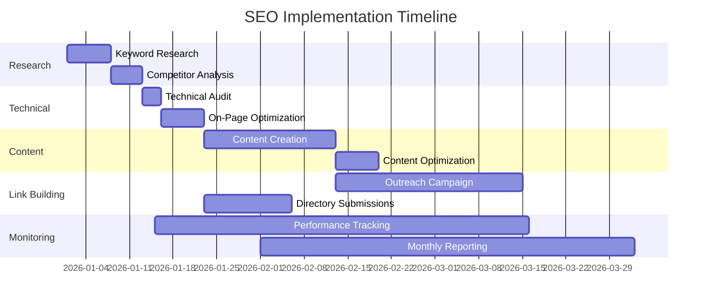

# Keyword Research & SEO Strategy Document

**Project Name:** [Project Name]
**Company:** [Company Name]
**Period:** [Start Date] to [End Date]
**Version:** 1.0

---

## Executive Summary

This SEO strategy document outlines the keyword research, on-page optimization, and content strategy to improve organic search visibility for [Company Name] during the internship project period.

---

## 1. Keyword Research

### 1.1 Primary Keywords

| Keyword | Search Volume | Difficulty | CPC | Intent | Priority |
|---------|---------------|------------|-----|-------|----------|
| [Primary KW 1] | [Volume] | [Difficulty] | [CPC] | Commercial | High |
| [Primary KW 2] | [Volume] | [Difficulty] | [CPC] | Informational | High |
| [Primary KW 3] | [Volume] | [Difficulty] | [CPC] | Commercial | High |

### 1.2 Secondary Keywords

| Keyword | Search Volume | Difficulty | Related Primary | Priority |
|---------|---------------|------------|-----------------|----------|
| [Secondary KW 1] | [Volume] | [Difficulty] | [Primary KW 1] | Medium |
| [Secondary KW 2] | [Volume] | [Difficulty] | [Primary KW 2] | Medium |
| [Secondary KW 3] | [Volume] | [Difficulty] | [Primary KW 3] | Medium |
| [Secondary KW 4] | [Volume] | [Difficulty] | [Primary KW 1] | Medium |
| [Secondary KW 5] | [Volume] | [Difficulty] | [Primary KW 2] | Medium |

### 1.3 Long-Tail Keywords

| Keyword | Search Volume | Difficulty | Conversion Potential | Priority |
|---------|---------------|------------|---------------------|----------|
| [Long-tail KW 1] | [Volume] | Low | High | High |
| [Long-tail KW 2] | [Volume] | Low | Medium | High |
| [Long-tail KW 3] | [Volume] | Low | High | Medium |
| [Long-tail KW 4] | [Volume] | Low | Medium | Medium |
| [Long-tail KW 5] | [Volume] | Low | Low | Low |

### 1.4 Keyword Clusters



---

## 2. Competitor Analysis

### 2.1 Competitor Keyword Gap Analysis

| Competitor | Domain Authority | Ranking Keywords | Traffic Est. | Gap Opportunity |
|------------|------------------|------------------|--------------|-----------------|
| [Competitor 1] | [DA] | [Number] | [Traffic] | [Gap Keywords] |
| [Competitor 2] | [DA] | [Number] | [Traffic] | [Gap Keywords] |
| [Competitor 3] | [DA] | [Number] | [Traffic] | [Gap Keywords] |

### 2.2 Keyword Opportunities

| Opportunity | Keyword | Competitor Rank | Our Rank | Action Required |
|-------------|---------|-----------------|----------|-----------------|
| Quick Win | [KW 1] | Position 5-10 | Not Ranking | Optimize existing content |
| Medium Term | [KW 2] | Position 1-3 | Not Ranking | Create new content |
| Long Term | [KW 3] | Position 1-3 | Not Ranking | Comprehensive strategy |

---

## 3. On-Page SEO Strategy

### 3.1 Content Optimization Checklist

| Element | Current State | Target State | Priority |
|---------|---------------|--------------|----------|
| Title Tags | [Current] | [Target with KW] | High |
| Meta Descriptions | [Current] | [Target 155-160 chars] | High |
| H1 Headings | [Current] | [Include Primary KW] | High |
| URL Structure | [Current] | [Short, KW-rich] | Medium |
| Image Alt Text | [Current] | [Descriptive with KW] | Medium |
| Internal Links | [Current] | [3-5 per page] | Medium |

### 3.2 Content Optimization Template

```markdown
## Page: [Page Title]

### Title Tag
[Primary KW] - [Secondary Value Proposition] | [Brand]
Example: Digital Marketing Services - Grow Your Business | [Company Name]

### Meta Description
[Include primary keyword, value proposition, and CTA within 155-160 characters]
Example: Discover our comprehensive digital marketing services. Boost your online presence with SEO, social media, and content marketing. Get started today!

### H1 Heading
[Primary Keyword] [Value Statement]
Example: Digital Marketing Services That Drive Results

### URL
[domain]/[primary-kw-category]/[specific-page]
Example: [domain]/services/digital-marketing
```

### 3.3 Technical SEO Requirements

| Element | Requirement | Status | Action |
|---------|-------------|--------|--------|
| Page Speed | < 3s load time | Check | Optimize images, minify code |
| Mobile Friendly | Pass Google Test | Check | Responsive design |
| SSL Certificate | HTTPS enabled | Check | Install SSL |
| XML Sitemap | Exists and submitted | Check | Generate and submit |
| Robots.txt | Properly configured | Check | Create/update |
| Schema Markup | Relevant structured data | Check | Implement |

---

## 4. Content Strategy

### 4.1 Content Calendar for SEO

| Week | Target Keyword | Content Type | Title | Length | Status |
|------|----------------|--------------|-------|--------|--------|
| 1 | [Primary KW 1] | Blog Post | [Title with KW] | 1500+ words | Planned |
| 2 | [Long-tail KW 1] | Guide | [Title with KW] | 2000+ words | Planned |
| 3 | [Primary KW 2] | Article | [Title with KW] | 1500+ words | Planned |
| 4 | [Secondary KW 1] | Blog Post | [Title with KW] | 1000+ words | Planned |

### 4.2 Content Requirements by Keyword Type

| Keyword Type | Min Word Count | KW Density | Internal Links | External Links |
|--------------|----------------|------------|----------------|----------------|
| Primary | 2000+ | 1-2% | 5-8 | 2-3 |
| Secondary | 1500+ | 0.5-1% | 3-5 | 1-2 |
| Long-tail | 1000+ | 0.5-1% | 2-3 | 1 |

### 4.3 Content Brief Template

```
TARGET KEYWORD: [Primary Keyword]
SECONDARY KEYWORDS: [KW2, KW3, KW4]
SEARCH INTENT: [Informational/Commercial/Transactional]

TITLE: [SEO-optimized title with primary keyword]
URL: [proposed URL structure]

WORD COUNT: [Minimum words]
READABILITY: [Target grade level]

STRUCTURE:
- Introduction (hook + keyword)
- H2: [Section with keyword variation]
  - H3: [Subsection]
  - H3: [Subsection]
- H2: [Section with keyword variation]
  - H3: [Subsection]
  - H3: [Subsection]
- Conclusion + CTA

INTERNAL LINKS TO:
- [Page 1]
- [Page 2]

EXTERNAL SOURCES:
- [Authority source 1]
- [Authority source 2]
```

---

## 5. Link Building Strategy

### 5.1 Backlink Goals

| Month | Target New Links | Target Referring Domains | Target DR Average |
|-------|------------------|-------------------------|-------------------|
| Month 1 | 5 | 5 | 30+ |
| Month 2 | 10 | 8 | 35+ |
| Month 3 | 15 | 10 | 40+ |

### 5.2 Link Building Tactics

| Tactic | Priority | Effort | Expected Links/Month |
|--------|----------|--------|---------------------|
| Guest Posting | High | High | 2-3 |
| Directory Submissions | High | Low | 5-10 |
| HARO/Help a Reporter | Medium | Medium | 1-2 |
| Broken Link Building | Medium | High | 1-2 |
| Resource Page Links | Medium | Medium | 2-3 |
| Social Profiles | Low | Low | 5 |

### 5.3 Outreach Template

```
Subject: Resource Suggestion for [Page Title]

Hi [Name],

I came across your excellent resource page on [Topic] at [URL]. 
Great collection of resources!

I recently published a comprehensive guide on [Topic] that might 
be a valuable addition: [Our URL]

The guide covers:
- [Key Point 1]
- [Key Point 2]
- [Key Point 3]

Would you consider adding it to your resource list?

Best regards,
[Name]
```

---

## 6. Performance Tracking

### 6.1 KPIs to Track

| KPI | Baseline | Month 1 Target | Month 2 Target | Month 3 Target |
|-----|----------|----------------|----------------|----------------|
| Organic Traffic | [Baseline] | +10% | +25% | +50% |
| Keyword Rankings (Top 10) | [Number] | +3 | +5 | +10 |
| Domain Authority | [Current] | +1 | +2 | +3 |
| Backlinks | [Current] | +5 | +15 | +30 |
| Organic CTR | [Current] | +0.5% | +1% | +2% |

### 6.2 Monthly Reporting Template

```markdown
# SEO Performance Report - [Month Year]

## Traffic Overview
- Organic Sessions: [Number] ([+/-]% vs previous month)
- Organic Users: [Number] ([+/-]% vs previous month)
- Page Views: [Number] ([+/-]% vs previous month)

## Keyword Performance
| Keyword | Previous Rank | Current Rank | Change |
|---------|---------------|--------------|--------|
| [KW 1] | [Prev] | [Curr] | [+/-] |
| [KW 2] | [Prev] | [Curr] | [+/-] |

## Top Performing Pages
1. [Page 1] - [Views]
2. [Page 2] - [Views]
3. [Page 3] - [Views]

## Link Building Progress
- New backlinks acquired: [Number]
- Referring domains: [Number]
- Best link: [URL] (DR: [Number])

## Recommendations
1. [Recommendation 1]
2. [Recommendation 2]
```

---

## 7. SEO Tools Stack

| Purpose | Tool | Free/Paid | Usage |
|---------|------|-----------|-------|
| Keyword Research | Google Keyword Planner | Free | Volume data |
| Keyword Research | Ubersuggest | Freemium | Suggestions |
| Rank Tracking | Google Search Console | Free | Performance |
| Technical SEO | Screaming Frog | Freemium | Site audit |
| Backlink Analysis | Ahrefs Backlink Checker | Free | Basic analysis |
| On-Page Analysis | Yoast SEO | Freemium | WordPress SEO |

---

## 8. Implementation Timeline



---

## SEO Strategy Change Log

| Version | Date | Change | Author |
|---------|------|--------|--------|
| 1.0 | [Date] | Initial SEO strategy created | SEO Specialist |

---

*Keyword Research & SEO Strategy - [Project Name] - Version 1.0*