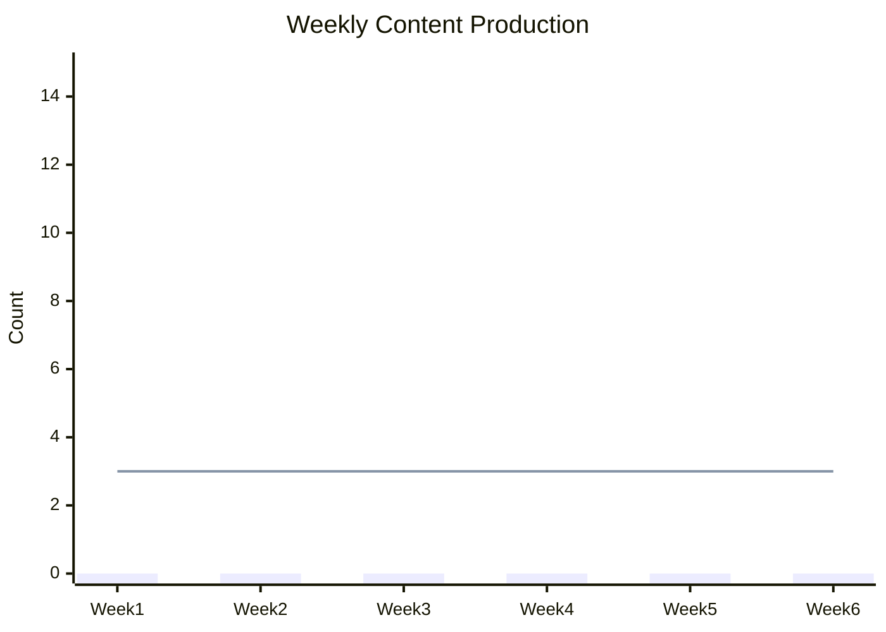
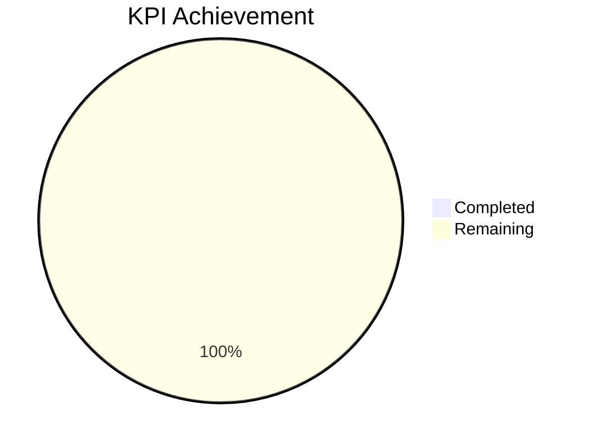

# KPI Monitoring Dashboard

**Project Name:** [Project Name]
**Company:** [Company Name]
**Period:** [Start Date] to [End Date]
**Version:** 1.0

---

## Dashboard Overview

This KPI Monitoring Dashboard provides real-time tracking of key performance indicators aligned with internship objectives and company goals.

---

## 1. KPI Summary Dashboard

### 1.1 Overall Performance Scorecard

| Category | KPI | Target | Current | % Achievement | Status |
|----------|-----|--------|---------|---------------|--------|
| **Content** | Articles Published | 10 | 0 | 0% | 🔴 Not Started |
| **Content** | Social Media Posts | 90 | 0 | 0% | 🔴 Not Started |
| **Content** | Video Content | 12 | 0 | 0% | 🔴 Not Started |
| **Engagement** | Instagram Followers | +500 | 0 | 0% | 🔴 Not Started |
| **Engagement** | Engagement Rate | 5% | 0% | 0% | 🔴 Not Started |
| **Engagement** | Website Traffic | +50% | 0% | 0% | 🔴 Not Started |
| **SEO** | Keyword Rankings (Top 10) | 10 | 0 | 0% | 🔴 Not Started |
| **SEO** | Organic Traffic | +30% | 0% | 0% | 🔴 Not Started |
| **Learning** | Skills Acquired | 5 | 0 | 0% | 🔴 Not Started |
| **Learning** | Certifications | 2 | 0 | 0% | 🔴 Not Started |

### 1.2 Status Legend
- 🟢 **On Track**: ≥90% of target
- 🟡 **At Risk**: 70-89% of target
- 🔴 **Behind**: <70% of target

---

## 2. Content Performance KPIs

### 2.1 Content Production Metrics

| Metric | Week 1 | Week 2 | Week 3 | Week 4 | Monthly Total | Target | Status |
|--------|--------|--------|--------|--------|---------------|--------|--------|
| Articles Written | | | | | 0 | 3 | 🔴 |
| Articles Published | | | | | 0 | 3 | 🔴 |
| Social Posts Created | | | | | 0 | 30 | 🔴 |
| Social Posts Scheduled | | | | | 0 | 30 | 🔴 |
| Videos Produced | | | | | 0 | 4 | 🔴 |
| Email Campaigns | | | | | 0 | 2 | 🔴 |

### 2.2 Content Quality Metrics

| Metric | Target | Actual | Status |
|--------|--------|--------|--------|
| Average Article Word Count | 1500+ | | 🔴 |
| SEO Score (Avg) | 80+ | | 🔴 |
| Grammar Score | 95%+ | | 🔴 |
| Plagiarism Score | <5% | | 🔴 |
| Image Quality | HD | | 🔴 |

---

## 3. Social Media KPIs

### 3.1 Instagram Metrics

| Metric | Baseline | Current | Target | Growth | Status |
|--------|----------|---------|--------|--------|--------|
| Followers | [Baseline] | | +500 | | 🔴 |
| Reach (Weekly) | [Baseline] | | +20% | | 🔴 |
| Impressions (Weekly) | [Baseline] | | +25% | | 🔴 |
| Engagement Rate | [Baseline]% | | 5% | | 🔴 |
| Story Views | [Baseline] | | +30% | | 🔴 |
| Reel Views | [Baseline] | | +40% | | 🔴 |

### 3.2 LinkedIn Metrics

| Metric | Baseline | Current | Target | Growth | Status |
|--------|----------|---------|--------|--------|--------|
| Connections | [Baseline] | | +100 | | 🔴 |
| Post Impressions | [Baseline] | | +50% | | 🔴 |
| Engagement Rate | [Baseline]% | | 3% | | 🔴 |
| Article Views | [Baseline] | | +40% | | 🔴 |
| Profile Views | [Baseline] | | +30% | | 🔴 |

### 3.3 TikTok Metrics

| Metric | Baseline | Current | Target | Growth | Status |
|--------|----------|---------|--------|--------|--------|
| Followers | [Baseline] | | +300 | | 🔴 |
| Video Views | [Baseline] | | +100% | | 🔴 |
| Average Watch Time | [Baseline]s | | 10s+ | | 🔴 |
| Share Rate | [Baseline]% | | 2% | | 🔴 |
| Comment Rate | [Baseline]% | | 1% | | 🔴 |

---

## 4. Website & SEO KPIs

### 4.1 Traffic Metrics

| Metric | Baseline | Current | Target | Change | Status |
|--------|----------|---------|--------|--------|--------|
| Total Sessions | [Baseline] | | +50% | | 🔴 |
| Organic Traffic | [Baseline] | | +30% | | 🔴 |
| Direct Traffic | [Baseline] | | +20% | | 🔴 |
| Referral Traffic | [Baseline] | | +25% | | 🔴 |
| Social Traffic | [Baseline] | | +40% | | 🔴 |

### 4.2 Engagement Metrics

| Metric | Baseline | Current | Target | Change | Status |
|--------|----------|---------|--------|--------|--------|
| Bounce Rate | [Baseline]% | | -10% | | 🔴 |
| Avg Session Duration | [Baseline]s | | +20% | | 🔴 |
| Pages per Session | [Baseline] | | +15% | | 🔴 |
| Return Visitor Rate | [Baseline]% | | +10% | | 🔴 |

### 4.3 SEO Performance

| Keyword | Current Rank | Target Rank | Search Volume | Clicks | Impressions |
|---------|--------------|-------------|---------------|--------|-------------|
| [KW 1] | Not Ranking | Top 10 | [Volume] | | |
| [KW 2] | Not Ranking | Top 10 | [Volume] | | |
| [KW 3] | Not Ranking | Top 20 | [Volume] | | |
| [KW 4] | Not Ranking | Top 20 | [Volume] | | |
| [KW 5] | Not Ranking | Top 10 | [Volume] | | |

---

## 5. Campaign Performance KPIs

### 5.1 Campaign Overview

| Campaign | Impressions | Reach | Clicks | CTR | Conversions | Cost | ROI |
|----------|-------------|-------|--------|-----|-------------|------|-----|
| Campaign 1 | | | | | | | |
| Campaign 2 | | | | | | | |
| Campaign 3 | | | | | | | |
| **Total** | | | | | | | |

### 5.2 Campaign Targets

| Campaign | Metric | Target | Current | % Complete | Status |
|----------|--------|--------|---------|------------|--------|
| Campaign 1 | Reach | 10,000 | | | 🔴 |
| Campaign 1 | Engagement | 500 | | | 🔴 |
| Campaign 2 | Reach | 15,000 | | | 🔴 |
| Campaign 2 | Leads | 50 | | | 🔴 |

---

## 6. Learning & Development KPIs

### 6.1 Skills Progress

| Skill | Level | Target | Progress | Evidence |
|-------|-------|--------|----------|----------|
| Content Writing | Beginner | Intermediate | 0% | |
| SEO Fundamentals | Beginner | Intermediate | 0% | |
| Social Media Strategy | Beginner | Intermediate | 0% | |
| Data Analytics | Beginner | Basic | 0% | |
| Project Management | Beginner | Intermediate | 0% | |

### 6.2 Learning Activities

| Activity | Target | Completed | Status |
|----------|--------|-----------|--------|
| Online Courses | 3 | 0 | 🔴 |
| Certifications | 2 | 0 | 🔴 |
| Books/Articles Read | 10 | 0 | 🔴 |
| Mentoring Sessions | 12 | 0 | 🔴 |
| Team Presentations | 3 | 0 | 🔴 |

---

## 7. Google Sheets Formulas

### 7.1 Dashboard Formulas

```excel
# Percentage Achievement
=IF(B2>0,C2/B2*100,0)

# Status Indicator
=IF(D2>=90,"🟢 On Track",IF(D2>=70,"🟡 At Risk","🔴 Behind"))

# Month-over-Month Growth
=(B2-C2)/C2*100

# Running Total
=SUM($B$2:B2)

# Average Engagement Rate
=AVERAGE(B2:B7)

# Conditional Formatting Rule
=IF(B2>=Target,"✓","✗")
```

### 7.2 KPI Calculation Formulas

```excel
# Engagement Rate
=(Likes+Comments+Shares)/Impressions*100

# Click-Through Rate (CTR)
=Clicks/Impressions*100

# Conversion Rate
=Conversions/Clicks*100

# Cost Per Click (CPC)
=Total_Cost/Clicks

# Return on Investment (ROI)
=(Revenue-Cost)/Cost*100

# Follower Growth Rate
=(New_Followers-Lost_Followers)/Total_Followers*100
```

### 7.3 Progress Tracking Formulas

```excel
# Days Remaining
=End_Date-TODAY()

# Target Daily Rate
=(Target-Current)/Days_Remaining

# Projected Completion
=Current+(Daily_Rate*Days_Remaining)

# Variance from Target
=Actual-Target

# Percent Complete
=Current/Target*100
```

---

## 8. Weekly Tracking Template

### Week of: [Date]

| KPI Category | Metric | Mon | Tue | Wed | Thu | Fri | Weekly Total | Target | Status |
|--------------|--------|-----|-----|-----|-----|-----|--------------|--------|--------|
| Content | Articles | | | | | | 0 | 2 | 🔴 |
| Content | Social Posts | | | | | | 0 | 7 | 🔴 |
| Engagement | Likes Received | | | | | | 0 | 100 | 🔴 |
| Engagement | Comments | | | | | | 0 | 30 | 🔴 |
| Learning | Hours Spent | | | | | | 0 | 10 | 🔴 |

---

## 9. Monthly Summary Template

### [Month Year] Performance Summary

```markdown
## Executive Summary
- Overall KPI Achievement: [X]%
- Key Wins: [List]
- Areas for Improvement: [List]

## Content Performance
- Articles Published: [X]/[Target]
- Social Posts: [X]/[Target]
- Engagement Rate: [X]%

## Social Media Growth
- Instagram: +[X] followers ([Y]% growth)
- LinkedIn: +[X] connections ([Y]% growth)
- TikTok: +[X] followers ([Y]% growth)

## Website & SEO
- Organic Traffic: [X] ([Y]% vs target)
- Keyword Rankings: [X] in top 10
- Bounce Rate: [X]%

## Learning Progress
- Courses Completed: [X]
- Skills Improved: [List]

## Recommendations
1. [Recommendation 1]
2. [Recommendation 2]
3. [Recommendation 3]
```

---

## 10. Dashboard Visualization

### KPI Trend Chart (Mermaid)



### Progress Gauge



---

## KPI Dashboard Change Log

| Version | Date | Change | Author |
|---------|------|--------|--------|
| 1.0 | [Date] | Initial dashboard created | PM |

---

*KPI Monitoring Dashboard - [Project Name] - Version 1.0*