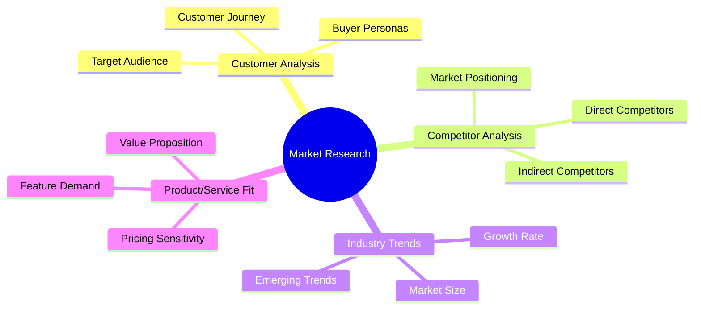
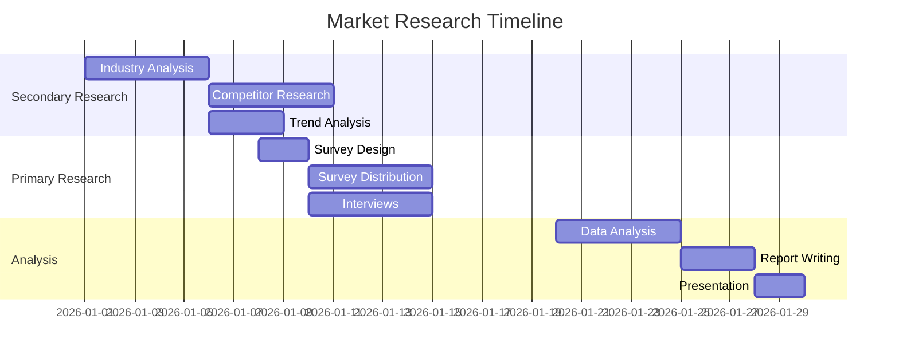

# Market Research Roadmap

**Project Name:** [Project Name]
**Company:** [Company Name]
**Period:** [Start Date] to [End Date]
**Version:** 1.0

---

## Executive Summary

This market research roadmap outlines the systematic approach to gathering, analyzing, and applying market intelligence to support [Project Name]'s strategic decisions during the internship period.

---

## 1. Research Objectives

### 1.1 Primary Objectives

| Objective | Research Question | Success Metric | Priority |
|-----------|-------------------|----------------|----------|
| [Obj 1] | [Question to answer] | [How to measure] | High |
| [Obj 2] | [Question to answer] | [How to measure] | High |
| [Obj 3] | [Question to answer] | [How to measure] | Medium |

### 1.2 Research Scope



---

## 2. Research Phases

### Phase 1: Secondary Research (Week 1-2)

| Activity | Description | Sources | Deliverable | Timeline |
|----------|-------------|---------|-------------|----------|
| Industry Overview | Market size, growth, trends | Reports, publications | Industry Summary | Day 1-3 |
| Competitor Mapping | Identify key players | Websites, databases | Competitor List | Day 3-5 |
| Trend Analysis | Emerging patterns | News, blogs, reports | Trend Report | Day 5-7 |
| Data Compilation | Aggregate findings | All sources | Research Database | Day 7-10 |

### Phase 2: Primary Research (Week 3-4)

| Activity | Description | Method | Deliverable | Timeline |
|----------|-------------|--------|-------------|----------|
| Survey Design | Create questionnaires | Online tools | Survey Instruments | Day 1-2 |
| Data Collection | Gather responses | Survey distribution | Raw Data | Day 2-5 |
| Interviews | Deep insights | 1-on-1 interviews | Interview Notes | Day 3-7 |
| Analysis | Process findings | Statistical analysis | Insights Report | Day 7-10 |

### Phase 3: Analysis & Reporting (Week 5-6)

| Activity | Description | Output | Timeline |
|----------|-------------|--------|----------|
| Data Synthesis | Combine all findings | Integrated Analysis | Day 1-3 |
| Insight Generation | Extract key insights | Key Findings Doc | Day 3-5 |
| Report Writing | Create final report | Market Research Report | Day 5-8 |
| Presentation | Share with stakeholders | Slide Deck | Day 8-10 |

---

## 3. Research Methods

### 3.1 Secondary Research Sources

| Source Type | Specific Sources | Data Points | Reliability |
|-------------|------------------|-------------|-------------|
| Industry Reports | [Report 1], [Report 2] | Market size, trends | High |
| Government Data | BPS, Kemendag | Statistics, regulations | High |
| News & Media | [Publication 1], [Publication 2] | Current events, trends | Medium |
| Academic Papers | Google Scholar, journals | Research findings | High |
| Company Reports | Annual reports, investor info | Financial data | High |

### 3.2 Primary Research Methods

| Method | Sample Size | Duration | Cost | Best For |
|--------|-------------|----------|------|----------|
| Online Survey | 100-500 | 1-2 weeks | Low | Quantitative data |
| In-depth Interviews | 5-15 | 30-60 min each | Medium | Deep insights |
| Focus Groups | 2-3 groups | 1-2 hours each | Medium | Group dynamics |
| Observation | As needed | Variable | Low | Behavior patterns |

### 3.3 Survey Template

```
MARKET RESEARCH SURVEY - [Topic]

Introduction:
Thank you for participating in our survey about [Topic]. 
This will take approximately [X] minutes.

SECTION 1: Demographics
1. What is your age group?
   [ ] 18-24  [ ] 25-34  [ ] 35-44  [ ] 45-54  [ ] 55+

2. What is your occupation?
   [Open text]

3. How familiar are you with [Product/Service Category]?
   [ ] Very familiar  [ ] Somewhat familiar  [ ] Not familiar

SECTION 2: Usage & Behavior
4. How often do you use [Product/Service]?
   [ ] Daily  [ ] Weekly  [ ] Monthly  [ ] Rarely  [ ] Never

5. What factors influence your purchasing decision? (Rank top 3)
   [ ] Price  [ ] Quality  [ ] Brand  [ ] Reviews  [ ] Availability

SECTION 3: Preferences
6. What features are most important to you?
   [Open text]

7. How much would you pay for [Product/Service]?
   [ ] Less than [Price]  [ ] [Price range]  [ ] More than [Price]

SECTION 4: Open Feedback
8. What improvements would you like to see?
   [Open text]

Thank you for your participation!
```

---

## 4. Competitor Analysis Framework

### 4.1 Competitor Matrix

| Criteria | [Competitor 1] | [Competitor 2] | [Competitor 3] | [Our Company] |
|----------|----------------|----------------|----------------|---------------|
| Market Share | [%] | [%] | [%] | [%] |
| Price Point | High/Med/Low | High/Med/Low | High/Med/Low | High/Med/Low |
| Key Strength | [Strength] | [Strength] | [Strength] | [Strength] |
| Key Weakness | [Weakness] | [Weakness] | [Weakness] | [Weakness] |
| Target Market | [Segment] | [Segment] | [Segment] | [Segment] |
| Unique Selling Point | [USP] | [USP] | [USP] | [USP] |

### 4.2 SWOT Analysis Template

```mermaid
quadrantChart
    title Competitive Position Analysis
    x-axis Internal Weakness --> Internal Strength
    y-axis External Threat --> External Opportunity
    quadrant-1 Leverage Strengths
    quadrant-2 Monitor
    quadrant-3 Improve
    quadrant-4 Address Threats
    [Feature 1]: [0.8, 0.8]
    [Feature 2]: [0.6, 0.7]
    [Feature 3]: [0.3, 0.4]
    [Feature 4]: [0.7, 0.3]
```

### 4.3 Competitor Profile Template

```markdown
## Competitor: [Name]

### Basic Information
- **Company**: [Name]
- **Website**: [URL]
- **Founded**: [Year]
- **Employees**: [Number]
- **Location**: [Location]

### Market Position
- **Market Share**: [%]
- **Target Audience**: [Description]
- **Price Range**: [Range]

### Products/Services
- **Core Offering**: [Description]
- **Key Features**: [List]
- **Differentiators**: [List]

### Strengths
1. [Strength 1]
2. [Strength 2]
3. [Strength 3]

### Weaknesses
1. [Weakness 1]
2. [Weakness 2]
3. [Weakness 3]

### Recent Activities
- [Activity 1] - [Date]
- [Activity 2] - [Date]
```

---

## 5. Customer Research

### 5.1 Buyer Persona Template

```markdown
## Persona: [Name]

### Demographics
- **Age**: [Range]
- **Occupation**: [Job Title]
- **Income**: [Range]
- **Location**: [City/Region]
- **Education**: [Level]

### Psychographics
- **Values**: [List]
- **Interests**: [List]
- **Lifestyle**: [Description]

### Goals & Challenges
- **Primary Goal**: [Goal]
- **Secondary Goals**: [List]
- **Pain Points**: [List]
- **Barriers**: [List]

### Buying Behavior
- **Information Sources**: [List]
- **Decision Criteria**: [List]
- **Purchase Frequency**: [Frequency]
- **Budget Range**: [Range]

### Customer Journey
1. **Awareness**: [How they discover needs]
2. **Research**: [How they gather information]
3. **Consideration**: [How they evaluate options]
4. **Purchase**: [How they make decision]
5. **Post-Purchase**: [How they use and review]

### Quote
"[Typical customer quote that represents this persona]"
```

### 5.2 Customer Journey Map

| Stage | Touchpoint | Customer Action | Emotion | Pain Point | Opportunity |
|-------|------------|-----------------|---------|------------|-------------|
| Awareness | Social media ad | Sees advertisement | Curious | Information overload | Better targeting |
| Research | Website | Browses products | Interested | Comparison difficulty | Comparison tools |
| Consideration | Review sites | Reads reviews | Cautious | Trust concerns | Social proof |
| Purchase | Checkout | Completes order | Anxious | Complex process | Streamlined UX |
| Post-Purchase | Email | Receives follow-up | Satisfied | None identified | Loyalty program |

---

## 6. Data Collection Plan

### 6.1 Data Requirements Matrix

| Data Point | Source | Method | Frequency | Owner |
|------------|--------|--------|-----------|-------|
| Market size | Industry reports | Secondary | Once | Researcher |
| Competitor pricing | Competitor sites | Secondary | Monthly | Researcher |
| Customer preferences | Surveys | Primary | Quarterly | Researcher |
| Brand awareness | Social listening | Secondary | Weekly | Marketing |
| Purchase behavior | Sales data | Internal | Monthly | Analytics |

### 6.2 Research Timeline



---

## 7. Analysis Frameworks

### 7.1 PESTLE Analysis

| Factor | Current State | Impact | Opportunity/Risk |
|--------|---------------|--------|------------------|
| **Political** | [Current policies] | High/Med/Low | [Implication] |
| **Economic** | [Economic conditions] | High/Med/Low | [Implication] |
| **Social** | [Social trends] | High/Med/Low | [Implication] |
| **Technological** | [Tech developments] | High/Med/Low | [Implication] |
| **Legal** | [Regulations] | High/Med/Low | [Implication] |
| **Environmental** | [Environmental factors] | High/Med/Low | [Implication] |

### 7.2 Porter's Five Forces

| Force | Strength | Analysis | Strategic Implication |
|-------|----------|----------|----------------------|
| Threat of New Entrants | High/Med/Low | [Analysis] | [Implication] |
| Supplier Power | High/Med/Low | [Analysis] | [Implication] |
| Buyer Power | High/Med/Low | [Analysis] | [Implication] |
| Threat of Substitutes | High/Med/Low | [Analysis] | [Implication] |
| Competitive Rivalry | High/Med/Low | [Analysis] | [Implication] |

---

## 8. Research Deliverables

### 8.1 Deliverables Checklist

| Deliverable | Format | Due Date | Status | Owner |
|-------------|--------|----------|--------|-------|
| Industry Overview Report | PDF | [Date] | Not Started | [Name] |
| Competitor Analysis | Spreadsheet + PDF | [Date] | Not Started | [Name] |
| Survey Results | Dashboard + Raw Data | [Date] | Not Started | [Name] |
| Interview Insights | Summary Document | [Date] | Not Started | [Name] |
| Final Market Research Report | PDF + Presentation | [Date] | Not Started | [Name] |

### 8.2 Report Structure Template

```markdown
# Market Research Report - [Project Name]

## Executive Summary
- Key findings (3-5 bullet points)
- Recommendations summary

## 1. Introduction
- Research objectives
- Scope and methodology
- Limitations

## 2. Industry Overview
- Market size and growth
- Key trends
- Future outlook

## 3. Competitor Analysis
- Competitive landscape
- Key competitors profile
- Competitive positioning map

## 4. Customer Analysis
- Target audience profile
- Buyer personas
- Customer journey insights

## 5. Key Findings
- Finding 1
- Finding 2
- Finding 3

## 6. Recommendations
- Recommendation 1
- Recommendation 2
- Recommendation 3

## 7. Appendices
- Survey questionnaire
- Raw data summaries
- Additional analysis
```

---

## 9. Budget & Resources

### 9.1 Research Budget

| Item | Cost (IDR) | Purpose | Status |
|------|------------|---------|--------|
| Survey Platform | [Cost] | Online survey tool | Pending |
| Industry Reports | [Cost] | Premium research reports | Pending |
| Incentives | [Cost] | Survey/Interview incentives | Pending |
| Tools & Software | [Cost] | Analysis tools | Pending |
| **Total** | **[Total]** | | |

---

## Market Research Change Log

| Version | Date | Change | Author |
|---------|------|--------|--------|
| 1.0 | [Date] | Initial roadmap created | PM |

---

*Market Research Roadmap - [Project Name] - Version 1.0*