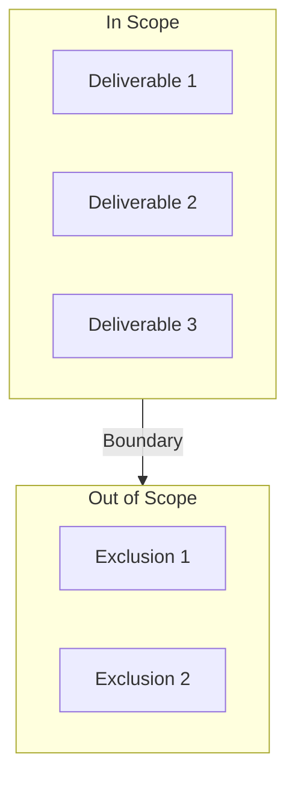
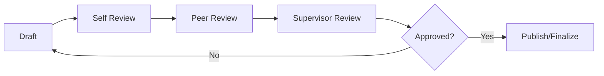

# Project Management Plan

**Project Name:** [Project Name]
**Company:** [Company Name]
**Period:** [Start Date] to [End Date]
**Version:** 1.0
**Last Updated:** [Date]

---

## 1. Executive Summary

This Project Management Plan outlines the approach, methodology, and governance structure for [Project Name]. The project aims to [primary objective] within a [duration] timeframe, supporting [Company Name]'s strategic goals of [strategic alignment].

### Key Objectives
1. [Objective 1 - aligned with KPI]
2. [Objective 2 - aligned with KPI]
3. [Objective 3 - aligned with KPI]

---

## 2. Project Scope

### 2.1 In Scope
| Item | Description | Deliverable |
|------|-------------|-------------|
| [Scope Item 1] | [Description] | [Deliverable] |
| [Scope Item 2] | [Description] | [Deliverable] |
| [Scope Item 3] | [Description] | [Deliverable] |

### 2.2 Out of Scope
- [Exclusion 1]
- [Exclusion 2]
- [Exclusion 3]

### 2.3 Scope Boundaries


---

## 3. Project Objectives & KPIs

### 3.1 SMART Objectives

| Objective | Specific | Measurable | Achievable | Relevant | Time-bound |
|-----------|----------|------------|------------|----------|------------|
| [Obj 1] | [Detail] | [Metric] | [Yes/How] | [Alignment] | [Date] |
| [Obj 2] | [Detail] | [Metric] | [Yes/How] | [Alignment] | [Date] |
| [Obj 3] | [Detail] | [Metric] | [Yes/How] | [Alignment] | [Date] |

### 3.2 Key Performance Indicators

| KPI | Target | Measurement Method | Frequency | Owner |
|-----|--------|-------------------|-----------|-------|
| [KPI 1] | [Target Value] | [How measured] | [Weekly/Monthly] | [Role] |
| [KPI 2] | [Target Value] | [How measured] | [Weekly/Monthly] | [Role] |
| [KPI 3] | [Target Value] | [How measured] | [Weekly/Monthly] | [Role] |

---

## 4. Project Organization

### 4.1 Team Structure

```mermaid
flowchart TD
    PM[Project Manager<br/>[Name]]
    
    PM --> TL[Team Lead<br/>[Name]]
    PM --> SM[Social Media<br/>[Name]]
    PM --> CT[Content Writer<br/>[Name]]
    PM --> DE[Designer<br/>[Name]]
    
    TL --> TA[Tech/Analytics<br/>[Name]]
```

### 4.2 Roles & Responsibilities

| Role | Name | Responsibilities | Time Allocation |
|------|------|------------------|-----------------|
| Project Manager | [Name] | Overall coordination, reporting, stakeholder management | 100% |
| Team Lead | [Name] | Day-to-day operations, quality control | 100% |
| Social Media Specialist | [Name] | Platform management, engagement | 100% |
| Content Writer | [Name] | Article creation, copywriting | 100% |
| Designer | [Name] | Visual content, branding | 50% |
| Tech/Analytics | [Name] | Data analysis, reporting | 50% |

---

## 5. Project Timeline

### 5.1 Phase Overview

| Phase | Duration | Start | End | Key Deliverables |
|-------|----------|-------|-----|------------------|
| Phase 1: Planning | Week 1-2 | [Date] | [Date] | Project plan, WBS, RACI |
| Phase 2: Setup | Week 3-4 | [Date] | [Date] | Tools setup, templates |
| Phase 3: Execution | Week 5-10 | [Date] | [Date] | Content, campaigns |
| Phase 4: Monitoring | Week 11-12 | [Date] | [Date] | Reports, optimization |

### 5.2 Milestones

| Milestone | Target Date | Success Criteria | Status |
|-----------|-------------|------------------|--------|
| Project Kickoff | [Date] | Kickoff meeting completed | Not Started |
| Planning Complete | [Date] | All plans approved | Not Started |
| First Content Published | [Date] | 5 articles live | Not Started |
| Mid-Project Review | [Date] | Progress report approved | Not Started |
| Final Presentation | [Date] | All deliverables submitted | Not Started |

---

## 6. Budget & Resources

### 6.1 Budget Allocation

| Category | Allocation (IDR) | Purpose |
|----------|------------------|---------|
| Content Production | [Amount] | Writing, editing, visuals |
| Tools & Software | [Amount] | Analytics, design tools |
| Paid Promotion | [Amount] | Social media ads |
| Contingency | [Amount] | 10% buffer |
| **Total** | **[Total]** | |

### 6.2 Resource Requirements

| Resource Type | Quantity | Source | Cost |
|---------------|----------|--------|------|
| Human Resources | [Number] | Internal | [Cost] |
| Software Tools | [List] | Subscription | [Cost] |
| Equipment | [List] | Company provided | [Cost] |

---

## 7. Risk Management

### 7.1 Risk Register Summary

| Risk ID | Description | Probability | Impact | Mitigation Strategy |
|---------|-------------|-------------|--------|---------------------|
| R001 | [Risk 1] | High/Medium/Low | High/Medium/Low | [Strategy] |
| R002 | [Risk 2] | High/Medium/Low | High/Medium/Low | [Strategy] |
| R003 | [Risk 3] | High/Medium/Low | High/Medium/Low | [Strategy] |

*See full Risk & Issue Register for detailed risk management.*

---

## 8. Communication Plan

### 8.1 Communication Matrix

| Communication Type | Frequency | Participants | Format | Owner |
|-------------------|-----------|--------------|--------|-------|
| Daily Standup | Daily | Core team | 15-min meeting | Team Lead |
| Weekly Report | Weekly | Team + Supervisor | Document | PM |
| Monthly Review | Monthly | Stakeholders | Presentation | PM |
| Ad-hoc Updates | As needed | Relevant parties | Email/Chat | PM |

### 8.2 Stakeholder Communication

| Stakeholder | Information Needs | Communication Method | Frequency |
|-------------|-------------------|---------------------|-----------|
| Company Supervisor | Progress, issues | Weekly report | Weekly |
| University Supervisor | Learning progress | Monthly report | Monthly |
| Team Members | Tasks, updates | Daily standup | Daily |

---

## 9. Quality Management

### 9.1 Quality Criteria

| Deliverable | Quality Criteria | Verification Method |
|-------------|------------------|---------------------|
| Articles | Grammar, SEO score, originality | Grammarly, SEO tools |
| Social Media Posts | Brand alignment, engagement potential | Review checklist |
| Reports | Accuracy, completeness | Peer review |

### 9.2 Review Process



---

## 10. Change Management

### 10.1 Change Request Process

1. **Identify Change**: Document the requested change
2. **Impact Assessment**: Evaluate scope, timeline, budget impact
3. **Approval**: Obtain PM and supervisor approval
4. **Implementation**: Execute approved changes
5. **Documentation**: Update project documents

### 10.2 Change Log

| Change ID | Date | Description | Impact | Status |
|-----------|------|-------------|--------|--------|
| C001 | [Date] | [Description] | [Impact] | [Status] |

---

## 11. Success Criteria

### 11.1 Project Success Definition

The project will be considered successful when:

- [ ] All deliverables completed on time
- [ ] KPI targets achieved (minimum 80%)
- [ ] Stakeholder satisfaction rating ≥ 4/5
- [ ] No critical issues unresolved
- [ ] Documentation complete and approved

### 11.2 Acceptance Criteria

| Deliverable | Acceptance Criteria | Sign-off Required |
|-------------|---------------------|-------------------|
| [Deliverable 1] | [Criteria] | [Role] |
| [Deliverable 2] | [Criteria] | [Role] |
| [Deliverable 3] | [Criteria] | [Role] |

---

## 12. Appendices

### Appendix A: Reference Documents
- Internship Assignment Letter
- Company Brand Guidelines
- Project Charter

### Appendix B: Glossary
| Term | Definition |
|------|------------|
| KPI | Key Performance Indicator |
| WBS | Work Breakdown Structure |
| RACI | Responsible, Accountable, Consulted, Informed |

### Appendix C: Contact Information
| Role | Name | Email | Phone |
|------|------|-------|-------|
| Project Manager | [Name] | [Email] | [Phone] |
| Company Supervisor | [Name] | [Email] | [Phone] |
| University Supervisor | [Name] | [Email] | [Phone] |

---

**Document Approval**

| Role | Name | Signature | Date |
|------|------|-----------|------|
| Project Manager | | | |
| Company Supervisor | | | |
| University Supervisor | | | |

---

*Project Management Plan - [Project Name] - Version 1.0*