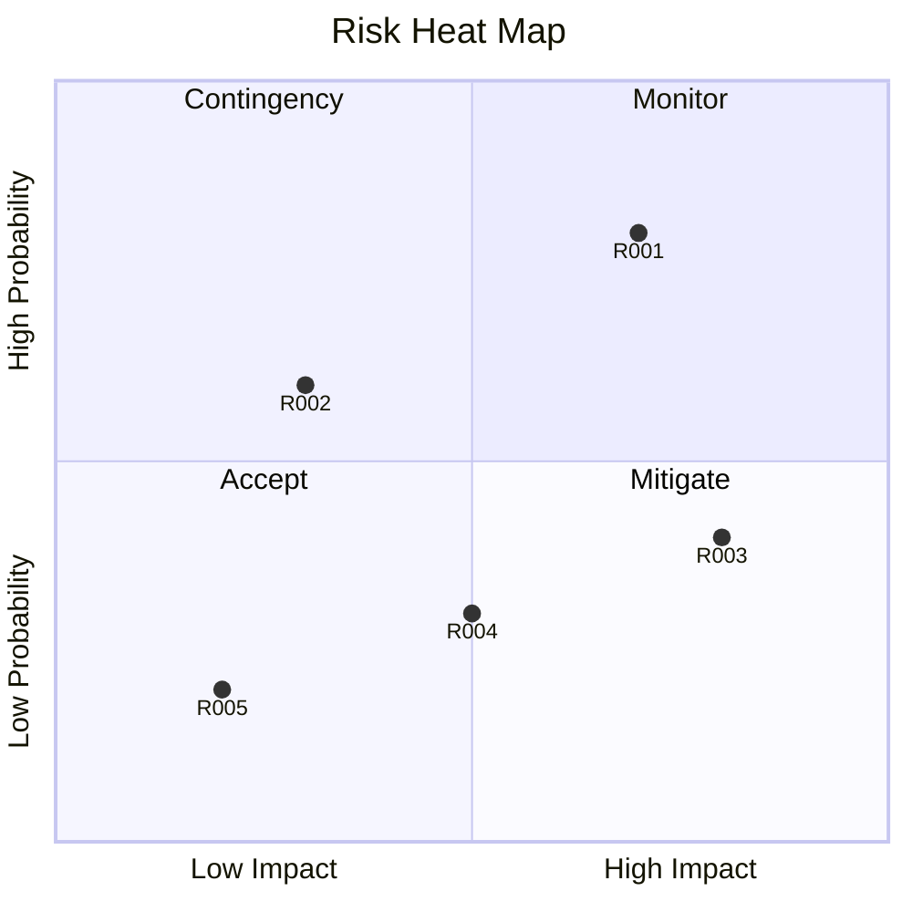

# Risk & Issue Register

**Project Name:** [Project Name]
**Company:** [Company Name]
**Period:** [Start Date] to [End Date]
**Version:** 1.0

---

## Risk Management Overview

This document provides a comprehensive framework for identifying, assessing, and managing risks and issues throughout the project lifecycle.

---

## 1. Risk Register

### 1.1 Risk Assessment Matrix
| Risk ID | Description | Probability | Impact | Risk Score | Priority |
|--------|-------------|-------------|--------|-------------|
| R001 | [Risk description] | High/Med/Low | High/Med/Low | [Score] | High/Med/Low |
| R002 | [Risk description] | High/Med/Low | High/Med/Low | [Score] | High/Med/Low |
| R003 | [Risk description] | High/Med/Low | High/Med/Low | [Score] | High/Med/Low |
| R004 | [Risk description] | High/Med/Low | High/Med/Low | [Score] | High/Med/Low |
| R005 | [Risk description] | High/Med/Low | High/Med/Low | [Score] | High/Med/Low |

| R006 | [Risk description] | High/Med/Low | High/Med/Low | [Score] | High/Med/Low |
| R007 | [Risk description] | High/Med/Low | High/Med/Low | [Score] | High/Med/Low |
| R008 | [Risk description] | High/Med/Low | High/Med/Low | [Score] | High/Med/Low |
| R009 | [Risk description] | High/Med/Low | High/Med/Low | [Score] | High/Med/Low |
| R010 | [Risk description] | High/Med/Low | High/Med/Low | [Score] | High/Med/Low |

### 1.2 Risk Scoring Guide
| Score Range | Priority | Action Required |
|---------------|----------|-----------------|
| 1-4 | Low | Monitor only |
| 5-8 | Medium | Develop mitigation plan |
| 9-12 | High | Immediate action required |
| 13-16 | Critical | Escalate immediately |

### 1.3 Risk Categories
| Category | Description | Examples |
|----------|-------------|----------|
| Technical | Technology-related risks | Tool failures, compatibility issues |
| Resource | People and material risks | Team availability, budget constraints |
| Schedule | Timeline risks | Delays, dependencies, milestones |
| External | Outside factors | Market changes, regulatory changes |
| Quality | Output risks | Errors, rework, standards |

| Scope | Project boundary risks | Scope creep, requirement changes |

---

## 2. Detailed Risk Register

| Risk ID | Category | Description | Probability | Impact | Owner | Status |
|--------|----------|-------------|-------------|--------|-------|--------|
| R001 | Schedule | [Detailed description] | Medium | High | PM | Open |
| R002 | Resource | [Detailed description] | Low | Medium | TL | Monitoring |
| R003 | Technical | [Detailed description] | Medium | High | Tech | Open |
| R004 | Quality | [Detailed description] | Low | High | QA | Open |
| R005 | External | [Detailed description] | Low | Low | PM | Monitoring |
| R006 | Scope | [Detailed description] | Medium | Medium | PM | Open |
| R007 | Resource | [Detailed description] | High | High | PM | Open |
| R008 | Schedule | [Detailed description] | Low | Medium | TL | Monitoring |
| R009 | Technical | [Detailed description] | Medium | Medium | Tech | Monitoring |
| R010 | Quality | [Detailed description] | Low | Low | QA | Monitoring |

---

## 3. Risk Response Plans

### 3.1 Mitigation Strategies

| Risk ID | Mitigation Strategy | Contingency Plan | Trigger | Owner |
|--------|---------------------|------------------|--------|-------|
| R001 | [Strategy description] | [Backup plan] | [Trigger condition] | [Name] |
| R002 | [Strategy description] | [Backup plan] | [Trigger condition] | [Name] |
| R003 | [Strategy description] | [Backup plan] | [Trigger condition] | [Name] |
| R004 | [Strategy description] | [Backup plan] | [Trigger condition] | [Name] |
| R005 | [Strategy description] | [Backup plan] | [Trigger condition] | [Name] |

### 3.2 Response Actions
| Response Level | When to Apply | Actions | Communication |
|----------------|------------------|---------|----------------|
| Avoid | Low probability/impact | Accept risk, monitor | Inform team |
| Transfer | Medium probability/impact | Move to different owner | Document transfer |
| Mitigate | High probability/impact | Reduce probability/impact | Implement mitigation |
| Escalate | Critical risk | Immediate escalation | Alert management |

---

## 4. Issue Register
### 4.1 Active Issues
| Issue ID | Description | Related Risk | Date Identified | Impact | Owner | Status |
|---------|-------------|--------------|-----------------|--------|-------|--------|
| I001 | [Issue description] | R001 | [Date] | [Impact level] | [Name] | Open |
| I002 | [Issue description] | R002 | [Date] | [Impact level] | [Name] | In Progress |
| I003 | [Issue description] | R003 | [Date] | [Impact level] | [Name] | Open |

### 4.2 Issue Resolution Log
| Issue ID | Resolution | Date Resolved | Outcome | Lessons Learned |
|---------|-----------|----------------|---------|-----------------|
| I001 | [Resolution description] | [Date] | [Outcome] | [Lesson learned] |
| I002 | [Resolution description] | [Date] | [Outcome] | [Lesson learned] |

---

## 5. Risk Monitoring Schedule
### 5.1 Weekly Review
| Review Date | Risks Reviewed | New Risks Identified | Changes | Reviewer |
|-------------|------------------|----------------------|---------|----------|
| [Date] | [List of risk IDs] | [New risks] | [Changes] | [Name] |
| [Date] | [List of risk IDs] | [New risks] | [Changes] | [Name] |
| [Date] | [List of risk IDs] | [New risks] | [Changes] | [Name] |

### 5.2 Monthly Assessment
| Month | Total Risks | Open | Closed | New | Avg Score |
|-------|-------------|------|--------|-----|----------|
| Month 1 | [Number] | [Number] | [Number] | [Number] | [Score] |
| Month 2 | [Number] | [Number] | [Number] | [Number] | [Score] |
| Month 3 | [Number] | [Number] | [Number] | [Number] | [Score] |

---

## 6. Risk Heat Map

---

## 7. Risk Communication Plan
| Stakeholder | Risk Information Needed | Frequency | Method |
|------------|------------------------|----------|--------|
| Project Team | All risks and issues | Weekly | Team meeting |
| Supervisor | High and critical risks | Bi-weekly | Report |
| Management | Critical risks only | Monthly | Executive summary |
| Client | Selected risks | Monthly | Status report |

---

## 8. Lessons Learned
| Risk/Issue | What Happened | Root Cause | Prevention |
|------------|---------------|-------------|------------|
| [Risk/Issue name] | [Description] | [Cause] | [Prevention measure] |
| [Risk/Issue name] | [Description] | [Cause] | [Prevention measure] |
| [Risk/Issue name] | [Description] | [Cause] | [Prevention measure] |

---

## Risk Register Change Log
| Version | Date | Change | Author |
|---------|------|--------|--------|
| 1.0 | [Date] | Initial risk register created | PM |

---

*Risk & Issue Register - [Project Name] - Version 1.0*