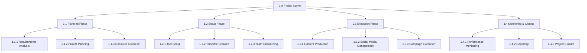
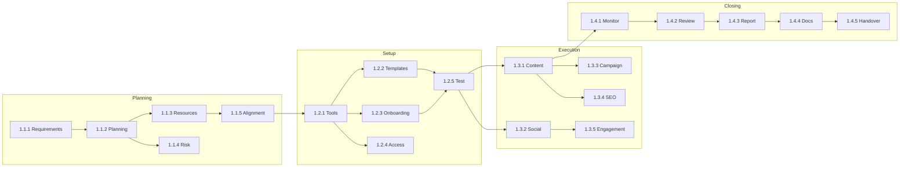

# Work Breakdown Structure (WBS)

**Project Name:** [Project Name]
**Company:** [Company Name]
**Period:** [Start Date] to [End Date]
**Version:** 1.0

---

## WBS Hierarchy Overview

---

## Level 1: Project Phases

| WBS Code | Phase Name | Duration | Start Date | End Date | Deliverable |
|----------|------------|----------|------------|----------|-------------|
| 1.0 | [Project Name] | [Total Days] | [Start] | [End] | Complete Project |
| 1.1 | Planning Phase | [Days] | [Start] | [End] | Project Plan |
| 1.2 | Setup Phase | [Days] | [Start] | [End] | Ready State |
| 1.3 | Execution Phase | [Days] | [Start] | [End] | Deliverables |
| 1.4 | Monitoring & Closing | [Days] | [Start] | [End] | Final Report |

---

## Level 2: Phase Breakdown

### 1.1 Planning Phase

| WBS Code | Task Name | Duration | Dependencies | Resources | Deliverable |
|----------|-----------|----------|--------------|-----------|-------------|
| 1.1.1 | Requirements Analysis | 3 days | None | PM, Team Lead | Requirements Doc |
| 1.1.2 | Project Planning | 5 days | 1.1.1 | PM | Project Plan |
| 1.1.3 | Resource Allocation | 2 days | 1.1.2 | PM, Team Lead | Resource Plan |
| 1.1.4 | Risk Assessment | 2 days | 1.1.2 | PM | Risk Register |
| 1.1.5 | Stakeholder Alignment | 2 days | 1.1.3 | PM | Approval Sign-off |

### 1.2 Setup Phase

| WBS Code | Task Name | Duration | Dependencies | Resources | Deliverable |
|----------|-----------|----------|--------------|-----------|-------------|
| 1.2.1 | Tool Setup | 3 days | 1.1.5 | Tech Lead | Tools Configured |
| 1.2.2 | Template Creation | 4 days | 1.2.1 | Content Writer | Templates Ready |
| 1.2.3 | Team Onboarding | 2 days | 1.2.1 | PM | Team Trained |
| 1.2.4 | Access & Permissions | 1 day | 1.2.1 | Tech Lead | Access Granted |
| 1.2.5 | Test Run | 2 days | 1.2.2, 1.2.3 | Team | Pilot Complete |

### 1.3 Execution Phase

| WBS Code | Task Name | Duration | Dependencies | Resources | Deliverable |
|----------|-----------|----------|--------------|-----------|-------------|
| 1.3.1 | Content Production | 30 days | 1.2.5 | Content Team | Articles/Content |
| 1.3.2 | Social Media Management | 30 days | 1.2.5 | Social Media | Posts & Engagement |
| 1.3.3 | Campaign Execution | 20 days | 1.3.1 | Marketing Team | Campaign Live |
| 1.3.4 | SEO Optimization | 15 days | 1.3.1 | SEO Specialist | Optimized Content |
| 1.3.5 | Community Engagement | 30 days | 1.3.2 | Social Media | Engagement Metrics |

### 1.4 Monitoring & Closing

| WBS Code | Task Name | Duration | Dependencies | Resources | Deliverable |
|----------|-----------|----------|--------------|-----------|-------------|
| 1.4.1 | Performance Monitoring | Ongoing | 1.3.1 | Analytics | Weekly Reports |
| 1.4.2 | Mid-Project Review | 2 days | Week 6 | PM, Team | Review Report |
| 1.4.3 | Final Reporting | 3 days | 1.3.5 | PM | Final Report |
| 1.4.4 | Documentation | 3 days | 1.4.3 | Team | Complete Docs |
| 1.4.5 | Project Handover | 2 days | 1.4.4 | PM | Handover Complete |

---

## Level 3: Work Packages

### 1.3.1 Content Production (Detailed)

| WBS Code | Work Package | Duration | Owner | Status | Notes |
|----------|--------------|----------|-------|--------|-------|
| 1.3.1.1 | Article 1: Topic Research | 1 day | Writer | Not Started | |
| 1.3.1.2 | Article 1: Writing | 2 days | Writer | Not Started | |
| 1.3.1.3 | Article 1: Review & Edit | 1 day | Editor | Not Started | |
| 1.3.1.4 | Article 1: SEO Optimization | 0.5 day | SEO | Not Started | |
| 1.3.1.5 | Article 1: Publish | 0.5 day | Writer | Not Started | |
| 1.3.1.6 | Article 2: Topic Research | 1 day | Writer | Not Started | |
| 1.3.1.7 | Article 2: Writing | 2 days | Writer | Not Started | |
| ... | ... | ... | ... | ... | |

### 1.3.2 Social Media Management (Detailed)

| WBS Code | Work Package | Duration | Owner | Status | Notes |
|----------|--------------|----------|-------|--------|-------|
| 1.3.2.1 | Content Calendar Creation | 2 days | Social Media | Not Started | |
| 1.3.2.2 | Instagram Posts (Week 1) | 1 day | Social Media | Not Started | |
| 1.3.2.3 | Instagram Posts (Week 2) | 1 day | Social Media | Not Started | |
| 1.3.2.4 | TikTok Content (Week 1) | 1 day | Social Media | Not Started | |
| 1.3.2.5 | LinkedIn Articles | 2 days | Writer | Not Started | |
| ... | ... | ... | ... | ... | |

---

## WBS Dictionary

### Work Package Template

| Field | Description |
|-------|-------------|
| **WBS Code** | Unique identifier (e.g., 1.3.1.1) |
| **Work Package Name** | Descriptive name |
| **Description** | Detailed scope of work |
| **Deliverable** | Expected output |
| **Acceptance Criteria** | How to verify completion |
| **Duration** | Estimated time |
| **Resources** | Required people/materials |
| **Dependencies** | Predecessor tasks |
| **Risks** | Associated risks |
| **Cost Estimate** | Budget allocation |

---

## Effort Summary

### By Phase

| Phase | Total Tasks | Estimated Hours | Resources Needed |
|-------|-------------|-----------------|------------------|
| Planning | 5 | 80 | PM, Team Lead |
| Setup | 5 | 60 | Full Team |
| Execution | 5 | 400 | Full Team |
| Monitoring & Closing | 5 | 40 | PM, Analytics |
| **Total** | **20** | **580** | |

### By Resource

| Resource | Assigned Tasks | Total Hours | Peak Week |
|----------|----------------|-------------|-----------|
| Project Manager | 8 | 120 | Week 1-2 |
| Team Lead | 6 | 100 | Week 1-4 |
| Content Writer | 5 | 150 | Week 5-10 |
| Social Media Specialist | 4 | 120 | Week 5-12 |
| Designer | 3 | 60 | Week 3-10 |
| SEO Specialist | 2 | 30 | Week 5-10 |

---

## Dependency Matrix

---

## Progress Tracking

### Status Legend
- 🟢 Complete
- 🟡 In Progress
- 🔴 Not Started
- ⚪ Blocked

### Current Status (As of [Date])

| Phase | Tasks Complete | Tasks Remaining | % Complete |
|-------|----------------|-----------------|------------|
| Planning | 0 | 5 | 0% |
| Setup | 0 | 5 | 0% |
| Execution | 0 | 5 | 0% |
| Closing | 0 | 5 | 0% |
| **Total** | **0** | **20** | **0%** |

---

## WBS Change Log

| Version | Date | Change Description | Author |
|---------|------|-------------------|--------|
| 1.0 | [Date] | Initial WBS created | PM |

---

*Work Breakdown Structure - [Project Name] - Version 1.0*