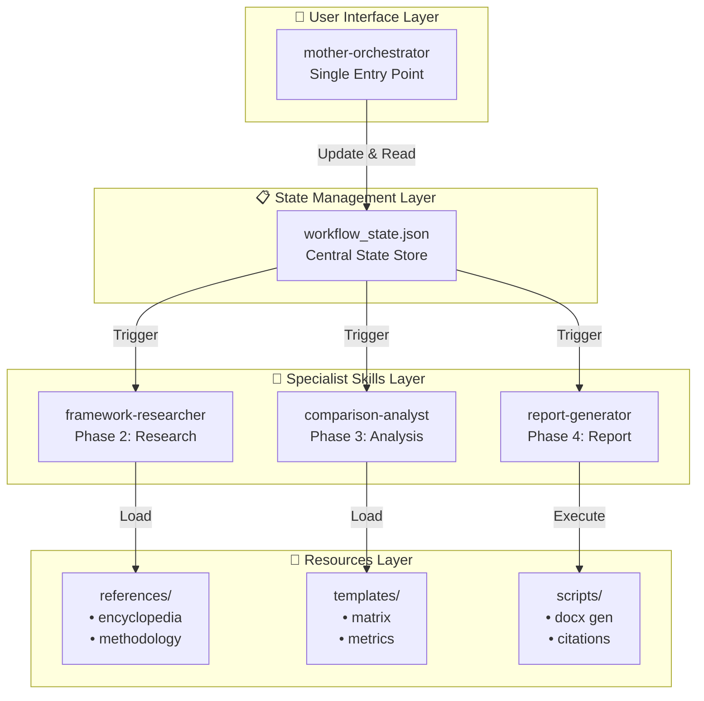
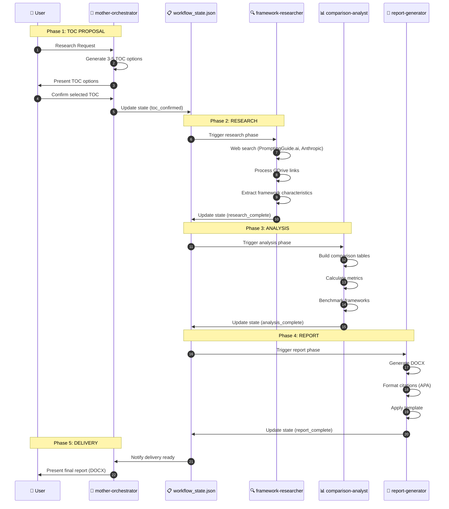
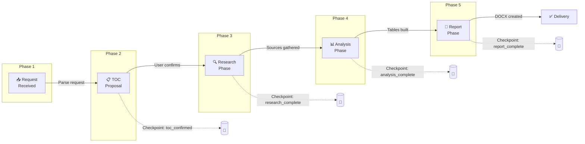
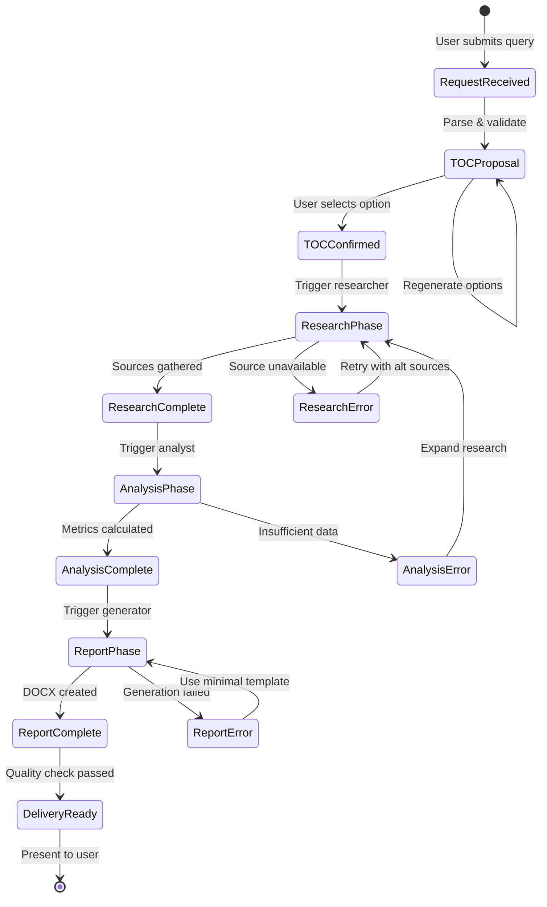

# Prompt Research Orchestrator Framework Documentation

> **Comprehensive Guide to the Multi-Skill Prompt Engineering Research Framework**

---

## Table of Contents

1. [Framework Overview](#1-framework-overview)
2. [Architecture & Design](#2-architecture--design)
3. [Complete Folder Structure](#3-complete-folder-structure)
4. [Skills Reference](#4-skills-reference)
5. [Workflow Chaining Sequence](#5-workflow-chaining-sequence)
6. [Metrics & Comparison Standards](#6-metrics--comparison-standards)
7. [Citation Standards](#7-citation-standards)
8. [Error Handling & Recovery](#8-error-handling--recovery)
9. [Quick Reference](#9-quick-reference)

---

## 1. Framework Overview

### Purpose

The **Prompt Research Orchestrator** is a production-ready multi-skill AI framework designed to automate rigorous, scientist-level research on prompt engineering frameworks with comprehensive comparison reports.

### Mission Statement

> Transform any prompt engineering research request into a comprehensive, academically-cited comparison report with TOC proposals, multi-source research, structured metrics, and professional DOCX delivery.

### Core Value Proposition

```
Research Request → TOC Options → Multi-Source Research → Comparison Analysis → DOCX Report
```

### Target Users

| User Type | Use Case |
|-----------|----------|
| **AI Researchers** | Framework comparison studies |
| **ML Engineers** | Prompting strategy selection |
| **Technical Writers** | Documentation with citations |
| **Product Teams** | LLM integration decisions |
| **Academics** | Literature reviews |

### Key Features

| Feature | Description |
|---------|-------------|
| **TOC Proposal System** | Always generates 3-5 options before execution |
| **Multi-Source Research** | Prioritizes PromptingGuide.ai + Anthropic docs |
| **GDrive Integration** | Processes user-provided GDrive links |
| **Mandatory Metrics** | Pros/cons, ease of use, thinking process, scalability |
| **Academic Citations** | APA-style citations from authoritative sources |
| **DOCX Generation** | Professional formatted reports |

---

## 2. Architecture & Design

### System Architecture



### Multi-Skill Coordination Model



### State Management Approach

The framework uses a centralized state file (`workflow_state.json`) to:

1. **Track Progress**: Monitor current phase and completion percentage
2. **Store Research**: Persist all gathered framework data
3. **Enable Recovery**: Resume from any checkpoint on failure
4. **Validate Transitions**: Ensure phase prerequisites are met

---

## 3. Complete Folder Structure

```
prompt-research-orchestrator/
│
├── README.md                                    # Entry point & quick start
├── PROMPT-RESEARCH-ORCHESTRATOR-FRAMEWORK.md    # This comprehensive guide
├── workflow_state.json                          # Central state management
│
├── mother-orchestrator/                         # Phase 1 & 5: User interface
│   └── SKILL.md                                 # Skill definition
│
├── framework-researcher/                        # Phase 2: Research
│   ├── SKILL.md                                 # Skill definition
│   └── references/
│       ├── prompt-frameworks-encyclopedia.md    # Framework knowledge base
│       └── research-methodology.md              # Scientific method guide
│
├── comparison-analyst/                          # Phase 3: Analysis
│   ├── SKILL.md                                 # Skill definition
│   └── templates/
│       ├── comparison-matrix.json               # Table structure template
│       └── metrics-schema.json                  # Metrics definition
│
├── report-generator/                            # Phase 4: Report creation
│   ├── SKILL.md                                 # Skill definition
│   ├── scripts/
│   │   ├── generate_docx.py                     # DOCX creation script
│   │   └── format_citations.py                  # Citation formatter
│   └── templates/
│       └── research-report-template.docx        # Report template
│
└── references/                                  # Shared references
    ├── academic-citation-standards.md           # Citation formats
    ├── benchmark-metrics-guide.md               # Metrics definitions
    └── source-priority-list.md                  # Source hierarchy
```

---

## 4. Skills Reference

### Skills Overview Table

| Skill Name | Phase | Primary Function | Auto-Trigger Condition |
|------------|-------|------------------|------------------------|
| `mother-orchestrator` | 1 & 5 | User interface, TOC proposals, coordination | Research request received |
| `framework-researcher` | 2 | Web research, framework analysis | TOC confirmed |
| `comparison-analyst` | 3 | Comparison tables, metrics | Research complete |
| `report-generator` | 4 | DOCX generation, citations | Analysis complete |

---

### Skill 1: mother-orchestrator

**Mission**: Serve as the single user interface for all prompt research requests, generate TOC proposals, coordinate specialist skills, and deliver final reports.

**Triggers**: Prompt engineering research requests, framework comparisons, analysis queries

**Responsibilities**:
- Receive and parse user requests
- Generate 3-5 TOC options
- Wait for user confirmation
- Coordinate specialist skill activation
- Manage workflow state
- Deliver final output

---

### Skill 2: framework-researcher

**Mission**: Conduct rigorous multi-source research on prompt engineering frameworks using web search, GDrive links, and authoritative documentation.

**Triggers**: TOC confirmation, research phase initiation

**Responsibilities**:
- Web search with source prioritization
- GDrive link processing
- Framework characteristic extraction
- Source quality assessment
- Research artifact compilation

---

### Skill 3: comparison-analyst

**Mission**: Transform research artifacts into structured comparison tables with mandatory metrics and benchmarking data.

**Triggers**: Research phase completion

**Responsibilities**:
- Build pros/cons tables
- Calculate ease-of-use scores
- Analyze LLM thinking process
- Assess scalability
- Evaluate Grok/Claude compatibility
- Compile benchmark comparisons

---

### Skill 4: report-generator

**Mission**: Generate professionally formatted DOCX reports with academic citations and structured layouts.

**Triggers**: Analysis phase completion

**Responsibilities**:
- DOCX file generation
- Citation formatting (APA style)
- Template application
- Quality validation
- Final deliverable packaging

---

## 5. Workflow Chaining Sequence

### Phase Transition Diagram



### State Machine Diagram



### Checkpoint System

| Checkpoint | Required Criteria |
|------------|-------------------|
| `toc_confirmed` | User selected 1 of 3-5 TOC options |
| `research_complete` | Minimum 3 sources per framework, GDrive processed |
| `analysis_complete` | All mandatory metrics calculated |
| `report_complete` | DOCX generated, citations formatted |
| `delivery_ready` | Quality validation passed |

---

## 6. Metrics & Comparison Standards

### Mandatory Metrics Table

| Metric | Definition | Scale | Source |
|--------|------------|-------|--------|
| **Pros** | Framework advantages | List | Research synthesis |
| **Cons** | Framework disadvantages | List | Research synthesis |
| **Ease of Use** | Implementation complexity | 1-10 | Expert assessment |
| **LLM Thinking Process** | Reasoning approach | Description | Framework analysis |
| **Scalability** | Production readiness | Low/Medium/High | Benchmark data |
| **Grok Compatibility** | xAI support | Yes/Partial/No | Documentation |
| **Claude Compatibility** | Anthropic support | Yes/Partial/No | Documentation |
| **Benchmark Performance** | Accuracy/Speed metrics | Varies | Academic papers |
| **Citation Quality** | Source rigor score | 1-10 | Citation analysis |

### Comparison Matrix Template

```json
{
  "frameworks": ["Framework A", "Framework B"],
  "metrics": {
    "ease_of_use": {"A": 8, "B": 6},
    "scalability": {"A": "High", "B": "Medium"},
    "thinking_process": {
      "A": "Sequential reasoning with explicit steps",
      "B": "Iterative action-observation loops"
    }
  },
  "pros": {
    "A": ["Transparent reasoning", "Easy to implement"],
    "B": ["Tool integration", "Dynamic adaptation"]
  },
  "cons": {
    "A": ["Token overhead", "Slower inference"],
    "B": ["Complex setup", "Error propagation"]
  }
}
```

---

## 7. Citation Standards

### Source Priority Hierarchy

| Priority | Source Type | Examples |
|----------|-------------|----------|
| 1 (Highest) | Official Documentation | Anthropic docs, OpenAI docs |
| 2 | Academic Papers | arXiv, peer-reviewed journals |
| 3 | Authoritative Guides | PromptingGuide.ai, Learn Prompting |
| 4 | Technical Blogs | Official company blogs |
| 5 | Community Resources | GitHub, forums (with verification) |

### Citation Format (APA Style)

```
Author, A. A. (Year). Title of work. Source.
URL: [link] Accessed: [date]
```

**Example**:
```
Wei, J., Wang, X., Schuurmans, D., Bosma, M., Ichter, B., Xia, F., Chi, E., Le, Q., & Zhou, D. (2022). Chain-of-Thought Prompting Elicits Reasoning in Large Language Models. arXiv preprint arXiv:2201.11903.
URL: https://arxiv.org/abs/2201.11903 Accessed: 2024-01-15
```

---

## 8. Error Handling & Recovery

### Error Codes Reference

| Code | Phase | Description | Recovery Action |
|------|-------|-------------|-----------------|
| E001 | TOC | No valid TOC generated | Retry with simplified scope |
| E002 | Research | Source unavailable | Use cached/alternative sources |
| E003 | Research | GDrive link invalid | Request alternative link |
| E004 | Analysis | Insufficient data | Expand research parameters |
| E005 | Report | DOCX generation failed | Retry with minimal template |

### Recovery Flow

```
Error Detected → Log Error → Retry (max 3) → Escalate to User
```

---

## 9. Quick Reference

### Skills Cheat Sheet

| Skill | Keywords | Phase | Output |
|-------|----------|-------|--------|
| `mother-orchestrator` | prompt research, framework comparison | 1 & 5 | TOC, delivery |
| `framework-researcher` | web search, framework analysis | 2 | research_artifacts |
| `comparison-analyst` | compare, pros cons, metrics | 3 | comparison_tables |
| `report-generator` | generate docx, citations | 4 | .docx file |

### Workflow Phases Summary

| Phase | Skill | Checkpoint | Key Deliverable |
|-------|-------|------------|-----------------|
| 1 | mother-orchestrator | toc_confirmed | TOC Options |
| 2 | framework-researcher | research_complete | Research Artifacts |
| 3 | comparison-analyst | analysis_complete | Comparison Tables |
| 4 | report-generator | report_complete | DOCX Report |
| 5 | mother-orchestrator | delivery_ready | Final Delivery |

### Command Reference

| Command | Description |
|---------|-------------|
| `status` | Display current workflow state |
| `retry` | Retry current phase |
| `rollback` | Return to previous checkpoint |

---

## Appendix: State Schema Reference

### workflow_state.json Complete Schema

```json
{
  "workflow_id": "research-${timestamp}",
  "version": "1.0.0",
  "created_at": "ISO-8601-timestamp",
  "updated_at": "ISO-8601-timestamp",
  
  "status": {
    "current_phase": "toc_proposal",
    "overall_status": "in_progress",
    "completion_percentage": 0
  },
  
  "request": {
    "original_query": "",
    "frameworks_to_compare": [],
    "gdrive_links": [],
    "special_requirements": []
  },
  
  "toc_options": [],
  "selected_toc": null,
  
  "research_artifacts": {
    "sources": [],
    "framework_data": {},
    "gdrive_content": {}
  },
  
  "analysis_artifacts": {
    "comparison_tables": {},
    "metrics": {},
    "benchmarks": {}
  },
  
  "deliverables": {
    "report_path": null,
    "citations": []
  },
  
  "checkpoints": {},
  "errors": []
}
```

---

*Part of Prompt Research Orchestrator Framework*

*Version 1.0.0*